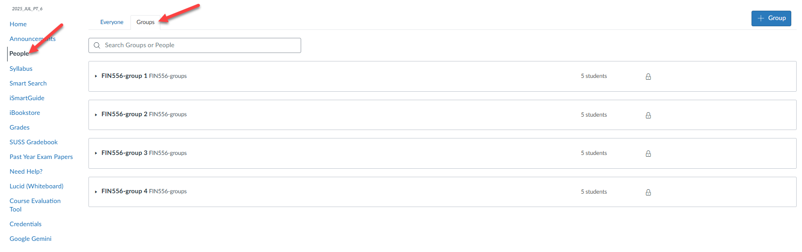

# One-Time Setup Guide (15 minutes to complete)

Please follow the steps below to set up your development environment for the course. This guide covers installation and configuration of all necessary tools and software.

- [ ] Step 1. Setup terminal.
- [ ] Step 2. Check Your Architecture
- [ ] Step 3. Install Git
- [ ] Step 4. Clone FIN556 repository.
- [ ] Step 5. Install Docker Desktop.
- [ ] Step 6. Install Visual Studio Code.
- [ ] Step 7. Verify DevContainer setup.

---

## Step 1. Setup Terminal

📌 **NOTE: Moving forward, whenever the guide refers to **"Terminal"**, it is referring either to the Windows Terminal for Windows/WSL2 users, or the native Terminal application for macOS users.**

The purpose of this step is to standardize the terminal environment for all students in the class to use Linux-based commands. This is important because most blockchain development tools are designed to work in a Unix-like environment.

- **🪟 Windows Users**
    1. Install WSL2 (Windows Subsystem for Linux). Follow the official Microsoft guide **[here](https://learn.microsoft.com/en-us/windows/wsl/install)**.
        - During installation, choose Ubuntu **24.04 LTS**.
        - You will be prompted to create a username and password for your Linux environment. ⚠️ Remember these credentials as you'll need them later.

    📌 NOTE: If you failed to install using the link above, try using the manual approach instead **[here](https://learn.microsoft.com/en-us/windows/wsl/install-manual)** 2. Install **[Windows Terminal](https://aka.ms/terminal)** from the Microsoft Store. 3. Open Windows Terminal, select **Ubuntu** from the dropdown, and confirm you can see a terminal prompt. 4. Task completed ✅.

- **🍎 macOS Users**
    1. There is no need to install anything extra, as macOS comes with a built-in terminal application.

    2. Find Terminal using one of these methods:
        - Press **Cmd + Space** and type **Terminal**
        - Go to Applications > Utilities > Terminal
        - Use Launchpad and search for **Terminal**

    3. Open Terminal and confirm you see a command prompt with your username.

    4. Task completed ✅.

---

## Step 2. Check Your Architecture

**NOTE: This step is optional, but it is highly recommended to check your computer's architecture before proceeding with the installation of Docker Desktop**

The subsequent steps may require you to know your computer's CPU architecture (e.g., x86_64 or ARM64). This is important for downloading the correct versions of software.

- **🪟 Windows Users**
    1. Open **Windows Terminal** (with WSL2 enabled).
    2. Run the following command:

        ```bash
        uname -m
        ```

    3. Note down the output:
        - If it shows `x86_64`, your architecture is x86_64.
        - If it shows `aarch64`, your architecture is ARM64.

    4. Task completed ✅.

- **🍎 macOS Users**
    1. Open **Terminal**.
    2. Run the following command:

        ```bash
        uname -m
        ```

    3. Note down the output:
        - If it shows `x86_64`, your architecture is x86_64 (Intel).
        - If it shows `arm64`, your architecture is ARM64 (Apple Silicon).

    4. Task completed ✅.

---

## Step 3. Install Git

**NOTE: This step is optional, but it is highly recommended for beginner login to Github via Browser**

Git is a version control system that allows you to track changes in your code and collaborate with others. It is required for downloading course materials and managing your project files.

- **🪟 Windows Users**
    1. Download Git for Windows from **[this link](https://git-scm.com/download/win)**.
    2. Run the installer and follow the installation wizard with default settings.
    3. Open **Windows Terminal** and click on the **Ubuntu** tab to open your WSL2 terminal.
    4. Enter the following command in your shell:

        ```bash
        git config --global credential.helper "/mnt/c/Program\ Files/Git/mingw64/bin/git-credential-manager.exe"
        ```

    5. Task completed ✅.

- **🍎 macOS Users**
    1. Git is often pre-installed on macOS. Check if it's already installed:

        ```bash
        git --version
        ```

    2. **Only if not installed**, you can install it via [this link](https://git-scm.com/download/mac)

    3. Task completed ✅.

---

## Step 4. Install Docker Desktop

Docker Desktop is required for DevContainer functionality used in this course.
For non-technical users, Docker allows you to run applications in isolated environments called containers. This is essential for ensuring that all students have the same development environment regardless of their host operating system.

### a) Download Docker Desktop

- Download Docker Desktop from the official download page:

    **👉 [docker.com/products/docker-desktop](https://www.docker.com/products/docker-desktop/)**

### b) Installation by Operating System

- **🪟 Windows Users**
    1. Download the correct version for your system, based on your architecture identified in [Step 2](#step-2-check-your-architecture):
        - For **x86_64**, download the x86_64 version.
        - For **aarch64**, download the ARM64 version.
    2. Run the installer and follow the prompts.
    3. After installation, open **Docker Desktop → Settings → Resources → WSL Integration**, and **enable integration for your WSL2 distribution**.

- **🍎 macOS Users**
    1. Download the correct version for your system, based on your architecture identified in [Step 2](#step-2-check-your-architecture):
        - Intel Macs (**x86_64**) → download the Intel build.
        - Apple Silicon Macs (**ARM64**) → download the Apple Silicon build.
    2. Run the installer and follow the on-screen instructions.
    3. If prompted, allow permissions under:  
       **System Settings ▸ Privacy & Security ▸ Allow Docker Desktop.**

### c) Verify Docker Desktop Installation

1. Launch **Docker Desktop**.
    - Make sure the whale 🐳 icon in the menu bar shows “Docker Desktop is running.”

2. Open **Terminal** and run:

    ```bash
    docker --version
    ```

    You should see a version number, e.g., `Docker version 24.0.5, build 0a4c701`.

3. Task completed ✅.

---

## Step 5. Install Visual Studio Code

Visual Studio Code is the code editor that we will use for development in this course.

### a) Download Visual Studio Code

1. Download Visual Studio Code from **[this link](https://code.visualstudio.com/)**.

### b) Installation by Operating System

- **🪟 Windows Users**

    Proceed with the default installation options.

- **🍎 macOS Users**

    Follow these steps to enable the `code` command in your terminal:
    1. Install **Visual Studio Code.app** in your **Applications** folder.
    2. Open the Terminal app.
    3. Run this command.

        ```bash
        sudo ln -s "/Applications/Visual Studio Code.app/Contents/Resources/app/bin/code" /usr/local/bin/code
        ```

    4. Close and reopen Terminal, then test with:

        ```bash
        code .
        ```

---

## Step 6. Clone FIN556 Repository

**Cloning** the repository means downloading a copy of the course materials from GitHub to your local machine. These files are necessary for all your lab exercises and assignments and will be updated throughout the course on a weekly basis.

1. Open your **Terminal** (Windows Terminal with WSL2 or macOS Terminal).

2. Go to your home directory.

    ```bash
    cd ~
    ```

3. Create a courses directory (if not already created):

    NOTE: If the `courses` directory already exists, you can skip this step. Otherwise, it will raise an error.

    ```bash
    mkdir courses
    ```

4. Change into the `courses` directory:

    ```bash
    cd courses
    ```

5. Clone the FIN556 repository from GitHub:

    NOTE: Make sure FIN556 is capitalized as shown below.

    ```bash
    git clone https://github.com/RoyLai-InfoCorp/FIN556.git
    ```

6. Verify the courses directory contains the `FIN556` folder:

    ```bash
    ls
    ```

7. Change into the FIN556 directory:

    ```bash
    cd FIN556
    ```

8. Verify the FIN556 directory contains the `day-0` folder:

    ```bash
    ls
    ```

9. You may close the terminal after confirming the FIN556 repository is successfully cloned.

10. Task completed ✅.

---

## Step 7. Find your Student Group in Canvas

By now you should have completed all the setup steps. The next step is to assign yourself to a student group in Canvas.

1. Open your web browser and login to Canvas.

2. Go to your Course site (e.g., FIN556_JUL25_L01)

3. Click on "People" in the left-hand menu

4. Click on "Groups" tab

    

5. Identify your assigned group (there can be no more than 5 members in a group).

---

## Step 8. Send Confirmation Email

Please send a confirmation email to the course instructor indicating that your development environment is ready for class. Please include:

- your full name
- student identification number
- Windows or macOS or others.
- Your assigned student group (from Step 7)
