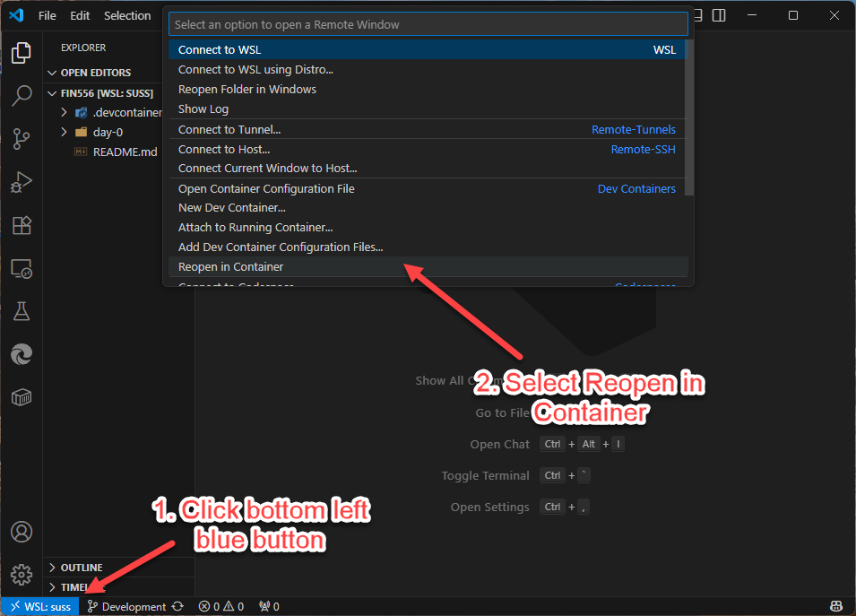

# Weekly Setup (At the Start of Class)

## Step 1. Get the Latest Course Materials

Each week, check for updates to the course materials by running the following commands in your terminal:

- Go to the FIN556 directory:

    ```bash
    cd ~/courses/FIN556
    ```

- Pull the latest changes from the repository:

    ```bash
    git pull
    ```

## Step 2. Open Visual Studio Code

**NOTE: Always make sure you are in the `~/courses/FIN556` directory before opening Visual Studio Code.**

Enter the following command in your terminal:

```bash
code .
```

---

## Step 3. Open the Repository in a Dev Container

### a) Install Dev Containers Extension

If the extension is already installed, skip to section b.

- Click on the Extensions icon in the sidebar (or press **Ctrl + Shift + X** on Windows or **Cmd + Shift + X** on macOS).
- Search for "Dev Containers" and click "Install".
- Task completed ✅.

### b) Open the Course Repository in a Dev Container

- **Prerequisites Check**
    - Ensure Docker Desktop is running
    - Ensure Visual Studio Code is installed with the Dev Containers extension
    - Ensure you have successfully cloned the FIN556 repository

1. Click "Reopen in Container" (or open the Command Palette with **Ctrl + Shift + P** on Windows or **Cmd + Shift + P** on macOS, then select **Dev Containers: Reopen in Container**).

    

2. VS Code will automatically:
    - Download the configured container image if it is not already available locally
    - Start the development container with its pre-installed tools
    - Install the configured VS Code extensions, including Solidity, Prettier, and ESLint

3. Wait for the container to start (this may take a few minutes on the first run).

4. Once complete, you should see:
    - The FIN556 project files in the explorer
    - A terminal with the development environment ready
    - Extensions automatically installed and active

---

## Step 4. Verify the Dev Container Setup

Dev containers allow you to develop inside a Docker container with the course's base tools pre-installed. This ensures a consistent development environment across different machines.

1. Open the integrated terminal in VS Code using **Terminal → New Terminal**.

2. Verify that the development tools are installed. The comments show example version output:

    ```bash
    node --version

     # v22.15.0

    npm --version

     # 10.9.2

    git --version

     # git version 2.34.1
    ```

3. Verify that `hardhat-shorthand` appears in the global package list (it will be used in the day-1 lessons). The comments show example output:

    ```bash
    npm ls -g

     #/usr/local/share/nvm/versions/node/v22.15.0/lib
     #├── corepack@0.32.0
     #├── hardhat-shorthand@1.1.0
     #└── npm@10.9.2
    ```

4. Task completed ✅.

---

## Troubleshooting

### Common Issues

These are some common issues you may encounter while setting up your development environment. If the suggested solutions do not work, search the web for more details.

**Docker Desktop not starting:**

- On Windows, ensure virtualization is enabled in BIOS/UEFI
- On Windows, ensure WSL2 is properly installed
- Restart your computer after installation
- Google "Docker Desktop not starting" for more help

**Dev container fails to start:**

- Check that Docker Desktop is running
- Ensure you have a stable internet connection
- Open the Command Palette and select **Dev Containers: Rebuild Container**
- Search for "Dev container fails to start" for more help

**VS Code extensions not working:**

- Open the Command Palette and select **Developer: Reload Window**
- Check if extensions are enabled
- Update VS Code to the latest version

**macOS-specific issues:**

- **Docker Desktop permission denied**: Follow any macOS permission prompts and check **System Settings → Privacy & Security**
- **Terminal command not found**: Check that the tool is installed and available in your terminal's `PATH`
- **Apple Silicon compatibility**: Download ARM64 versions of Docker Desktop and VS Code for M1/M2/M3/M4 Macs
- **File permissions in DevContainer**: If you encounter permission issues, try rebuilding the container

---

## About the Dev Container

This section describes the dev container's tools and configured VS Code extensions.

### a) Installed Tools

The following tools are pre-installed in the dev container:

- **Node.js**: JavaScript runtime for building blockchain applications.
- **npm**: Package manager for JavaScript.
- **Git**: Version control system for tracking changes in code.
- **hardhat-shorthand**: Global npm package that allows using `hh` instead of `npx hardhat` commands.

### b) Installed Visual Studio Code Extensions

The following Visual Studio Code extensions are automatically installed in the dev container:

- **Solidity (Juan Blanco)**: Language support for Solidity contracts.
- **Prettier**: Code formatter for consistent styling.
- **ESLint**: Linter for identifying and fixing code issues.
- **JavaScript (ES6) code snippets**: Enhances JavaScript development with useful snippets.
