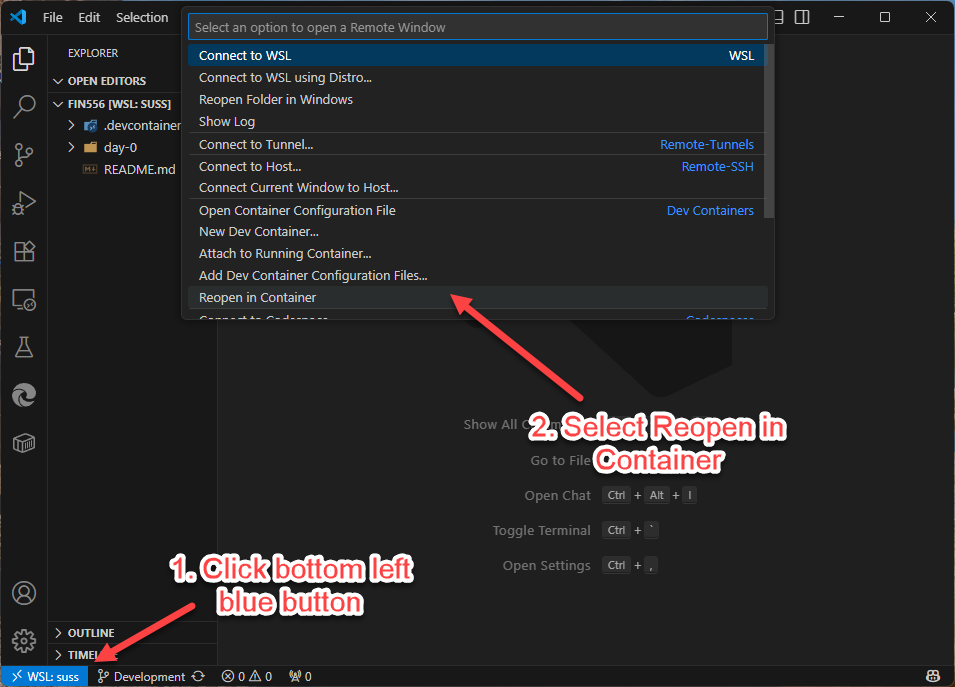

# Setup

## Overview

Please follow the steps below to set up your development environment for the course. This guide covers installation and configuration of all necessary tools and software.

-   [ ] Step 1. Setup terminal.
-   [ ] Step 2. Install Git.
-   [ ] Step 3. Clone FIN556 repository.
-   [ ] Step 4. Install Docker Desktop.
-   [ ] Step 5. Install Visual Studio Code.
-   [ ] Step 6. Verify DevContainer setup.

---

## Step 1. Setup Terminal

The purpose of this step is to standardize the terminal environment for all students in the class to use Linux-based commands. This is important because most blockchain development tools are designed to work in a Unix-like environment.

### a) For Windows Users

1. Install WSL2 (Windows Subsystem for Linux). Follow the official Microsoft guide **[here](https://learn.microsoft.com/en-us/windows/wsl/install)**.

    - During installation, choose Ubuntu **24.04 LTS**.
    - You will be prompted to create a username and password for your Linux environment. ⚠️ Remember these credentials as you'll need them later.

📌 NOTE: If you failed to install using the link above, try using the manual approach instead **[here](https://learn.microsoft.com/en-us/windows/wsl/install-manual)**

2. Install **[Windows Terminal](https://aka.ms/terminal)** from the Microsoft Store.

3. Open Windows Terminal, select Ubuntu from the dropdown, and confirm you can see a terminal prompt.

4. Task completed ✅.

### b) For macOS Users

1. Use the built-in "Terminal" application in macOS (no additional installation needed).

2. Find Terminal using one of these methods:

    - Press **Cmd + Space** and type **Terminal**
    - Go to Applications > Utilities > Terminal
    - Use Launchpad and search for **Terminal**

3. Open Terminal and confirm you see a command prompt with your username.

4. Task completed ✅.

**Note for Apple Silicon Macs (M1, M2, M3, M4)**: Ensure Docker Desktop and VS Code downloads are for Apple Silicon (ARM64) architecture.

---

## Step 2. Install Git

Git is a version control system that allows you to track changes in your code and collaborate with others. It's essential for downloading course materials and managing your project files.

### a) For Windows Users

1. Download Git for Windows from **[this link](https://git-scm.com/download/win)**.

2. Run the installer and follow the installation wizard with default settings.

3. Git for Windows includes Git for WSL2 integration.

4. Open Windows Terminal with WSL2 and verify installation:

    ```bash
    git --version
    ```

5. Task completed ✅.

### b) For macOS Users

1. Git is often pre-installed on macOS. Check if it's already installed:

    ```bash
    git --version
    ```

2. If not installed, you can install it via:

    - **Option 1**: Download from **[this link](https://git-scm.com/download/mac)**
    - **Option 2**: Install Xcode Command Line Tools:
        ```bash
        xcode-select --install
        ```

3. Verify installation:

    ```bash
    git --version
    ```

4. Task completed ✅.

---

## Step 3. Clone FIN556 Repository

Now that Git is installed, you need to clone the course repository which contains all the lab materials and project structure.

1. Open your terminal (Windows Terminal with WSL2 or macOS Terminal).

2. Navigate to a directory where you want to store the course materials:

    ```bash
    cd ~
    mkdir courses
    cd courses
    ```

3. Clone the FIN556 repository:

    ```bash
    git clone https://github.com/RoyLai-InfoCorp/FIN556.git
    ```

4. Navigate into the cloned repository:

    ```bash
    cd FIN556
    ```

5. Verify the repository contents:

    ```bash
    ls -la
    ```

    You should see the directory `day-0`.

6. Task completed ✅.

---

## Step 4. Install Docker Desktop

Docker Desktop is required for DevContainer functionality used in this course.

### For All Platforms

1. Download Docker Desktop from **[docker.com/products/docker-desktop](https://www.docker.com/products/docker-desktop/)**:

    - **Windows**: Choose the appropriate version (x86_64 or ARM64)
    - **macOS**: Choose Intel or Apple Silicon based on your Mac
    - **Linux**: Download the native Linux version

2. Follow the installation instructions for your operating system.

3. **Important for macOS users**: After installation, you may need to grant Docker Desktop permissions in System Preferences > Security & Privacy.

4. **For Windows users**: Ensure WSL2 integration is enabled in Docker Desktop settings.

5. Open Docker Desktop and ensure the whale icon shows "Docker Desktop is running" status.

6. Verify installation by opening terminal and running:

    ```bash
    docker --version
    ```

7. Task completed ✅.

---

## Step 5. Install Visual Studio Code

Visual Studio Code is a powerful code editor that provides excellent support for blockchain development and smart contract programming.

### a) Installation

1. Download Visual Studio Code from **[this link](https://code.visualstudio.com/)**.

2. Follow the installation instructions for your operating system.

3. Once installed, open Visual Studio Code.

### b) Install Dev Containers Extension

You only need to install the Dev Containers extension. All other blockchain development extensions will be automatically installed by the DevContainer when you open the course projects.

1. **Dev Containers** - Required for DevContainer setup

To install the extension:

-   Open VS Code
-   Click on the Extensions icon in the sidebar (or press **Ctrl + Shift + X**)
-   Search for "Dev Containers" and click "Install"

2. Task completed ✅.

---

## Step 6. Verify DevContainer Setup

DevContainers allow you to develop inside a Docker container with all necessary dependencies pre-installed. This ensures a consistent development environment across different machines.

### a) Prerequisites Check

1. Ensure Docker Desktop is running
2. Ensure Visual Studio Code is installed with Dev Containers extension
3. Ensure you have successfully cloned the FIN556 repository

### b) Open Course Repository in DevContainer

1. Open Visual Studio Code

2. Open the cloned FIN556 repository:

    - **Option 1**: Use File menu: **File > Open Folder** and navigate to your **~/courses/FIN556** directory
    - **Option 2**: From terminal in the FIN556 directory:
        ```bash
        cd ~/courses/FIN556
        code .
        ```

3. VS Code should detect the DevContainer configuration and show a popup asking "Reopen in Container"

4. Click "Reopen in Container" (or press **Ctrl + Shift + P** and type **Dev Containers: Reopen in Container**)

    

5. VS Code will automatically:

    - Build the development container
    - Install all required blockchain development tools
    - Install extensions (Solidity, Hardhat, etc.)
    - Set up the complete development environment

6. Wait for the container to build (this may take a few minutes on first run)

7. Once complete, you should see:
    - The FIN556 project files in the explorer
    - A terminal with the development environment ready
    - Extensions automatically installed and active

### c) Verify DevContainer Environment

1. Open the integrated terminal in VS Code (** Ctrl + ` **)

2. Verify the development tools are installed:

    ```bash
    node --version
    # Should show v18.x or higher
    npm --version
    # Should show v9.x or higher
    git --version
    # git version 2.34.1
    ```

3. Test that hardhat-shorthand is available (this will be used in day-1 lessons):

    ```bash
    hh --version
    # Should show Hardhat version
    ```

4. Task completed ✅.

---

## Step 7. Send Confirmation Email

Upon successful completion of all setup steps, please send a confirmation email to the course instructor indicating that your development environment is ready for class. Please include:

-   your full name
-   student identification number
-   Windows or macOS or others.

---

## About the DevContainer

This section is purely informational and describes the configuration and tools pre-installed in the DevContainer.

### a) Installed Tools

The following tools are pre-installed in the DevContainer:

-   **Node.js**: JavaScript runtime for building blockchain applications.
-   **npm**: Package manager for JavaScript.
-   **git**: Version control system for tracking changes in code.
-   **hardhat-shorthand**: Global npm package that allows using `hh` instead of `npx hardhat` commands.

### b) Installed Visual Studio Code Extensions

The following Visual Studio Code extensions are pre-installed in the DevContainer:

-   **Solidity (Juan Blanco)**: Language support for Solidity contracts.
-   **Prettier**: Code formatter for consistent styling.
-   **ESLint**: Linter for identifying and fixing code issues.
-   **JavaScript(ES6) code snippets**: Enhances JavaScript development with useful snippets.

---

## Troubleshooting

### Common Issues

These are some common issues you may encounter while setting up your development environment. The solutions are provided for convenience only. If the suggested actions does not work for you, please search on the web for more details.

**Docker Desktop not starting:**

-   Ensure virtualization is enabled in BIOS/UEFI
-   On Windows, ensure WSL2 is properly installed
-   Restart your computer after installation
-   Google "Docker Desktop not starting" for more help

**DevContainer fails to build:**

-   Check Docker Desktop is running
-   Ensure you have stable internet connection
-   Try rebuilding with **Ctrl + Shift + P** → **Dev Containers: Rebuild Container**
-   Google "DevContainer fails to build" for more help

**VS Code extensions not working:**

-   Reload VS Code window: **Ctrl + Shift + P** → **Developer: Reload Window**
-   Check if extensions are enabled
-   Update VS Code to latest version

**macOS-specific issues:**

-   **Docker Desktop permission denied**: Go to System Preferences > Security & Privacy > General and allow Docker
-   **Terminal command not found**: Ensure you're using the correct terminal (not zsh with restricted PATH)
-   **Apple Silicon compatibility**: Download ARM64 versions of Docker Desktop and VS Code for M1/M2/M3/M4 Macs
-   **File permissions in DevContainer**: If you encounter permission issues, try rebuilding the container
