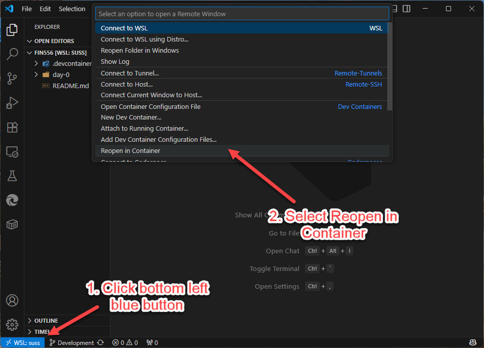
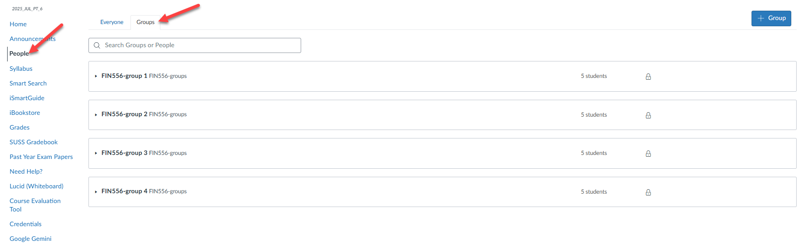

# 环境配置指南（15分钟完成）

## 概述

请按照以下步骤为您在本课程中的开发环境进行设置。本指南涵盖所有必要工具和软件的安装和配置。

-   [ ] 步骤 1. 配置终端。
-   [ ] 步骤 2. 安装 Git。
-   [ ] 步骤 3. 克隆 FIN556 仓库。
-   [ ] 步骤 4. 安装 Docker Desktop。
-   [ ] 步骤 5. 安装 Visual Studio Code。
-   [ ] 步骤 6. 验证 DevContainer 配置。 

---

## 步骤 1. 配置终端

📌 **注意：从现在开始，本指南中提到的"终端"对于 Windows/WSL2 用户指的是 Windows Terminal，对于 macOS 用户指的是原生的 Terminal 应用程序。**

此步骤的目的是标准化所有学生的终端环境，使用基于 Linux 的命令。这很重要，因为大多数区块链开发工具都设计用于类 Unix 环境。

-   **🪟 Windows 用户**

    1.  安装 WSL2（Windows Subsystem for Linux）。请按照 Microsoft 官方指南**[点击这里](https://learn.microsoft.com/en-us/windows/wsl/install)**进行操作。

        -   安装时，请选择 **Ubuntu 24.04 LTS**。
        -   系统将提示您为 Linux 环境创建用户名和密码。⚠️ 请记住这些凭据，因为稍后需要用到。

    📌 注意：如果使用上述链接安装失败，请尝试使用手动方法**[点击这里](https://learn.microsoft.com/en-us/windows/wsl/install-manual)**

    2.  从 Microsoft Store 安装 **[Windows Terminal](https://aka.ms/terminal)**。

    3.  打开 Windows Terminal，从下拉菜单中选择 **Ubuntu**，确认您可以看到终端提示符。

    4.  任务完成 ✅。

-   **🍎 macOS 用户**

    1.  无需安装任何额外软件，因为 macOS 自带终端应用程序。

    2.  使用以下方法之一查找终端：

        -   按 **Cmd + Space** 并输入 **Terminal**
        -   转到 Applications > Utilities > Terminal
        -   使用 Launchpad 并搜索 **Terminal**

    3.  打开终端，确认您可以看到带有用户名的命令提示符。

    4.  任务完成 ✅。

---

## 步骤 2. 检查您的架构

后续步骤可能需要您知道计算机的 CPU 架构（例如 x86_64 或 ARM64）。这对于下载正确版本的软件很重要。

-   **🪟 Windows 用户**

    1.  打开 **Windows Terminal**（已启用 WSL2）。
    2.  运行以下命令：

        ```bash
        uname -m
        ```

    3.  记下输出结果：

        -   如果显示 `x86_64`，您的架构是 x86_64。
        -   如果显示 `aarch64`，您的架构是 ARM64。

    4.  任务完成 ✅。

-   **🍎 macOS 用户**

    1.  打开 **终端**。
    2.  运行以下命令：

        ```bash
        uname -m
        ```

    3.  记下输出结果：

        -   如果显示 `x86_64`，您的架构是 x86_64（英特尔）。
        -   如果显示 `arm64`，您的架构是 ARM64（Apple Silicon）。

    4.  任务完成 ✅。

---

## 步骤 3. 安装 Git

Git 是一个版本控制系统，允许您跟踪代码更改并与他人协作。它是下载课程材料和管理项目文件所必需的。

-   **🪟 Windows 用户**

    1.  从 **[此链接](https://git-scm.com/download/win)** 下载 Git for Windows。

    2.  运行安装程序，使用默认设置进行安装。

    3.  Git for Windows 包含 Git for WSL2 集成。

    4.  打开带 WSL2 的 Windows Terminal 并验证安装：

        ```bash
        git --version
        ```

    5.  任务完成 ✅。

-   **🍎 macOS 用户**

    1.  Git 通常预装在 macOS 上。检查是否已安装：

        ```bash
        git --version
        ```

    2.  **仅在未安装的情况下**，可以通过以下方式安装：

        -   **选项 1**：从 **[此链接](https://git-scm.com/download/mac)** 下载
        -   **选项 2**：安装 Xcode Command Line Tools：
            ```bash
            xcode-select --install
            ```

    3.  验证安装：

        ```bash
        git --version
        ```

    4.  任务完成 ✅。

---

## 步骤 4. 安装 Docker Desktop

Docker Desktop 是本课程中 DevContainer 功能所必需的。
对于非技术用户来说，Docker 允许您在称为容器的隔离环境中运行应用程序。这对于确保所有学生无论主机操作系统是什么，都具有相同的开发环境至关重要。

### a) 下载 Docker Desktop

-   从官方下载页面下载 Docker Desktop：

    **👉 [docker.com/products/docker-desktop](https://www.docker.com/products/docker-desktop/)**

### b) 按操作系统安装

-   **🪟 Windows 用户**

    1.  根据 [步骤 2](#step-2-check-your-architecture) 中识别的架构，为您的系统下载正确版本：
        -   对于 **x86_64**，下载 x86_64 版本。
        -   对于 **aarch64**，下载 ARM64 版本。
    2.  运行安装程序，按照提示进行操作。
    3.  安装后，打开 **Docker Desktop → Settings → Resources → WSL Integration**，并**为您的 WSL2 发行版启用集成**。

-   **🍎 macOS 用户**

    1.  根据 [步骤 2](#step-2-check-your-architecture) 中识别的架构，为您的系统下载正确版本：
        -   英特尔 Mac（**x86_64**）→ 下载英特尔版本。
        -   Apple Silicon Mac（**ARM64**）→ 下载 Apple Silicon 版本。
    2.  运行安装程序，按照屏幕上的说明进行操作。
    3.  如果出现提示，请在以下位置授予权限：  
       **System Settings ▸ Privacy & Security ▸ Allow Docker Desktop。**

### c) 验证 Docker Desktop 安装

1.  启动 **Docker Desktop**。

    -   确保菜单栏中的鲸鱼 🐳 图标显示 "Docker Desktop is running"。

2.  打开 **终端**并运行：

    ```bash
    docker --version
    ```

    您应该看到一个版本号，例如 `Docker version 24.0.5, build 0a4c701`。

3.  任务完成 ✅。

---

## 步骤 4. 安装 Visual Studio Code

Visual Studio Code 是本课程中我们将用于开发的代码编辑器。

### a) 下载 Visual Studio Code

1.  从 **[此链接](https://code.visualstudio.com/)** 下载 Visual Studio Code。

### b) 按操作系统安装

-   **🪟 Windows 用户**

    使用默认安装选项继续。

-   **🍎 macOS 用户**

    按照以下步骤在终端中启用 `code` 命令：

    1.  将 **Visual Studio Code.app** 安装到您的 **Applications** 文件夹。
    2.  打开终端应用程序。
    3.  运行此命令。

        ```bash
        sudo ln -s "/Applications/Visual Studio Code.app/Contents/Resources/app/bin/code" /usr/local/bin/code
        ```

    4.  关闭并重新打开终端，然后测试：

        ```bash
        code .
        ```

---

## 步骤 5. 克隆 FIN556 仓库

**克隆**仓库意味着从 GitHub 将课程材料的副本下载到本地计算机。这些文件是所有实验练习和作业所必需的，并将每周更新。

1.  打开您的 **终端**（Windows Terminal 带 WSL2 或 macOS 终端）。

2.  进入您的主目录。

    ```bash
    cd ~
    ```

3.  创建一个 courses 目录（如果尚未创建）：

    注意：如果 `courses` 目录已存在，可以跳过此步骤。否则会报错。

    ```bash
    mkdir courses
    ```

4.  进入 `courses` 目录：

    ```bash
    cd courses
    ```

5.  从 GitHub 克隆 FIN556 仓库：

    注意：确保 FIN556 按如下所示大写。

    ```bash
    git clone https://github.com/RoyLai-InfoCorp/FIN556.git
    ```

6.  验证 courses 目录包含 `FIN556` 文件夹：

    ```bash
    ls -la
    ```

7.  进入 FIN556 目录：

    ```bash
    cd FIN556
    ```

8.  验证 FIN556 目录包含 `day-0` 文件夹：

    ```bash
    ls -la
    ```

9.  任务完成 ✅。

## 步骤 6. 更新 FIN556 仓库

在后续几周，您可以直接通过运行以下命令进入 `FIN556` 目录：

```bash
cd ~/courses/FIN556
```

然后，要使用最新课程材料更新本地仓库，请运行：

```bash
git pull
```

## 步骤 5. 在 Visual Studio Code 中打开仓库

继续前一步，在终端中输入以下命令：

```bash
code .
```

这将在 Visual Studio Code 中打开 FIN556 仓库，其中包含您所有的实验练习和作业。

---

## 步骤 6. 在 DevContainer 中打开仓库

### a) 安装 Dev Containers 扩展

-   单击侧边栏中的扩展图标（或按 **Ctrl + Shift + X**）
-   搜索 "Dev Containers" 并点击 "Install"
-   任务完成 ✅。

### b) 为 DevContainer 配置平台（仅限 macOS 或 ARM64 用户）

**注意：** 请参考之前的 [步骤 2](#step-2-check-your-architecture) 来识别您的架构。

仅当您的计算机架构为 **aarch64**（Apple Silicon Mac 或 ARM64 Windows PC）时才需要以下说明。如果您的架构是 **x86_64**，可以跳过此部分。

-   在 **.devcontainer** 目录中创建一个名为 **docker-compose.override.yml** 的文件。
-   将以下内容添加到文件中：

    ```yaml
    services:
        devcontainer:
        platform: linux/arm64
    ```

### c) 在 DevContainer 中打开课程仓库

-   **先决条件检查**

    -   确保 Docker Desktop 正在运行
    -   确保已安装带 Dev Containers 扩展的 Visual Studio Code
    -   确保您已成功克隆 FIN556 仓库

1.  点击 "Reopen in Container"（或按 **Ctrl + Shift + P** 并输入 **Dev Containers: Reopen in Container**）

    

2.  VS Code 将自动：

    -   构建开发容器
    -   安装所有必需的区块链开发工具
    -   安装扩展（Solidity、Hardhat 等）
    -   设置完整的开发环境

3.  等待容器构建（首次运行可能需要几分钟）

4.  完成后，您应该看到：
    -   资源管理器中的 FIN556 项目文件
    -   已准备好开发环境的终端
    -   已自动安装并激活的扩展

---

## 步骤 7. 验证 DevContainer 设置

DevContainers 允许您在具有所有必要依赖项预装的 Docker 容器中进行开发。这确保了不同机器之间的一致开发环境。

1.  在 VS Code 中打开集成终端（**Ctrl + `**）

2.  验证开发工具已安装：

    ```bash
    node --version

     # v22.15.0

    npm --version

     # 10.9.2

    git --version

     # git version 2.34.1
    ```

3.  测试 hardhat-shorthand 是否可用（这将在第 1 天的课程中使用）：

    ```bash
    npm ls -g

     #/usr/local/share/nvm/versions/node/v22.15.0/lib
     #├── corepack@0.32.0
     #├── hardhat-shorthand@1.1.0
     #└── npm@10.9.2
    ```

4.  任务完成 ✅。

---

## 步骤 8. 在 Canvas 上找到您的学生组

1.  登录 Canvas

2.  进入您的课程网站（例如 FIN556_JUL25_L01）

3.  点击左侧菜单中的 "People"

4.  点击 "Groups" 标签

    

5.  找到您被分配的组（每组最多 5 人）。

---

## 步骤 9. 发送确认邮件

完成所有设置步骤后，请向课程讲师发送一封确认邮件，表明您的开发环境已准备好上课。请包括：

-   您的全名
-   学生证号
-   Windows 或 macOS 或其他操作系统
-   您被分配的学生组（来自步骤 7）

---

## 关于 DevContainer

本节仅为信息性内容，描述了 DevContainer 中预装的配置和工具。

### a) 已安装的工具

DevContainer 中预装了以下工具：

-   **Node.js**：用于构建区块链应用程序的 JavaScript 运行时。
-   **npm**：JavaScript 的包管理器。
-   **git**：用于跟踪代码更改的版本控制系统。
-   **hardhat-shorthand**：全局 npm 包，允许使用 `hh` 而不是 `npx hardhat` 命令。

### b) 已安装的 Visual Studio Code 扩展

DevContainer 中预装了以下 Visual Studio Code 扩展：

-   **Solidity (Juan Blanco)**：Solidity 合约的语言支持。
-   **Prettier**：用于一致样式的代码格式化工具。
-   **ESLint**：用于识别和修复代码问题的检查器。
-   **JavaScript(ES6) code snippets**：通过有用的代码片段增强 JavaScript 开发。

---

## 故障排除

### 常见问题

以下是您在设置开发环境时可能遇到的一些常见问题。提供的解决方案仅供方便。如果建议的操作对您不起作用，请在网上搜索更多详细信息。

**Docker Desktop 无法启动：**

-   确保在 BIOS/UEFI 中启用了虚拟化
-   在 Windows 上，确保 WSL2 已正确安装
-   安装后重启计算机
-   Google "Docker Desktop not starting" 获取更多帮助

**DevContainer 构建失败：**

-   检查 Docker Desktop 是否正在运行
-   确保您有稳定的网络连接
-   尝试使用 **Ctrl + Shift + P** → **Dev Containers: Rebuild Container** 重新构建
-   Google "DevContainer fails to build" 获取更多帮助

**VS Code 扩展不工作：**

-   重新加载 VS Code 窗口：**Ctrl + Shift + P** → **Developer: Reload Window**
-   检查扩展是否已启用
-   更新 VS Code 到最新版本

**macOS 特定问题：**

-   **Docker Desktop 权限被拒绝**：转到 System Preferences > Security & Privacy > General 并允许 Docker
-   **终端命令找不到**：确保您使用的是正确的终端（不是带有受限 PATH 的 zsh）
-   **Apple Silicon 兼容性**：为 M1/M2/M3/M4 Mac 下载 ARM64 版本的 Docker Desktop 和 VS Code
-   **DevContainer 中的文件权限**：如果遇到权限问题，请尝试重建容器
