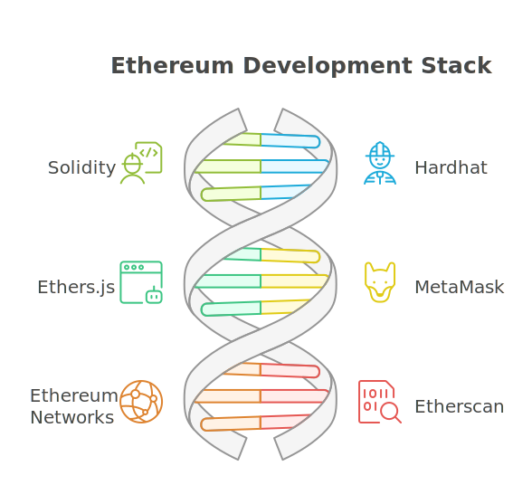

# Development Stack

## 1. Overview

Before diving into the programming aspect of Ethereum smart contracts, we first need to become familiar with the core tools we will use in this course. The development stack is not limited to these tools—there are many alternatives available—but the following combination is among the most widely used in practice, and is therefore the focus of this course:



-   **Solidity** - A programming language for writing smart contracts.
    (https://docs.soliditylang.org/en/v0.8.20/grammar.html)

-   **Hardhat** - A framework for compiling, deploying, and testing smart contracts.
    (https://hardhat.org/getting-started/)

-   **Ethers.js** - A Javascript library for interacting with smart contracts
    (https://docs.ethers.org/v6/)

-   **MetaMask** - A browser wallet for Decentralized Applications (DApps) (https://metamask.io/)

-   **Ethereum Networks** - An environment to deploy and interact with smart contracts.

-   **Etherscan** - A block explorer to view transactions and contract details. (https://etherscan.io/)

_Note: Other tools such as Truffle, Web3.js, and Ganache are also commonly used in Ethereum development, but this course will emphasize Hardhat, Ethers.js, and MetaMask because they represent one of the most popular and modern combinations in practice._

---

## 2. Hardhat - Development Environment


**Hardhat** (we will use **HH** for short in this course) is a **development environment** for Ethereum smart contracts. It provides the platform for compiling, deploying, starting up a development blockchain, and testing smart contracts. There are other development environments available, such as **Truffle** and **Remix**, but Hardhat is currently the industry standard.

📌 This provides the infrastructure for your smart contract development workflow.

## 3. Ethers.js - JavaScript Library


**Ethers.js** is a Javascript **library** for interacting with Ethereum smart contracts. It serves as the bridge between your JavaScript code and the Ethereum blockchain, providing a clean, modern interface for blockchain operations. There are other libraries available, such as **Web3.js**, but Ethers.js is currently the industry standard.

📌 This enables your code to interact with the blockchain.

Both Hardhat as the infrastructure and Ethers.js as the library are designed to work together for Ethereum development.

---

## 4. Hardhat Console - Interactive Development Console

To get a feel for how to interact with the blockchain network using Javascript, we will use the **Hardhat Console**.

This is particularly useful for:

-   **Quick Testing:** Rapidly test contract functions and blockchain interactions
-   **Learning:** Experiment with blockchain concepts without writing full scripts
-   **Debugging:** Investigate contract state and behavior interactively
-   **Prototyping:** Try out ideas before implementing them in applications

The console provides full access to your development environment, including deployed contracts, account management, and blockchain state inspection.

---

## 🛠️ Lab Practice: Using Hardhat Console

1.  **Create Node.js Project**

    ```bash
    cd /workspace/day-1/01-development-stack
    npm init -y
    ```

    This should create a `package.json` file.

    When you install packages, they will be added to this file.

2.  **Install Hardhat and Ethers.js Libraries**

    Run the commands below to install Hardhat and Ethers.js locally. It is recommended to install these libraries locally to the project rather than globally to avoid version conflicts between different projects in future.

    ```bash
    npm i -D hardhat@2.22.15 ethers@6.13.2 @nomicfoundation/hardhat-ethers@3.0.8
    ```

    **NOTE:** A directory named `node_modules` should be created in your project folder. This is where the installed packages are stored.

    We also install a tool that allow us to use Hardhat commands by typing `hh` instead of `npx hardhat`. This is installed globally one time since it is just a command line shortcut.

    ```bash
    npm i -g hardhat-shorthand
    ```

    **package.json** should now include:

    ```javascript
    "devDependencies": {
        "@nomicfoundation/hardhat-ethers": "^3.0.8",
        "ethers": "^6.13.2",
        "hardhat": "^2.22.15"
    }
    ```

3.  **Create Configuration File**

    Create a file named `hardhat.config.js` with the following content:

    **hardhat.config.js**

    ```javascript
    require("@nomicfoundation/hardhat-ethers");
    module.exports = {
        solidity: "0.8.20",
    };
    ```

    This specifies the Solidity compiler version to use and loads the Ethers.js plugin for Hardhat. This setting can affect contract compatibility, so ensure it matches the version you plan to use.

4.  **Start Console (New Terminal)**

    Enter the following command in the terminal.

    ```bash
     hh console

     # expected output:
     # Welcome to Node.js v22.15.0.
     # Type ".help" for more information.
     # >
    ```

    This will open an interactive console app that lets you enter JavaScript commands after the `>` prompt.

5.  **Using Console**

    The following commands are a simple demonstration of how to use the console and not so much about the details of each command. You will learn more about these commands in later parts of the course.

    -   **Import Ethers plugin**

        Enter the following command in the console after the `>` prompt:

        ```javascript
        > const { ethers } = require("hardhat");

        // expected output:
        // undefined
        ```

    -   **Get Network Accounts**

        Hardhat Network comes with 20 built-in dummy accounts for testing. The following command retrieves the list into the `accounts` variable.

        ```javascript
        > accounts = await ethers.getSigners();

        // expected output:
        // [
        // HardhatEthersSigner {
        //    _gasLimit: 30000000,
        //    address: '0xf39Fd6e51aad88F6F4ce6aB8827279cffFb92266',
        //    provider: HardhatEthersProvider {
        //  ...
        ```

    -   **Default Wallet address**

        The first account in the array is the default account used for transactions.

        ```javascript
        > accounts[0].address;

        // Sample:
        // "0xf39Fd6e51aad88F6F4ce6aB8827279cffFb92266"
        ```

    -   **Send ETH**

        Send 1 ETH from the default account to the second account in the array. `10n ** 18n` refers to 10 to the power of 18 units of **wei** which represents 1 ETH.

        ```javascript
        > await accounts[0].sendTransaction({
            to: accounts[1].address,
            value: 10n ** 18n,
        });
        // Sample:
        //
        // TransactionResponse {
        // provider: HardhatEthersProvider {
        //     ...
        //     to: '0x70997970C51812dc3A010C7d01b50e0d17dc79C8',
        //     from: '0xf39Fd6e51aad88F6F4ce6aB8827279cffFb92266',
        //     nonce: 0,
        //     ...
        //     value: 1000000000000000000n,
        //     ...
        // }

        ```

    -   **Check Balance**

        Check the balance of the second account. Every dummy account in Hardhat Network starts with 10,000 ETH. After sending 1 ETH from the default account, the balance should now be 10,001 ETH (10001 followed by 18 zeros in wei).

        ```javascript
        > await ethers.provider.getBalance(accounts[1].address);
        // Sample:
        // 10001000000000000000000n
        ```

6.  **Task completed ✅** and you can now exit the console by typing pressing `Ctrl + C` twice.

---

## 5. MetaMask - Browser Wallet for DApps


The premise of Decentralized Applications (DApps) and web3 ultimately is having the ability to interact with the blockchain without any intermediaries. That means private keys must only be managed by the users on the client-side and not on any server or third-party service. MetaMask provides this functionality by securing the user's private keys locally within the browser extension.

NOTE: A large part of the course will be using Hardhat Network which manages the private keys for you for learning purposes. You will learn about MetaMask integration at a later stage in the course.

---

## 6. Ethereum Networks

When developing smart contracts, you’ll work with different types of Ethereum networks depending on your stage of testing and deployment. These range from local networks for rapid iteration to public environments that closely mimic real-world conditions.

-   Hardhat (in-process): Built-in local blockchain that runs automatically with Hardhat commands.

-   Hardhat (standalone): Manually started local blockchain, accessible to external tools like MetaMask.

-   Public Testnet: Shared Ethereum-like network using free test ETH for safe trial deployments.

-   Mainnet: Live Ethereum network with real ETH and irreversible transactions.

---

### a) Hardhat Network

https://hardhat.org/hardhat-network/reference

#### In-Process Network

In the earlier Lab Session, we interacted with a blockchain network without needing to set up or configure anything. This is because Hardhat comes with a built-in blockchain network called the **Hardhat Network (in-process)** that spins up automatically when you run Hardhat commands and is shut down when the command completes.

#### Standalone Network

Hardhat Network can also be run as a standalone network that runs independently from Hardhat commands. This is useful when you want to interact with the network using other tools, such as MetaMask or custom deployment scripts.

---

### b) Public Testnet (Hoodi)

Every public testnet has a codename and each generation of testnet will deprecate the previous generation. The current generation of public testnet is called **Hoodi**.

A public test network for testing contracts before deploying to mainnet. Useful for analyzing contract behavior, gas costs, and performance in a real-world environment without risking real funds.

https://github.com/eth-clients/hoodi

Understanding public testnets is crucial for the complete development workflow:

-   **Mainnet Similarity:** Closely mimics Ethereum's mainnet parameters
-   **Purpose-Built:** Testing before mainnet hard forks and upgrades
-   **Free Testing:** Uses "Hoodi Ether" which has no real-world value
-   **Faucet Access:** Test Ether can be obtained for free from faucets
-   **Public Environment:** Shared testing environment with other developers
-   **Gas Costs:** Transactions incur gas costs, simulating real-world conditions
-   **Contract Integration:** Allows interaction with other deployed contracts

### c) Ethereum Mainnet


The Ethereum Mainnet is the primary public Ethereum production blockchain where real value is transacted. It is the live network where users interact with smart contracts and decentralized applications (DApps) using real Ether (ETH).

Mainnet Characteristics

-   **Real Value:** Transactions involve real economic value
-   **Decentralized:** Operated by a global network of nodes
-   **Secure:** High security due to widespread participation
-   **Public:** Open for anyone to join and participate
-   **Immutable:** Once deployed, smart contracts cannot be changed

---

## 🛠️ Lab Practice: Hardhat Standalone Network

-   **Start Hardhat Network**

    ```bash
    hh node
    ```

-   **Expected Output:**

    -   JSON-RPC server at http://0.0.0.0:8545/
    -   20 accounts with 10,000 ETH each
    -   Account addresses and private keys
    -   Continuous operation (keep terminal open)

-   **Example Account:**

    ```
    Account #0: 0xf39Fd6e51aad88F6F4ce6aB8827279cffFb92266 (10000 ETH)
    Private Key: 0xac0974bec39a17e36ba4a6b4d238ff944bacb478cbed5efcae784d7bf4f2ff80
    ```

-   **Connect Hardhat Console to Local Network (New Terminal)**

    You need to open a new terminal window while keeping the previous terminal running the network. In the new terminal, enter the following command:

    ```bash
    hh console --network localhost
    ```

-   **Get Network Accounts**

    ```javascript
    accounts = await ethers.getSigners();
    accounts[0].address;
    // Sample:
    // "0xf39Fd6e51aad88F6F4ce6aB8827279cffFb92266"
    ```

-   Compare the address returned with the first account listed in the terminal running the Hardhat Network. They should match.

-   **Task completed ✅** and you can shut down the Hardhat Network by pressing `Ctrl + C` in the terminal running the network. Then exit the console in the other terminal by pressing `Ctrl + C` twice.

---
