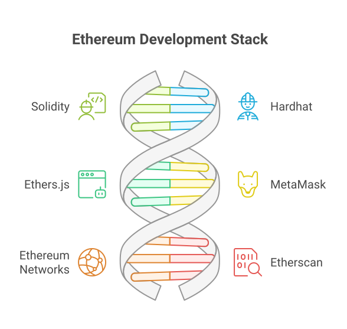

# 开发工具栈

## 1. 概述

在深入学习以太坊智能合约编程之前，我们首先需要熟悉本课程中将使用的核心工具。开发工具栈不仅限于这些工具——还有许多替代方案可用——但以下组合是实际应用中最广泛使用的，因此也是本课程的重点：



-   **Solidity** - 用于编写智能合约的编程语言。
    (https://docs.soliditylang.org/en/v0.8.20/grammar.html)

-   **Hardhat** - 用于编译、部署和测试智能合约的框架。
    (https://hardhat.org/getting-started/)

-   **Ethers.js** - 用于与智能合约交互的 JavaScript 库
    (https://docs.ethers.org/v6/)

-   **MetaMask** - 用于去中心化应用（DApps）的浏览器钱包 (https://metamask.io/)

-   **以太坊网络** - 部署和交互智能合约的环境。

-   **Etherscan** - 用于查看交易和合约详情的区块浏览器。 (https://etherscan.io/)

_注意：其他工具如 Truffle、Web3.js 和 Ganache 在以太坊开发中也常用，但本课程将重点介绍 Hardhat、Ethers.js 和 MetaMask，因为它们代表了实际应用中最流行和现代的组合之一。_

---

## 2. Hardhat - 开发环境


**Hardhat**（在本课程中简称 **HH**）是以太坊智能合约的**开发环境**。它提供了编译、部署、启动开发区块链和测试智能合约的平台。还有其他可用的开发环境，如 **Truffle** 和 **Remix**，但 Hardhat 目前是行业标准。

📌 这为您的智能合约开发工作流程提供了基础设施。

## 3. Ethers.js - JavaScript 库


**Ethers.js** 是用于与以太坊智能合约交互的 JavaScript **库**。它作为 JavaScript 代码和以太坊区块链之间的桥梁，为区块链操作提供简洁、现代的接口。还有其他可用的库，如 **Web3.js**，但 Ethers.js 目前是行业标准。

📌 这使您的代码能够与区块链交互。

Hardhat 作为基础设施和 Ethers.js 作为库，两者都设计为协同工作，用于以太坊开发。

---

## 4. Hardhat Console - 交互式开发控制台

为了感受如何使用 JavaScript 与区块链网络交互，我们将使用 **Hardhat Console**。

这特别适用于：

-   **快速测试**：快速测试合约功能和区块链交互
-   **学习**：无需编写完整脚本即可尝试区块链概念
-   **调试**：交互式调查合约状态和行为
-   **原型设计**：在应用程序中实现之前尝试想法

控制台提供对开发环境的完全访问，包括已部署合约、账户管理和区块链状态检查。

---

## 🛠️ 实验实践：使用 Hardhat Console

1.  **创建 Node.js 项目**

    ```bash
    cd /workspace/day-1/01-development-stack
    npm init -y
    ```

    这应该创建一个 `package.json` 文件。

    当您安装软件包时，它们将被添加到此文件中。

2.  **安装 Hardhat 和 Ethers.js 库**

    运行以下命令在本地安装 Hardhat 和 Ethers.js。建议将这些库安装在项目本地，而不是全局安装，以避免未来不同项目之间的版本冲突。

    ```bash
    npm i -D hardhat@2.22.15 ethers@6.13.2 @nomicfoundation/hardhat-ethers@3.0.8
    ```

    **注意：** 应该在您的项目文件夹中创建一个名为 `node_modules` 的目录。这是安装的软件包存储的位置。

    我们还安装了一个工具，允许我们通过输入 `hh` 而不是 `npx hardhat` 来使用 Hardhat 命令。这是一个全局安装一次的工具，因为它只是一个命令行快捷方式。

    ```bash
    npm i -g hardhat-shorthand@hh2
    ```

    **package.json** 现在应该包括：

    ```javascript
    "devDependencies": {
        "@nomicfoundation/hardhat-ethers": "^3.0.8",
        "ethers": "^6.13.2",
        "hardhat": "^2.22.15"
    }
    ```

3.  **创建配置文件**

    创建一个名为 `hardhat.config.js` 的文件，内容如下：

    **hardhat.config.js**

    ```javascript
    require("@nomicfoundation/hardhat-ethers");
    module.exports = {
        solidity: "0.8.20",
    };
    ```

    这指定了要使用的 Solidity 编译器版本，并加载了 Hardhat 的 Ethers.js 插件。此设置可能影响合约兼容性，因此请确保它与您计划使用的版本匹配。

4.  **启动控制台（新终端）**

    在终端中输入以下命令。

    ```bash
     hh console

     # 预期输出：
     # Welcome to Node.js v22.15.0.
     # Type ".help" for more information.
     # >
    ```

    这将打开一个交互式控制台应用程序，让您在 `>` 提示符后输入 JavaScript 命令。

5.  **使用控制台**

    以下命令简单演示了如何使用控制台，并非每个命令的详细说明。您将在课程的后续部分了解更多关于这些命令的信息。

    -   **导入 Ethers 插件**

        在控制台中 `>` 提示符后输入以下命令：

        ```javascript
        > const { ethers } = require("hardhat");

        // 预期输出：
        // undefined
        ```

    -   **获取网络账户**

        Hardhat Network 内置了 20 个用于测试的虚拟账户。以下命令将列表检索到 `accounts` 变量中。

        ```javascript
        > accounts = await ethers.getSigners();

        // 预期输出：
        // [
        // HardhatEthersSigner {
        //    _gasLimit: 30000000,
        //    address: '0xf39Fd6e51aad88F6F4ce6aB8827279cffFb92266',
        //    provider: HardhatEthersProvider {
        //  ...
        ```

    -   **默认钱包地址**

        数组中的第一个账户是用于交易的默认账户。

        ```javascript
        > accounts[0].address;

        // 示例：
        // "0xf39Fd6e51aad88F6F4ce6aB8827279cffFb92266"
        ```

    -   **发送 ETH**

        从默认账户向数组中的第二个账户发送 1 ETH。`10n ** 18n` 表示 10 的 18 次方 wei，即 1 ETH。

        ```javascript
        > await accounts[0].sendTransaction({
            to: accounts[1].address,
            value: 10n ** 18n,
        });
        // 示例：
        //
        // TransactionResponse {
        // provider: HardhatEthersProvider {
        //     ...
        //     to: '0x70997970C51812dc3A010C7d01b50e0d17dc79C8',
        //     from: '0xf39Fd6e51aad88F6F4ce6aB8827279cffFb92266',
        //     nonce: 0,
        //     ...
        //     value: 1000000000000000000n,
        //     ...

        ```

    -   **检查余额**

        检查第二个账户的余额。Hardhat Network 中的每个虚拟账户初始有 10,000 ETH。从默认账户发送 1 ETH 后，余额现在应为 10,001 ETH（10001 后面跟 18 个零的 wei）。

        ```javascript
        > await ethers.provider.getBalance(accounts[1].address);
        // 示例：
        // 10001000000000000000000n
        ```

6.  **任务完成 ✅** 您可以按两次 `Ctrl + C` 退出控制台。

---

## 5. MetaMask - DApps 浏览器钱包


去中心化应用（DApps）和 web3 的前提是能够无需任何中介与区块链交互。这意味着私钥必须仅由用户在客户端管理，而不是在任何服务器或第三方服务上。MetaMask 通过在浏览器扩展中本地保护用户的私钥来提供此功能。

注意：本课程的很大一部分将使用 Hardhat Network，它为您学习目的管理私钥。您将在课程的后面阶段了解 MetaMask 集成。

---

## 6. 以太坊网络

在开发智能合约时，您将根据测试和部署的不同阶段使用不同类型的以太坊网络。这些网络从用于快速迭代的本地网络到模拟真实世界条件的公共环境。

-   Hardhat（进程内）：随 Hardhat 命令自动运行的内置本地区块链。
-   Hardhat（独立）：手动启动的本地区块链，可被外部工具（如 MetaMask）访问。
-   公共测试网：使用免费测试 ETH 的共享以太坊类网络，用于安全试用部署。
-   主网：使用真实 ETH 且交易不可逆的实时以太坊网络。

---

### a) Hardhat Network

https://hardhat.org/hardhat-network/reference

#### 进程内网络

在之前的实验课程中，我们无需设置或配置任何内容即可与区块链网络交互。这是因为 Hardhat 自带了一个名为 **Hardhat Network（进程内）** 的内置区块链网络，它在您运行 Hardhat 命令时自动启动，并在命令完成时关闭。

#### 独立网络

Hardhat Network 也可以作为独立网络运行，独立于 Hardhat 命令。这在您想使用其他工具（如 MetaMask 或自定义部署脚本）与网络交互时非常有用。

---

### b) 公共测试网 (Hoodi)

每个公共测试网都有一个代号，每一代测试网都会淘汰上一代。当前一代的公共测试网称为 **Hoodi**。

一个用于在主网部署前测试合约的公共测试网络。用于在真实环境中分析合约行为、Gas 成本和性能，而无需承担真实资金的风险。

https://github.com/eth-clients/hoodi

理解公共测试网对于完整的开发工作流程至关重要：

-   **主网相似性：** 紧密模仿以太坊主网参数
-   **专用目的：** 在主网硬分叉和升级前进行测试
-   **免费测试：** 使用"Hoodi Ether"，无现实世界价值
-   **水龙头访问：** 可以从水龙头免费获取测试 Ether
-   **公共环境：** 与其他开发者共享测试环境
-   **Gas 成本：** 交易会产生 Gas 成本，模拟真实世界条件
-   **合约集成：** 允许与其他已部署合约交互

### c) 以太坊主网


以太坊主网是主要的公共以太坊生产区块链，在其中进行真实价值交易。它是用户使用真实以太（ETH）与智能合约和去中心化应用（DApps）交互的实时网络。

主网特点

-   **真实价值：** 交易涉及真实经济价值
-   **去中心化：** 由全球节点网络运营
-   **安全：** 由于广泛参与而具有高安全性
-   **公开：** 任何人都可以加入和参与
-   **不可变：** 智能合约一旦部署就无法更改

---

## 🛠️ 实验实践：Hardhat 独立网络

-   **启动 Hardhat 网络**

    ```bash
    hh node
    ```

-   **预期输出：**

    -   JSON-RPC 服务器在 http://0.0.0.0:8545/
    -   20 个账户，每个有 10,000 ETH
    -   账户地址和私钥
    -   持续运行（保持终端打开）

-   **示例账户：**

    ```
    Account #0: 0xf39Fd6e51aad88F6F4ce6aB8827279cffFb92266 (10000 ETH)
    Private Key: 0xac0974bec39a17e36ba4a6b4d238ff944bacb478cbed5efcae784d7bf4f2ff80
    ```

-   **将 Hardhat Console 连接到本地网络（新终端）**

    您需要在保持前一个终端运行网络的同时打开一个新的终端窗口。在新终端中输入以下命令：

    ```bash
    hh console --network localhost
    ```

-   **获取网络账户**

    ```javascript
    accounts = await ethers.getSigners();
    accounts[0].address;
    // 示例：
    // "0xf39Fd6e51aad88F6F4ce6aB8827279cffFb92266"
    ```

-   将返回的地址与运行 Hardhat Network 的终端中列出的第一个账户进行比较。它们应该匹配。

-   **任务完成 ✅** 您可以通过在运行网络的终端中按 `Ctrl + C` 来关闭 Hardhat Network。然后在另一个终端中按两次 `Ctrl + C` 退出控制台。

---

（完）
