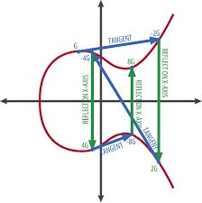

# Accounts and Addresses

## 1. Ethereum Addresses

Ethereum addresses are made up of 20 bytes and are represented as hexadecimal strings, e.g., 0xf39Fd6e51aad88F6F4ce6aB8827279cffFb92266.

-   The prefix `0x` denotes a hexadecimal string,
-   Every two characters represent one byte (total 42 characters long).

Ethereum uses addresses in two ways:

-   **Externally Owned Accounts (EOAs)**: Addresses used for human wallets that are controlled by private keys
-   **Contract Accounts**: Addresses used for smart contracts that are controlled by code

The main difference is that EOAs require private keys that must be known and kept safe by the wallet user, while contract accounts are controlled by their code logic.

---

## 🛠️ Lab Practice: Generating a new Ethereum Account

-   **Install packages**

    ```bash
    /workspace/day-1/02-accounts-and-addresses
    npm i
    ```

-   **run Hardhat Console**

    ```bash
    hh console
    ```

-   **Generate a new wallet**

    Enter the following commands line by line after the `>` prompt:

    ```javascript
    > const { ethers } = require("hardhat");
    > const wallet = ethers.Wallet.createRandom();
    ```

-   **Get the wallet address**

    ```javascript
    > wallet.address
    // output
    // '0x815dA86F4B01e53292541592E82f1FDdDB37038A'
    ```

-   **Get the private key**

    ```javascript
    > wallet.privateKey
    // output
    // 0x8132dae6f139bc7d1a6308843d9df9062f49943aeb2dc600eadd9485ef872d1f
    ```

---

## 2. Addresses and Private Keys

Ethereum addresses are derived from the public key, which in turn is derived from a private key which is a 32-byte (2^256) random number.

The process involves:

1. Generating a random private key (32 bytes) - k

2. Deriving the public key using the Elliptic Curve Digital Signature Algorithm (ECDSA) and secp256k1 curve.

    

    The secp256k1 curve is defined by the equation:

    ```
    y^2 = x^3 + 7 (mod p)
    ```

    where the constant p is a 256-bit prime number that fixes the allowable range of x and y coordinates.

    The secp256k1 standard also defines a base point G on the curve. The process of deriving the public key can be visualized geometrically as the process of "walking" along the elliptic curve in a specific way starting from G. The resulting point on the curve after k (private key) steps is the public key. This allows for very efficient computation of the public key from the private key, while making it computationally infeasible to reverse the process (i.e., derive the private key from the public key).

3. Hashing the public key using the Keccak-256 hashing algorithm
4. Taking the last 20 bytes of the hash to form the address

---

## 🛠️ Lab Practice: Derive Address from Private Key [Optional]

This lab is optional and for those who want to dive deeper into the cryptographic details.

-   **Derive public key from private key**

    ```javascript
    > const pubKey = ethers.SigningKey.computePublicKey(wallet.privateKey, false);
    ```

-   **Drop the version byte**

    ```javascript
    > const pubKeyNoPrefix = "0x" + pubKey.slice(4);
    ```

-   **Hash the public key using Keccak-256**

    ```javascript
    > const hash = ethers.keccak256(pubKeyNoPrefix);
    ```

-   **Take the last 20 bytes (40 hexadecimal characters) to get the address**

    ```javascript
    > const derivedAddress = "0x" + hash.slice(-40)
    // sample output
    // 0x815da86f4b01e53292541592e82f1fdddb37038a
    ```

    This is the exact same address as the one generated in previous lab.

    ```javascript
    > wallet.address
    //'0x815dA86F4B01e53292541592E82f1FDdDB37038A'
    ```

---

## 3. Address Uniqueness and Collisions

The probability of two different private keys generating the same address is astronomically low due to the vast keyspace (2^256 possible private keys). This makes address collisions practically impossible in real-world scenarios.

**Quiz: How many atoms are there in our Sun?**

**Answer: Roughly 10^57 atoms.**

Now, if we frame private key collision probability using the birthday problem analogy:

-   The total possible private keys (2^256) are equivalent to the combined atoms of about 120 quintillion Suns (1.2 x 10^20 Suns).
-   A collision would be about as likely as randomly picking two identical atoms out of all the atoms spread across those Suns.

---

## 4. Checksummed Addresses

Ethereum addresses can be written in two ways as shown in the previous 2 labs:

-   **Lowercase format**: e.g., `0x815da86f4b01e53292541592e82f1fdddb37038a`
-   **Checksummed format**: e.g., `0x815dA86F4B01e53292541592E82f1FDdDB37038A`

Both represent the same address since hexadecimal is case-insensitive, but the checksummed version provides error detection capabilities.
The address returned by most Ethereum libraries (like ethers.js) is in checksummed format.

### Why Use Checksummed Addresses

Checksummed addresses help prevent costly mistakes by:

-   **Error Detection**: Invalid checksums indicate potential typos
-   **Industry Standard**: Most tools and services expect checksummed addresses
-   **Security**: Reduces risk of sending funds to wrong addresses

### Methods to Generate Checksummed Addresses

1. **Using Etherscan**: Search with any address format and get checksummed result
2. **Using ethers.js**: `ethers.getAddress(address)` function
3. **Manual Validation**: Tools can verify checksum correctness

## 🛠️ Lab Practice: Create Checksummed Address

-   **Use ethers library to convert lowercase address to checksummed address**

    ```javascript

    // Convert to checksummed
    > ethers.getAddress("0x815da86f4b01e53292541592e82f1fdddb37038a");

    // Output:
    // '0x815dA86F4B01e53292541592E82f1FDdDB37038A'
    ```

-   **Task completed ✅** You can exit the console by pressing `Ctrl + C` twice.
