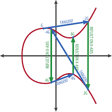

# 账户和地址

## 1. 以太坊地址

以太坊地址由 20 个字节组成，表示为十六进制字符串，例如 0xf39Fd6e51aad88F6F4ce6aB8827279cffFb92266。

-   前缀 `0x` 表示十六进制字符串，
-   每两个字符代表一个字节（总共 42 个字符）。

以太坊地址有两种用途：

-   **外部拥有账户（EOAs）**：用于由私钥控制的个人钱包的地址
-   **合约账户**：用于由代码控制的智能合约的地址

主要区别在于，EOA 需要钱包妥善保管的私用户必须知道并钥，而合约账户由其代码逻辑控制。

---

## 🛠️ 实验实践：生成新的以太坊账户

-   **安装软件包**

    ```bash
    /workspace/day-1/02-accounts-and-addresses
    npm i
    ```

-   **运行 Hardhat Console**

    ```bash
    hh console
    ```

-   **生成新钱包**

    在 `>` 提示符后逐行输入以下命令：

    ```javascript
    > const { ethers } = require("hardhat");
    > const wallet = ethers.Wallet.createRandom();
    ```

-   **获取钱包地址**

    ```javascript
    > wallet.address
    // 输出
    // '0x815dA86F4B01e53292541592E82f1FDdDB37038A'
    ```

-   **获取私钥**

    ```javascript
    > wallet.privateKey
    // 输出
    // 0x8132dae6f139bc7d1a6308843d9df9062f49943aeb2dc600eadd9485ef872d1f
    ```

---

## 2. 地址和私钥

以太坊地址来源于公钥，公钥则来源于私钥，私钥是一个 32 字节（2^256）的随机数。

过程包括：

1. 生成随机私钥（32 字节）- k

2. 使用椭圆曲线数字签名算法（ECDSA）和 secp256k1 曲线派生公钥。

    

    secp256k1 曲线由以下方程定义：

    ```
    y^2 = x^3 + 7 (mod p)
    ```

    其中常数 p 是一个 256 位素数，限定了 x 和 y 坐标的允许范围。

    secp256k1 标准还定义了曲线上的一个基点 G。派生公钥的过程可以从几何上理解为从 G 开始沿椭圆曲线"走"特定方式的过程。走 k 步（私钥）后曲线上的结果点就是公钥。这允许非常高效地从私钥计算公钥，同时使反向推导过程（即从公钥派生私钥）在计算上不可行。

3. 使用 Keccak-256 哈希算法对公钥进行哈希
4. 取哈希的最后 20 个字节形成地址

---

## 🛠️ 实验实践：从私钥派生地址 [可选]

此实验是可选的，供想深入了解密码学细节的人使用。

-   **从私钥派生公钥**

    ```javascript
    > const pubKey = ethers.SigningKey.computePublicKey(wallet.privateKey, false);
    ```

-   **删除版本字节**

    ```javascript
    > const pubKeyNoPrefix = "0x" + pubKey.slice(4);
    ```

-   **使用 Keccak-256 对公钥进行哈希**

    ```javascript
    > const hash = ethers.keccak256(pubKeyNoPrefix);
    ```

-   **取最后 20 个字节（40 个十六进制字符）获取地址**

    ```javascript
    > const derivedAddress = "0x" + hash.slice(-40)
    // 示例输出
    // 0x815da86f4b01e53292541592e82f1fdddb37038a
    ```

    这与上一个实验中生成的地址完全相同。

    ```javascript
    > wallet.address
    //'0x815dA86F4B01e53292541592E82f1FDdDB37038A'
    ```

---

## 3. 地址唯一性和碰撞

由于密钥空间巨大（2^256 个可能的私钥），两个不同私钥生成相同地址的概率极低。这使得地址碰撞在现实世界中实际上不可能发生。

**测验：太阳中有多少个原子？**

**答案：大约 10^57 个原子。**

现在，如果我们用生日问题类比来分析私钥碰撞概率：

-   可能的私钥总数（2^256）相当于约 1.2 亿亿（1.2 x 10^20）个太阳的原子总和。
-   碰撞的概率就像从散布在所有这些太阳中的所有原子中随机挑选两个相同的原子一样。

---

## 4. 校验和地址

以太坊地址可以以前面两个实验中显示的两种方式编写：

-   **小写格式**：例如 `0x815da86f4b01e53292541592e82f1fdddb37038a`
-   **校验和格式**：例如 `0x815dA86F4B01e53292541592E82f1FDdDB37038A`

两者表示相同的地址，因为十六进制不区分大小写，但校验和版本提供错误检测功能。
大多数以太坊库（如 ethers.js）返回的地址都是校验和格式。

### 为什么使用校验和地址

校验和地址通过以下方式帮助防止代价高昂的错误：

-   **错误检测**：无效校验和表示可能有拼写错误
-   **行业标准**：大多数工具和服务期望校验和地址
-   **安全性**：降低将资金发送到错误地址的风险

### 生成校验和地址的方法

1. **使用 Etherscan**：使用任何地址格式搜索，获取校验和结果
2. **使用 ethers.js**：`ethers.getAddress(address)` 函数
3. **手动验证**：工具可以验证校验和的正确性

## 🛠️ 实验实践：创建校验和地址

-   **使用 ethers 库将小写地址转换为校验和地址**

    ```javascript

    // 转换为校验和
    > ethers.getAddress("0x815da86f4b01e53292541592e82f1fdddb37038a");

    // 输出：
    // '0x815dA86F4B01e53292541592E82f1FDdDB37038A'
    ```

-   **任务完成 ✅** 您可以按两次 `Ctrl + C` 退出控制台。
