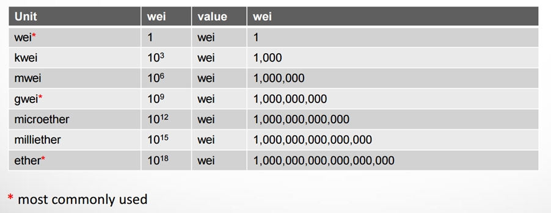

# Ethers

## 1. Ether (ETH)

-   **Ether (ETH)** is the native cryptocurrency of Ethereum. While Bitcoin's (the cryptocurrency) primary purpose is for value transfer or peer-to-peer electronic cash on the Bitcoin network, Ether's main utility is for running computations on the Ethereum blockchain.

-   When a block is mined, miners receive a **mining reward** in Ether (ETH). This is how ETH is minted and added to circulation.

-   Besides the mining rewards, ETH is also used by transaction senders to compensate miners for the computational resources consumed to run their transactions.

## 2. Ether Denominations

-   The standard unit used in Ethereum is wei.
-   ETH prices are quoted for Ether = 10^18 wei (18 decimals).
-   Gas prices are quoted in Gwei = 10^9 wei (9 decimals).
-   ERC20 units (token amount) are generally quoted in wei = 1 wei.

    

The following section list some commonly used ethers.js functions to convert between different ether denominations and to send ETH transactions.

---

### Convert a string to wei - ethers.parseUnits() function

You can use ethers.js to convert any ether denominations to wei. This is commonly used to convert human input based on `ether` to contract input based on `wei`.

-   **Syntax:**

    ```js

    ethers.parseUnits(valueString , decimalsOrUnitName) => BigInt

    ```

-   **Example:**

    ```js

    > ethers.parseUnits("1", "ether");
    // 1000000000000000000n

    ```

---

### Convert from wei to string - ethers.formatUnits() function

You can use ethers.js to convert from wei to any ether denominations. This is commonly used to convert contract output based on `wei` to human output based on `ether`.

-   **Syntax:**

    ```js
    utils.formatUnits(wei , decimalsOrUnitName) => string
    ```

-   **Example:**

    ```js
    > ethers.formatUnits(1000000000000000000n, "ether");
    // '1.0'
    ```

## 3. ETH Transactions

The following are the main steps to send ETH from one account to another using ethers.js:

1. Obtain a **signer** to connect with Ethereum account
2. Check ETH balance with **getBalance()** to ensure sufficient funds
3. Execute **sendTransaction()** to send ETH from one account to another
4. Wait for transaction to be mined with **wait()** to get the transaction receipt

### a) Get Signer - ethers.getSigners() function

To send ETH, you need to get the account (signer) containing the private key and the ETH balance. A signer is basically an account that can sign transactions (refer to lesson on **Accounts and Addresses** for more details).

-   **Syntax:**

    ```js

    ethers.getSigners() => Promise<array<Signer>>

    ```

-   **Example:**
    The following example is used to get all accounts in the network wallet.

    ```js

    > accounts = await ethers.getSigners();
    > accounts[0]
    // Wallet {
    //    address: '0x...',
    //    _signingKey: [Function (anonymous)],
    //    provider: Provider { ... }
    //}

    ```

### b) Check ETH balance - provider.getBalance() function

You can use ethers.js to check an address' ETH balance.

-   **Syntax:**

    ```js

    ethers.provider.getBalance(address[,blockTag=latest]) => Promise<BigInt>

    ```

-   **Example:**

    The following example is used to check the balance of accounts[0] in the network wallet.

    ```js

    > await ethers.provider.getBalance(accounts[0].address);
    // output: 10000000000000000000000n

    ```

---

### c) Send ETH - account.sendTransaction() function

You can use ethers.js to transfer ETH from a given account.

-   **Syntax:**

    ```js

    signer.sendTransaction(transactionRequest) =>  Promise<TransactionResponse>

    ```

-   **What is a transactionRequest?**

    A transactionRequest is a JavaScript object with the following fields:

    -   **to**: The recipient address (string)
    -   **value**: The amount of ETH to send (BigInt)
    -   **gasLimit**: (Optional) The maximum amount of gas units that can be consumed by the transaction (BigInt)
    -   **gasPrice**: (Optional) The price (in wei) per unit of gas (BigInt)
    -   **data**: (Optional) The data payload for the transaction (string)
    -   **nonce**: (Optional) The transaction count for the sender's address (number)

    For sending ETH, you only need to specify the `to` and `value` fields. The other fields will be automatically populated by ethers.js if not provided.

-   **Example:**

    -   The example below sends 1 wei from accounts[0] to accounts[1] of the network wallet.

        ```js

        > tx = await accounts[0].sendTransaction(
            {
                to: accounts[1].address,
                value:1
            }
        )
        // output:
        // TransactionResponse {
        //     hash: '0x...',
        //     nonce: 0,
        //     gasLimit: BigNumber { value: "21000" },
        //     gasPrice: BigNumber { value: "20000000000" },
        //     to: '0x...',
        //     value: BigNumber { value: "1" },
        //     data: '0x',
        //     chainId: 31337,
        //     ...
        // }

        ```

    -   After calling sendTransaction() and receiving a TransactionResponse object, it means your transaction is not rejected by the provider but this doesn't mean the transaction has been mined yet. You can still find useful information from the TransactionResponse object such as the transaction hash, gas limit, gas price, etc.

### d) Confirm Transaction - transactionResponse.wait() function

To wait for the transaction to be mined, you can call the wait() function on the TransactionResponse object. This returns a TransactionReceipt object.
One important field in the TransactionReceipt object is gasUsed which tells you how much gas was actually used to mine the transaction.

-   **Syntax:**

    ```js

    transactionResponse.wait([confirmations=1]) => Promise<TransactionReceipt>

    ```

-   **Example:**

    ```js

    > receipt = await tx.wait();

    // output:
    //TransactionReceipt {
    //    ...
    //    gasUsed: 21000n,
    //    ...
    //}

    ```

    The TransactionReceipt object contains useful information about the mined transaction such as the actual gas used.

**NOTE:** When you send ETH, you pay two costs:

-   **Transfer Amount**: The actual ETH you're sending to the recipient
-   **Gas Fee**: The cost to execute the transaction on the Ethereum network

We will cover gas fees in more details in lesson on **Transactions and Gas**.

---

## 🛠️ Lab: Send ETH

-   **Install project dependencies**

    ```bash
    cd /workspace/day-1/03-ethers
    npm i
    ```

-   **Start Local Network**

    ```bash
    hh node
    ```

-   **Connect Hardhat Console to Local Network (New Terminal)**

    You need to open a new terminal window while keeping the previous terminal running the network. In the new terminal, enter the following command:

    ```bash
    hh console --network localhost
    ```

-   **Import Ethers plugin**

    Enter the following command in the console after the `>` prompt:

    ```javascript
    > const { ethers } = require("hardhat");
    ```

-   **Load the accounts.**

    ```js
    > accounts = await ethers.getSigners();
    ```

-   **Get ETH balance of accounts[0]**

    ```js
    > before = await ethers.provider.getBalance(accounts[0].address);
    // output:
    //10000000000000000000000n
    ```

-   **Convert from ether to wei**

    In lesson 1, we sent 1 ETH using the notation `10n**18n`. The proper way is to use the ethers.js function `parseUnits()` to convert 0.1 ETH to wei.

    ```js
    > amt = ethers.parseUnits('0.1','ether')
    100000000000000000n
    ```

-   **Send 0.1 ETH to accounts[1]**

    Note that TransactionResponse is returned immediately after calling sendTransaction(). In reality, the transaction is still pending and has not been validated yet.

    ```js
    > tx = await accounts[0].sendTransaction({
        to: accounts[1].address,
        value:amt
    });

    // output:
    // TransactionResponse {
    //  ...
    //  hash: '0x...',
    //  to: '0x70997970C51812dc3A010C7d01b50e0d17dc79C8',
    //  from: '0xf39Fd6e51aad88F6F4ce6aB8827279cffFb92266',
    //  nonce: 0,
    //  gasLimit: 30000000n,
    //  gasPrice: 20000000000n,
    //  maxPriorityFeePerGas: 1000000000n,
    //  maxFeePerGas: 1107421875n,
    //  value: 100000000000000000n,
    //  data: '0x',
    ```

    Results that are important to note:

    -   **hash**: This is the unique identifier for the transaction. Use this to check transaction status on Etherscan.
    -   **to**: The recipient address you are sending ETH to.
    -   **value**: The amount of ETH (in wei) you are sending to the recipient.

    Results that are useful to note:

    -   **nonce**: This is an incremental counter tied to your account. We will show how to use this to fix forever pending transactions later.
    -   **gasLimit**: A value you set to prevent your transaction from using too much gas. We will cover this in contract deployment later.
    -   **gasPrice**: The price (in wei) you are willing to pay for each unit of gas. We will cover this in the lesson on Transactions and Gas along with **maxPriorityFeePerGas** and **maxFeePerGas**.

-   **Wait for transaction to be mined and get the receipt**

    Run the following command to wait for the transaction to be validated. This returns a TransactionReceipt object.

    ```js
    > receipt = await tx.wait();

    // output:
    // TransactionReceipt {
    //    ...
    //    to: '0x70997970C51812dc3A010C7d01b50e0d17dc79C8',
    //    from: '0xf39Fd6e51aad88F6F4ce6aB8827279cffFb92266',
    //    ...
    //    gasUsed: 21000n,
    //    ...
    //    cumulativeGasUsed: 21000n,
    //    gasPrice: 1107421875n,
    //    ...
    //    }
    ```

    Once the transaction is validated, we are able to see the actual gas used to validate the transaction in the `gasUsed` field.

-   **Get ETH balance of accounts[0] again**

    ```js
    > after = await ethers.provider.getBalance(accounts[0].address);
    // output:
    // 9999899976744140625000n
    ```

-   **Compare balance before and after**

    ```js
    > deduction = before - after
    100023255859375000n
    ```

-   **Convert from wei to ether**

    ```js
    > ethers.formatUnits(deduction,"ether")
    '0.100023255859375'
    ```

-   **Quiz**

    Why is the amount deducted more than 0.1 ETH?
