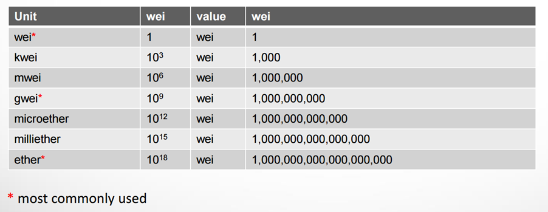

# Ethers

## 1. 以太 (ETH)

-   **以太 (ETH)** 是以太坊的原生加密货币。虽然比特币（这种加密货币）的主要目的是在比特币网络上进行价值转移或点对点电子现金，但以太的主要用途是在以太坊区块链上运行计算。

-   当一个区块被挖出时，矿工获得以太（ETH）作为**挖矿奖励**。这是 ETH 被铸造并进入流通的方式。

-   除了挖矿奖励外，ETH 还被交易发送者用于补偿运行其交易所消耗的计算资源。

## 2. 以太单位

-   以太坊使用的标准单位是 wei。
-   ETH 价格以 Ether = 10^18 wei（18 位小数）报价。
-   Gas 价格以 Gwei = 10^9 wei（9 位小数）报价。
-   ERC20 代币单位通常以 wei = 1 wei 报价。

    

以下部分列出了一些常用的 ethers.js 函数，用于在不同以太单位之间转换以及发送 ETH 交易。

---

### 将字符串转换为 wei - ethers.parseUnits() 函数

您可以使用 ethers.js 将任何以太单位转换为 wei。这常用于将基于 `ether` 的人类输入转换为基于 `wei` 的合约输入。

-   **语法：**

    ```js

    ethers.parseUnits(valueString , decimalsOrUnitName) => BigInt

    ```

-   **示例：**

    ```js

    > ethers.parseUnits("1", "ether");
    // 1000000000000000000n

    ```

---

### 从 wei 转换为字符串 - ethers.formatUnits() 函数

您可以使用 ethers.js 将 wei 转换为任何以太单位。这常用于将基于 `wei` 的合约输出转换为基于 `ether` 的人类输出。

-   **语法：**

    ```js
    utils.formatUnits(wei , decimalsOrUnitName) => string
    ```

-   **示例：**

    ```js
    > ethers.formatUnits(1000000000000000000n, "ether");
    // '1.0'
    ```

## 3. ETH 交易

使用 ethers.js 将 ETH 从一个账户发送到另一个账户的主要步骤如下：

1. 获取一个**签名者**以连接以太坊账户
2. 使用 **getBalance()** 检查 ETH 余额以确保有足够的资金
3. 执行 **sendTransaction()** 将 ETH 从一个账户发送到另一个账户
4. 使用 **wait()** 等待交易被挖掘以获取交易收据

### a) 获取签名者 - ethers.getSigners() 函数

要发送 ETH，您需要获取包含私钥和 ETH 余额的账户（签名者）。签名者基本上是一个可以签署交易的账户（有关更多详细信息，请参阅**账户和地址**课程）。

-   **语法：**

    ```js

    ethers.getSigners() => Promise<array<Signer>>

    ```

-   **示例：**
    以下示例用于获取网络钱包中的所有账户。

    ```js

    > accounts = await ethers.getSigners();
    > accounts[0]
    // Wallet {
    //    address: '0x...',
    //    _signingKey: [Function (anonymous)],
    //    provider: Provider { ... }
    //}

    ```

### b) 检查 ETH 余额 - provider.getBalance() 函数

您可以使用 ethers.js 检查地址的 ETH 余额。

-   **语法：**

    ```js

    ethers.provider.getBalance(address[,blockTag=latest]) => Promise<BigInt>

    ```

-   **示例：**

    以下示例用于检查网络钱包中 accounts[0] 的余额。

    ```js

    > await ethers.provider.getBalance(accounts[0].address);
    // 输出: 10000000000000000000000n

    ```

---

### c) 发送 ETH - account.sendTransaction() 函数

您可以使用 ethers.js 从给定账户转移 ETH。

-   **语法：**

    ```js

    signer.sendTransaction(transactionRequest) =>  Promise<TransactionResponse>

    ```

-   **什么是 transactionRequest？**

    transactionRequest 是一个具有以下字段的 JavaScript 对象：

    -   **to**：接收者地址（字符串）
    -   **value**：要发送的 ETH 数量（BigInt）
    -   **gasLimit**：（可选）交易可以消耗的最大 Gas 单位数量（BigInt）
    -   **gasPrice**：（可选）每单位 Gas 的价格（以 wei 为单位）（BigInt）
    -   **data**：（可选）交易的数据负载（字符串）
    -   **nonce**：（可选）发送者地址的交易计数（数字）

    对于发送 ETH，您只需指定 `to` 和 `value` 字段。如果未提供，其他字段将由 ethers.js 自动填充。

-   **示例：**

    -   以下示例从网络钱包的 accounts[0] 向 accounts[1] 发送 1 wei。

        ```js

        > tx = await accounts[0].sendTransaction(
            {
                to: accounts[1].address,
                value:1
            }
        )
        // 输出：
        // TransactionResponse {
        //     hash: '0x...',
        //     nonce: 0,
        //     gasLimit: BigNumber { value: "21000" },
        //     gasPrice: BigNumber { value: "20000000000" },
        //     to: '0x...',
        //     value: BigNumber { value: "1" },
        //     data: '0x',
        //     chainId: 31337,
        //     ...
        // }

        ```

    -   调用 sendTransaction() 并收到 TransactionResponse 对象后，意味着您的交易没有被提供商拒绝，但这并不意味着交易已经被挖掘。您仍然可以从 TransactionResponse 对象中找到有用的信息，如交易哈希、Gas 限制、Gas 价格等。

### d) 确认交易 - transactionResponse.wait() 函数

要等待交易被挖掘，您可以调用 TransactionResponse 对象上的 wait() 函数。这返回一个 TransactionReceipt 对象。
TransactionReceipt 对象中的一个重要字段是 gasUsed，它告诉您实际挖掘交易使用了多少 Gas。

-   **语法：**

    ```js

    transactionResponse.wait([confirmations=1]) => Promise<TransactionReceipt>

    ```

-   **示例：**

    ```js

    > receipt = await tx.wait();

    // 输出：
    //TransactionReceipt {
    //    ...
    //    gasUsed: 21000n,
    //    ...
    //}

    ```

    TransactionReceipt 对象包含有关已挖掘交易的有用信息，如实际使用的 Gas。

**注意：** 当您发送 ETH 时，您需要支付两笔费用：

-   **转账金额**：您实际发送给接收者的 ETH
-   **Gas 费**：在以太坊网络上执行交易的成本

我们将在**交易和 Gas**课程中更详细地介绍 Gas 费。

---

## 🛠️ 实验：发送 ETH

-   **安装项目依赖**

    ```bash
    cd /workspace/day-1/03-ethers
    npm i
    ```

-   **启动本地网络**

    ```bash
    hh node
    ```

-   **将 Hardhat Console 连接到本地网络（新终端）**

    您需要在保持前一个终端运行网络的同时打开一个新的终端窗口。在新终端中输入以下命令：

    ```bash
    hh console --network localhost
    ```

-   **导入 Ethers 插件**

    在控制台中 `>` 提示符后输入以下命令：

    ```javascript
    > const { ethers } = require("hardhat");
    ```

-   **加载账户。**

    ```js
    > accounts = await ethers.getSigners();
    ```

-   **获取 accounts[0] 的 ETH 余额**

    ```js
    > before = await ethers.provider.getBalance(accounts[0].address);
    // 输出:
    //10000000000000000000000n
    ```

-   **从 ether 转换为 wei**

    在第一课中，我们使用符号 `10n**18n` 发送了 1 ETH。正确的方法是使用 ethers.js 函数 `parseUnits()` 将 0.1 ETH 转换为 wei。

    ```js
    > amt = ethers.parseUnits('0.1','ether')
    100000000000000000n
    ```

-   **向 accounts[1] 发送 0.1 ETH**

    请注意，调用 sendTransaction() 后会立即返回 TransactionResponse。实际上，交易仍然待处理，尚未验证。

    ```js
    > tx = await accounts[0].sendTransaction({
        to: accounts[1].address,
        value:amt
    });

    // 输出：
    // TransactionResponse {
    //  ...
    //  hash: '0x...',
    //  to: '0x70997970C51812dc3A010C7d01b50e0d17dc79C8',
    //  from: '0xf39Fd6e51aad88F6F4ce6aB8827279cffFb92266',
    //  nonce: 0,
    //  gasLimit: 30000000n,
    //  gasPrice: 20000000000n,
    //  maxPriorityFeePerGas: 1000000000n,
    //  maxFeePerGas: 1107421875n,
    //  value: 100000000000000000n,
    //  data: '0x',
    ```

    需要注意的结果：

    -   **hash**：这是交易的唯一标识符。使用它可以在 Etherscan 上检查交易状态。
    -   **to**：您发送 ETH 的接收者地址。
    -   **value**：您发送给接收者的 ETH 数量（以 wei 为单位）。

    有用的结果：

    -   **nonce**：这是一个与您的账户绑定的增量计数器。稍后我们将展示如何使用它来修复永远待处理的交易。
    -   **gasLimit**：您设置的一个值，用于防止您的交易使用过多 Gas。我们将在合约部署中介绍这一点。
    -   **gasPrice**：您愿意为每单位 Gas 支付的价格（以 wei 为单位）。我们将在交易和 Gas 课程中与 **maxPriorityFeePerGas** 和 **maxFeePerGas** 一起介绍这一点。

-   **等待交易被挖掘并获取收据**

    运行以下命令等待交易被验证。这返回一个 TransactionReceipt 对象。

    ```js
    > receipt = await tx.wait();

    // 输出：
    // TransactionReceipt {
    //    ...
    //    to: '0x70997970C51812dc3A010C7d01b50e0d17dc79C8',
    //    from: '0xf39Fd6e51aad88F6F4ce6aB8827279cffFb92266',
    //    ...
    //    gasUsed: 21000n,
    //    ...
    //    cumulativeGasUsed: 21000n,
    //    gasPrice: 1107421875n,
    //    ...
    //    }
    ```

    一旦交易被验证，我们就能够在 `gasUsed` 字段中看到验证交易实际使用的 Gas。

-   **再次获取 accounts[0] 的 ETH 余额**

    ```js
    > after = await ethers.provider.getBalance(accounts[0].address);
    // 输出：
    // 9999899976744140625000n
    ```

-   **比较前后的余额**

    ```js
    > deduction = before - after
    100023255859375000n
    ```

-   **从 wei 转换为 ether**

    ```js
    > ethers.formatUnits(deduction,"ether")
    '0.100023255859375'
    ```

-   **测验**

    为什么扣除的金额超过 0.1 ETH？
