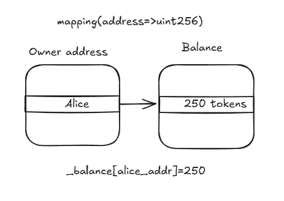
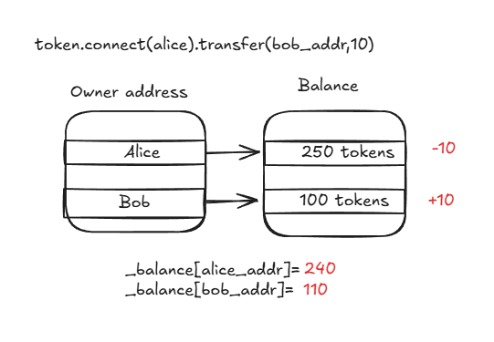
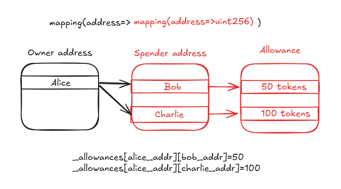
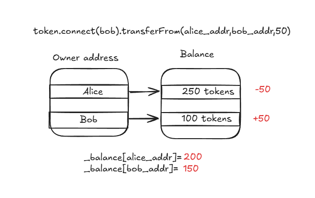

# ERC20 代币标准基础

在本课程中，我们将学习如何实现 ERC20 代币标准，这是以太坊上使用最广泛的代币标准。本课程假设您熟悉 Solidity 基础语法和概念。

---

## 1. ERC20 代币标准介绍

在以太坊语境中，"代币"是代表数字资产的智能合约的通用术语。原生代币或货币是指用于操作区块链的内置加密货币，也称为协议代币。在以太坊的例子中，这就是 ETH。

除了协议代币之外，还有由满足不同目的的智能合约合成的代币。以太坊上最常见的代币类型称为 ERC20 代币。

ERC 代表以太坊征求意见稿，这是一种在以太坊上为智能合约设定标准的方式。这个标准对于允许以太坊上的智能合约相互交互是必要的。ERC20 代币的官方规范可以在这里找到 **https://eips.ethereum.org/EIPS/eip-20**。

ERC20 代币是构建同质化代币的模板。同质化意味着合约中的所有代币总是具有相同的价值并且可以完全互换，就像货币一样。这个代币标准在 2017 年以太坊 ICO 时代的高峰期获得了流行，至今仍是当代合约设计的核心。

**注意：** ERC20 代币有很多变体，增加了新功能，但所有 ERC20 代币必须实现相同的基本规范。

根据规范（**https://eips.ethereum.org/EIPS/eip-20**），标准的 ERC20 代币合约必须实现：

-   6 个只读函数

    ```solidity
    function name() public view returns (string)
    function symbol() public view returns (string)
    function decimals() public view returns (uint8)
    function totalSupply() public view returns (uint256)
    function balanceOf(address _owner) public view returns (uint256 balance)
    function allowance(address _owner, address _spender) public view returns (uint256 remaining)

    ```

-   3 个状态修改函数

    ```solidity

    function transfer(address _to, uint256 _value) public returns (bool success)

    function transfer(address _to, uint256 _value) public returns (bool success)
    function transferFrom(address _from, address _to, uint256 _value) public returns
    function approve(address _spender, uint256 _value) public returns (bool success)

    ```

-   2 个事件

    ```solidity
    event Transfer(address indexed _from, address indexed _to, uint256 _value);
    event Approval(address indexed _owner, address indexed _spender, uint256 _value);
    ```

---

## 2. ERC20 构造函数

构造函数的目的是在合约部署时初始化合约的状态变量，这不在 ERC20 标准中定义。

通常，ERC20 代币构造函数会接受以下参数：

```solidity
constructor(string memory name_, string memory symbol_, uint256 totalSupply_, address owner_)
```

其中：

-   `name_` 是代币的名称
-   `symbol_` 是代币的符号
-   `totalSupply_` 是代币的初始总供应量
-   `owner_` 是接收代币初始总供应量的地址

创建 ERC20 代币的过程通常称为"铸造"代币。在这个基础实现中，我们将在合约部署时将全部代币供应量铸造到所有者的地址。

---

## 3. 只读函数

根据规范，合约必须包含以下 6 个只读函数：

-   **name()** 此函数以字符串形式返回代币的名称。

    ```solidity
    function name() public view returns (string memory)
    ```

-   **symbol()** 此函数以字符串形式返回代币的符号（通常为 3-4 个字符）。

    ```solidity
    function symbol() public view returns (string memory)
    ```

-   **decimals()** 此函数返回此代币数量可以支持的小数位数。由于这个值惯例上是 18，所以我们将返回 18，而不是创建状态变量以节省 Gas 成本。

    ```solidity
    function decimals() public pure returns (uint8)
    ```

-   **totalSupply()** 此函数以无符号 32 位整数形式返回流通中的代币总供应量。

    ```solidity
    function totalSupply() public view returns (uint256)
    ```

-   **balanceOf()** 此函数以无符号 32 位整数形式返回地址 `_owner` 持有的代币余额。

    ```solidity
    function balanceOf(address _owner) public view returns (uint256 balance)
    ```

-   **allowance()** 此函数以无符号 32 位整数形式返回允许 `_spender` 从 `_owner` 提取的限额。

    ```solidity
    function allowance(address _owner, address _spender) public view returns (uint256 remaining)
    ```

---

## 4. 状态修改函数

-   **transfer()** 此函数将 `_value` 数量的代币发送到地址 `_to`，并返回一个表示成功的布尔值。**此函数由代币持有者调用**

    ```solidity
    function transfer(address _to, uint256 _value) external virtual returns (bool success)
    ```

-   **transferFrom()** 此函数根据批准的限额从持有者地址 `_from` 向花费者地址 `_to` 提取 `_value` 数量的代币。
    **注意：**
    **1. 此函数与 approve() 函数结合使用。**
    **2. 此函数由花费者调用，而非代币持有者。**

    ```solidity
    function transferFrom(address _from, address _to, uint256 _value) external virtual returns (bool success)
    ```

-   **approve()** 此函数为 `_spender` 设置从调用者账户提取 `_value` 数量的批准限额。它返回一个表示成功的布尔值。
    **注意：**
    **1. 此函数与 transferFrom() 函数结合使用。**
    **2. 此函数由代币持有者调用，而非花费者。**

    ```solidity
    function approve(address _spender, uint256 _value) external virtual returns (bool success)
    ```

---

## 🛠️ 实验实践：创建 DemoToken

在这个实验中，我们将从头开始实现一个符合 ERC20 标准的代币合约，称为 **DemoToken**，规格如下：

> -   名称：DemoToken
> -   符号：DEMO
> -   总供应量：1,000 DEMO（18 位小数）

1.  **安装项目依赖**

    ```bash
    cd /workspace/day-2/07-erc20-basic
    npm i
    ```

2.  **创建 DemoToken**

    在 `contracts` 目录中创建一个名为 `DemoToken.sol` 的新文件。

    **contracts/DemoToken.sol**

    ```solidity
    // SPDX-License-Identifier: MIT
    pragma solidity 0.8.20;

    contract DemoToken {

        uint256 _totalSupply;

        mapping(address=>uint256) _balances;

        mapping(address=>mapping(address=>uint256)) _allowances;

    }
    ```

    合约包含以下状态变量：

    -   `_totalSupply`：一个 uint256 变量，用于存储代币的总供应量
    -   `_balances`：一个映射，用于存储每个地址的余额
    -   `_allowances`：一个嵌套映射，用于存储每个地址的授权额度

3.  **插入只读函数**

    将以下只读函数插入您的合约：

    ```solidity

    // ERC20 只读函数

    function name() public pure returns (string memory)
    {
        return "DemoToken";
    }

    function symbol() public pure returns (string memory)
    {
        return "DEMO";
    }

    function decimals() public pure returns (uint8)
    {
        return 18;
    }

    function totalSupply() public view returns (uint256)
    {
        return _totalSupply;
    }

    function balanceOf(address _owner) public view returns (uint256 balance)
    {
        return _balances[_owner];
    }

    function allowance(address _owner, address _spender) public view returns (uint256 remaining)
    {
        return _allowances[_owner][_spender];
    }

    ```

4.  **插入构造函数**

    将构造函数插入您的合约。它在合约部署时初始化状态变量，并将代币总供应量铸造到所有者的地址。

    ```solidity

    // ERC20 构造函数

    constructor(uint256 totalSupply_, address owner_)
    {
        _totalSupply = totalSupply_;
        _balances[owner_] = totalSupply_;
    }
    ```

5.  **插入状态修改函数**

-   **transfer()** 此函数将 `_value` 数量的代币发送到地址 `_to`，并返回一个表示成功的布尔值。转账将减少发送者的 `_balance` 并增加接收者的 `balance`。如果发送者余额不足，它将抛出错误。

    ```solidity

    // transfer: 从调用者账户发送 _value 到 _to

    function transfer(address _to, uint256 _value) external virtual returns (bool success)
    {
        require(_balances[msg.sender] >= _value, "Insufficient balance");
        _balances[msg.sender] -= _value;
        _balances[_to] += _value;
        return true;
    }
    ```

-   **transferFrom()** 此函数根据批准的限额从持有者地址 `_from` 向花费者地址 `_to` 提取 `_value` 数量的代币。它将减少提取的限额 `_value`，如果限额不足则抛出错误。

    ```solidity

    // transferFrom: 基于批准的限额从 _from 提取 _value 到 _to

    function transferFrom(address _from, address _to, uint256 _value) external virtual returns (bool success)
    {
        require(_balances[_from] >= _value, "Insufficient balance");
        require(_allowances[_from][msg.sender] >= _value, "Insufficient allowance");
        _balances[_from] -= _value;
        _balances[_to] += _value;
        _allowances[_from][msg.sender] -= _value;
        return true;
    }
    ```

-   **approve()** 此函数为 `_spender` 设置从调用者账户提取 `_value` 数量的批准限额。它返回一个表示成功的布尔值。approve 函数将用新值覆盖任何现有的授权额度。

    ```solidity

    // approve: 为 _spender 设置从调用者账户提取的限额

    function approve(address _spender, uint256 _value) external virtual returns (bool success)
    {
        _allowances[msg.sender][_spender] = _value;
        return true;
    }
    ```

6.  **编译合约**

    使用 Hardhat 编译合约：

    ```bash
    hh compile
    ```

7.  **创建测试文件**

    在 `test` 目录中创建一个名为 `testDemoToken.js` 的新文件。

    **test/testDemoToken.js**

    ```js
    const { expect } = require("chai");
    describe("Test DemoToken", () => {
        let erc20;
        let accounts;
        beforeEach(async () => {
            accounts = await ethers.getSigners();
            const factory = await ethers.getContractFactory("DemoToken");
            erc20 = await factory.deploy(
                ethers.parseUnits("1000", "ether"),
                accounts[0].address
            );
        });
    });
    ```

8.  **添加 name() 的测试**

    我们首先添加一个测试，检查 name() 函数是否返回正确的代币名称，即 `DEMO`。

    ```js
    it("Should call name() and get DEMO", async () => {
        let name = await erc20.name();
        expect(name).to.equals("DemoToken");
    });
    ```

9.  **添加 balanceOf() 的测试**

    接下来，我们添加一个测试，检查 balanceOf() 函数是否返回所有者地址的正确余额。

    ```js
    it("Should call balanceOf() and get 1000 DEMO", async () => {
        let balance = await erc20.balanceOf(accounts[0].address);
        expect(balance).to.equals(ethers.parseUnits("1000", "ether"));
    });
    ```

10. **运行测试**

    使用 Hardhat 运行测试：

    ```bash
    hh test
    ```

    您应该看到以下输出：

    ```
      Test ERC20
        ✔ Should call name() and get DEMO (XXms)
        ✔ Should call balanceOf() and get 1000 DEMO (XXms)
        2 passing (XXms)
    ```

---

## 5. ERC20 代币转账机制

-   **代币余额和供应量**

    ERC20 代币维护一个内部表，跟踪每个地址的代币余额。

    ```solidity
    mapping(address => uint256) private _balances;
    ```

    **示例用法：**

    余额在合约部署期间的构造函数中更新。

    ```js
    constructor(string memory name_, string memory symbol_, uint256 totalSupply_, address owner_)
    {
        ...
        _balances[owner_] = totalSupply_;
    }
    ```

    

-   **代币转账方法 1：直接转账**

    `transfer` 函数允许代币持有者直接将代币发送到另一个地址：

    ```solidity
    await token.connect(sender).transfer(recipient.address, amount);
    ```

    这主要涉及增加接收者的余额和减少发送者的余额。

    **示例用法：**

    ```js
    // Alice 转移 10 个代币给 Bob
    await token.connect(alice).transfer(bob.address, 10);
    ```

    

    这种方法很简单，但由于安全和可用性问题，在许多情况下不推荐作为转账代币的最佳实践。

-   **代币转账方法 2：授权转账**

    对于这种方法，合约维护一个单独的授权表，跟踪花费者被允许从代币持有者账户提取的金额。

    ```solidity
    mapping(address => mapping(address => uint256)) private _allowances;
    ```

    

    `approve` 和 `transferFrom` 函数使第三方能够代表代币持有者转账代币：

    1.  代币持有者批准花费者最多提取一定金额：

        ```solidity
        await token.connect(holder).approve(spender.address, amount);
        ```

    2.  批准的花费者然后可以从持有者向另一个地址转账代币：

        ```solidity
        await token.connect(spender).transferFrom(holder.address, recipient.address, amount);
        ```

    **示例用法：**

    ```js
    // Alice 批准 Bob 花费 100 个代币
    await token.connect(alice).approve(bob.address, 100);

    // Bob 从 Alice 提取 50 个代币
    await token.connect(bob).transferFrom(alice.address, bob.address, 50);
    ```

    

    这是转账代币的首选方法。它更安全，允许支付服务、订阅和其他用例。

    例如，为了订阅服务，用户进行 2 次调用：
    1.  批准服务合约从他们的账户提取代币。
    2.  调用服务合约，让合约调用 `transferFrom` 原子化地提取代币。如果转账成功，合约将提供服务。

---

## 🛠️ 实验实践：代币转账

1. **添加 transfer() 的测试**

    首先为 DEMO 代币的 transfer() 创建一个测试。

    ```js
    it("Should transfer 1 DEMO from accounts[0] to accounts[1]", async () => {
        const before = await erc20.balanceOf(accounts[1].address);

        // Transfer
        const response = await erc20.transfer(accounts[1].address, 1);
        const receipt = await response.wait();

        // Assert
        const after = await erc20.balanceOf(accounts[1].address);
        expect(before + 1n).equals(after);
    });
    ```

    运行测试。

    ```bash
    hh test

     #  Test ERC20
     # ✔ Should call name() and get DEMO (XXms)
     # ✔ Should call balanceOf() and get 1000 DEMO (XXms)
     # ✔ Should transfer 1 DEMO from accounts[0] to accounts[1] (XXms)
     #   3 passing (XXms)
    ```

2. **添加 approve() 和 transferFrom() 的测试**

    接下来，为 DEMO 代币的 approve() 和 transferFrom() 创建一个测试。

    ```js
    it("Should approve and transferFrom 1 DEMO from accounts[0] to accounts[1]", async () => {
        const before = await erc20.balanceOf(accounts[1].address);

        // Approve and TransferFrom
        let response = await erc20.approve(accounts[1].address, 1);
        let receipt = await response.wait();

        response = await erc20
            .connect(accounts[1])
            .transferFrom(accounts[0].address, accounts[1].address, 1);
        receipt = await response.wait();

        // Assert
        const after = await erc20.balanceOf(accounts[1].address);
        expect(before + 1n).equals(after);
    });
    ```

    运行测试。

    ```bash
    hh test
        #  Test ERC20
        # ✔ Should call name() and get DEMO (XXms)
        # ✔ Should call balanceOf() and get 1000 DEMO (XXms)
        # ✔ Should transfer 1 DEMO from accounts[0] to accounts[1] (XXms)
        # ✔ Should approve and transferFrom 1 DEMO from accounts[0] to accounts[1] (XXms)
        #   4 passing (XXms)
    ```

## 测验

以下代码片段将导致错误"Error: VM Exception while processing transaction: reverted with reason string 'Insufficient allowance'"。为什么？

```js
let response = await erc20.approve(accounts[1].address, 1);
let receipt = await response.wait();
response = await erc20
    .connect(accounts[1])
    .transferFrom(accounts[0].address, accounts[1].address, 1);
receipt = await response.wait();
```

---

## 6. ERC20 事件

根据 ERC20 规范，合约必须发出以下两个事件：

```solidity
event Transfer(address indexed _from, address indexed _to, uint256 _value);
event Approval(address indexed _owner, address indexed _spender, uint256 _value);
```

这些事件在以下函数中发出：

-   **Transfer 事件**：当代币从一个地址转移到另一个地址时，此事件在 `transfer` 和 `transferFrom` 函数中发出。

    ```solidity
    emit Transfer(msg.sender, _to, _value); // in transfer function
    emit Transfer(_from, _to, _value); // in transferFrom function
    ```

-   **Approval 事件**：当代币持有者批准花费者从他们的账户提取代币时，此事件在 `approve` 函数中发出。

    ```solidity
    emit Approval(msg.sender, _spender, _value); // in approve function
    ```

### 事件的重要性

事件很重要的原因有几个：

1.  **日志记录**：事件提供了一种透明的方式来跟踪区块链上的代币转账和授权。这对于审计和验证交易至关重要。
2.  **链下应用**：链下应用（如钱包、浏览器和 dApps）可以监控事件以更新用户界面并为用户提供实时反馈。
3.  ** Gas 效率**：发出事件比在链上存储数据更具 Gas 效率，使其成为记录重要操作的经济有效的方式。

---

## 🛠️ 实验实践：ERC20 事件

1. **插入事件声明**

    在您的 `ERC20.sol` 合约中插入以下事件。

    ```solidity
        contract ERC20 {
            string _name;
            string _symbol;
            uint256 _totalSupply;
            mapping(address=>uint256) _balances;
            mapping(address=>mapping(address=>uint256)) _allowance;

            // ERC20 事件
            event Transfer(address indexed from, address indexed to, uint256 value);
            event Approval(address indexed owner, address indexed spender, uint256 value);

            ...
        }

    ```

2. **在函数中发出事件**

    在 `transfer` 和 `transferFrom` 函数中发出 `Transfer` 事件，在 `approve` 函数中发出 `Approval` 事件。

    ```solidity
        function transfer(address _to, uint256 _value) external virtual returns (bool success)
        {
            require(_balances[msg.sender] >= _value, "Insufficient balance");
            _balances[msg.sender] -= _value;
            _balances[_to] += _value;

            // 发出 Transfer 事件
            emit Transfer(msg.sender, _to, _value);

            return true;
        }

        function transferFrom(address _from, address _to, uint256 _value) external virtual returns (bool success)
        {
            require(_balances[_from] >= _value, "Insufficient balance");
            require(_allowance[_from][msg.sender] >= _value, "Insufficient allowance");
            _balances[_from] -= _value;
            _balances[_to] += _value;
            _allowance[_from][msg.sender] -= _value;

            // 发出 Transfer 事件
            emit Transfer(_from, _to, _value);

            return true;
        }

        function approve(address _spender, uint256 _value) external virtual returns (bool success)
        {
            _allowances[msg.sender][_spender] = _value;

            // 发出 Approval 事件
            emit Approval(msg.sender, _spender, _value);

            return true;
        }

    ```

3. **为事件创建测试**
   创建 `Transfer` 事件的测试。发出事件的结果可以从收据中提取，如下所示。

    ```js
    it("Should transfer 1 DEMO and receive Transfer event", async () => {
        // Transfer
        const response = await erc20.transfer(accounts[1].address, 1);
        const receipt = await response.wait();

        // 解析所有日志

        const transferLog = receipt.logs.find(
            (x) => x.fragment.name === "Transfer"
        );
        const args = transferLog.args.toObject();
        expect(args.from).to.equal(accounts[0].address);
        expect(args.to).to.equal(accounts[1].address);
        expect(args.value).to.equal(1n);
    });
    ```

    ```js
    it("Should approve 1 DEMO and receive Approval event", async () => {
        // Approve
        const response = await erc20.approve(accounts[1].address, 1);
        const receipt = await response.wait();

        const approvalLog = receipt.logs.find(
            (x) => x.fragment.name === "Approval"
        );
        const args = approvalLog.args.toObject();
        expect(args.owner).to.equal(accounts0].address);
        expect(args.spender).to.equal(accounts[1].address);
        expect(args.value).to.equal(1n);
    });
    ```

    运行测试。

    ```bash
    hh test
    ```

## 7. OpenZeppelin 智能合约库

您已经从头开始创建了自己的 ERC20 智能合约用于学习，但在实践中它存在 2 个主要问题：

1.  它的名称和符号是硬编码的，不够灵活。
2.  没有可重用的代码，这意味着您必须为您想创建的每个新代币重复编写相同的代码。

为了解决这些问题，我们通常使用 OpenZeppelin 库作为智能合约开发的基础。OpenZeppelin 提供了大多数标准 ERC 智能合约（包括 ERC20），这些合约基于行业最佳实践实现，使其更安全、更易于采用。在本课程中，我们将使用 OpenZeppelin 库替换我们的 ERC20 代币。

## 🛠️ 实验实践：OpenZeppelin 智能合约库

1.  **安装 OpenZeppelin 包**

    ```bash
    npm i @openzeppelin/contracts@5.4.0
    ```

2.  **用 OpenZeppelin ERC20 合约替换 DemoToken 合约**

    用以下代码替换 `contracts/DemoToken.sol`：

    ```solidity
    // SPDX-License-Identifier: MIT
    pragma solidity ^0.8.20;

    import "@openzeppelin/contracts/token/ERC20/ERC20.sol";

    contract DemoToken is ERC20 {
        constructor(
            uint256 totalSupply_,
            address owner_
        ) ERC20("DemoToken", "DEMO") {
            _mint(owner_, totalSupply_);
        }
    }
    ```

3.  **测试合约**

    如果操作正确，您应该能够运行相同的测试而不会出现任何错误：

    ```bash
    hh test
    ```
