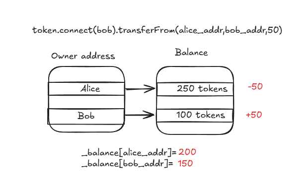

# ERC20 Token Standard Basics

In this lesson, we will learn how to implement the ERC20 token standard, which is the most widely used token standard on Ethereum. This lesson assumes familiarity with basic Solidity syntax and concepts.

---

## 1. Introduction to ERC20 Token Standard

A token, in the Ethereum context, is a generic term for smart contracts representing digital assets. A native token or currency refers to the built-in cryptocurrency used for operating the blockchain, also known as protocol tokens. In Ethereum's case, this is ETH.

Beyond protocol tokens are tokens that are synthesized from smart contracts serving different purposes. The most common type of tokens on Ethereum is known as the ERC20 token.

ERC stands for Ethereum Request for Comment, which is a way of setting standards for smart contracts on Ethereum. This standard is necessary to allow smart contracts on Ethereum to interact with each other. The official specification for the ERC20 token can be found here **https://eips.ethereum.org/EIPS/eip-20**.

An ERC20 token is a template for building fungible tokens. Fungibility means all tokens within the contract always have the same value and are fully interchangeable, just like currency. This token standard gained its popularity in 2017 during the peak of the ICO era of Ethereum history and is still core to present-day contract design.

**Note:** There are many variants of ERC20 tokens with new features added to them, but all ERC20 tokens must implement the same basic specification.

According to the specification(**https://eips.ethereum.org/EIPS/eip-20**), a standard ERC20 token contract must implement:

-   6 Read-Only Functions

    ```solidity
    function name() public view returns (string)
    function symbol() public view returns (string)
    function decimals() public view returns (uint8)
    function totalSupply() public view returns (uint256)
    function balanceOf(address _owner) public view returns (uint256 balance)
    function allowance(address _owner, address _spender) public view returns (uint256 remaining)

    ```

-   3 State-Changing Functions

    ```solidity

    function transfer(address _to, uint256 _value) public returns (bool success)

    function transfer(address _to, uint256 _value) public returns (bool success)
    function transferFrom(address _from, address _to, uint256 _value) public returns
    function approve(address _spender, uint256 _value) public returns (bool success)

    ```

-   2 Events

    ```solidity
    event Transfer(address indexed _from, address indexed _to, uint256 _value);
    event Approval(address indexed _owner, address indexed _spender, uint256 _value);
    ```

---

## 2. ERC20 Constructor Function

The purpose of the constructor is to initialize the contract's state variables when the contract is deployed and is not defined in the ERC20 standard.

Typically, an ERC20 token constructor will take the following parameters:

```solidity
constructor(string memory name_, string memory symbol_, uint256 totalSupply_, address owner_)
```

Where:

-   `name_` is the name of the token
-   `symbol_` is the symbol of the token
-   `totalSupply_` is the initial total supply of the token
-   `owner_` is the address that will receive the initial total supply of the token

The process of creating ERC20 tokens is often referred to as "minting" tokens. In this basic implementation, we will mint the entire supply of tokens to the owner's address during contract deployment.

---

## 3. Read-only functions

According to the specification, the contract must contain the following 6 read-only functions:

-   **name()** This function returns the token's name as a string.

    ```solidity
    function name() public view returns (string memory)
    ```

-   **symbol()** This function returns the token's symbol as a string (usually 3-4 characters long).

    ```solidity
    function symbol() public view returns (string memory)
    ```

-   **decimals()** This function returns the number of decimal places this token's quantity can support. Since this value is conventionally 18, so we will return 18 and instead of creating a state variable to save on gas cost.

    ```solidity
    function decimals() public pure returns (uint8)
    ```

-   **totalSupply()** This function returns the total supply of the token in circulation as an unsigned 32-bit integer.

    ```solidity
    function totalSupply() public view returns (uint256)
    ```

-   **balanceOf()** This function returns the balance of token held by the address `_owner` as an unsigned 32-bit integer.

    ```solidity
    function balanceOf(address _owner) public view returns (uint256 balance)
    ```

-   **allowance()** This function returns the withdrawal limit that `_spender` is allowed to withdraw from `_owner` as an unsigned 32-bit integer.

    ```solidity
    function allowance(address _owner, address _spender) public view returns (uint256 remaining)
    ```

---

## 4. State-Changing functions

-   **transfer()** This function sends `_value` amount of tokens to address `_to` and returns a boolean value indicating success. **This function is called by token holder**

    ```solidity
    function transfer(address _to, uint256 _value) external virtual returns (bool success)
    ```

-   **transferFrom()** This function withdraws `_value` amount of tokens from holder's address `_from` into spender's address `_to` based on the approved allowance.
    **NOTE:**
    **1. This function is used in conjunction with the approve() function.**
    **2. This function is called by the spender, not the token holder.**

    ```solidity
    function transferFrom(address _from, address _to, uint256 _value) external virtual returns (bool success)
    ```

-   **approve()** This function sets the approved allowance of `_value` for `_spender` to withdraw from the caller's account. It returns a boolean value indicating success.
    **NOTE:**
    **1. This function is used in conjunction with the transferFrom() function.**
    **2. This function is called by the token holder, not the spender.**

    ```solidity
    function approve(address _spender, uint256 _value) external virtual returns (bool success)
    ```

---

## 🛠️ Lab Practice: Create DemoToken

In this lab, we will implement a ERC20-compliant token contract from scratch called **DemoToken** with the following specifications:

> -   Name: DemoToken
> -   Symbol: DEMO
> -   Total Supply: 1,000 DEMO (with 18 decimal places)

1.  **Install project dependencies**

    ```bash
    cd /workspace/day-2/07-erc20-basic
    npm i
    ```

2.  **Create DemoToken**

    Create a new file named `DemoToken.sol` in the `contracts` directory.

    **contracts/DemoToken.sol**

    ```solidity
    // SPDX-License-Identifier: MIT
    pragma solidity 0.8.20;

    contract DemoToken {

        uint256 _totalSupply;

        mapping(address=>uint256) _balances;

        mapping(address=>mapping(address=>uint256)) _allowances;

    }
    ```

    The contract contains the following state variables:

    -   `_totalSupply`: a uint256 variable to store the total supply of the token
    -   `_balances`: a mapping to store the balance of each address.
    -   `_allowances`: a nested mapping to store the allowance of each address.

3.  **Insert the read-only functions**

    Insert the following read-only functions into your contract:

    ```solidity

    // ERC20 Read-only functions

    function name() public pure returns (string memory)
    {
        return "DemoToken";
    }

    function symbol() public pure returns (string memory)
    {
        return "DEMO";
    }

    function decimals() public pure returns (uint8)
    {
        return 18;
    }

    function totalSupply() public view returns (uint256)
    {
        return _totalSupply;
    }

    function balanceOf(address _owner) public view returns (uint256 balance)
    {
        return _balances[_owner];
    }

    function allowance(address _owner, address _spender) public view returns (uint256 remaining)
    {
        return _allowances[_owner][_spender];
    }

    ```

4.  **Insert the constructor**

    Insert the constructor into your contract. It initializes the state variables when the contract is deployed and mints the total supply of tokens to the owner's address.

    ```solidity

    // ERC20 Constructor

    constructor(uint256 totalSupply_, address owner_)
    {
        _totalSupply = totalSupply_;
        _balances[owner_] = totalSupply_;
    }
    ```

5.  **Insert state-changing functions**

-   **transfer()** This function sends `_value` amount of tokens to address `_to` and returns a boolean value indicating success. The transfer will decrement the sender's `_balance` and increment the recipient's `balance`. It will throw an error if the sender has insufficient balance.

    ```solidity

    // transfer: Send _value to _to from caller's account

    function transfer(address _to, uint256 _value) external virtual returns (bool success)
    {
        require(_balances[msg.sender] >= _value, "Insufficient balance");
        _balances[msg.sender] -= _value;
        _balances[_to] += _value;
        return true;
    }
    ```

-   **transferFrom()** This function withdraws `_value` amount of tokens from holder's address `_from` into spender's address `_to` based on the approved allowance. It will reduce the allowance for withdrawal by `_value` and throw an error if the allowance is insufficient.

    ```solidity

    // transferFrom: Withdraw _value from _from to _to based on approved allowance

    function transferFrom(address _from, address _to, uint256 _value) external virtual returns (bool success)
    {
        require(_balances[_from] >= _value, "Insufficient balance");
        require(_allowances[_from][msg.sender] >= _value, "Insufficient allowance");
        _balances[_from] -= _value;
        _balances[_to] += _value;
        _allowances[_from][msg.sender] -= _value;
        return true;
    }
    ```

-   **approve()** This function sets the approved allowance of `_value` for `_spender` to withdraw from the caller's account. It returns a boolean value indicating success. The approve function will overwrite any existing allowance with the new value.

    ```solidity

    // approve: Set allowance for _spender to withdraw from caller's account

    function approve(address _spender, uint256 _value) external virtual returns (bool success)
    {
        _allowances[msg.sender][_spender] = _value;
        return true;
    }
    ```

6.  **Compile the contract**

    Compile the contract using Hardhat:

    ```bash
    hh compile
    ```

7.  **Create test file**

    Create a new file named `testDemoToken.js` in the `test` directory.

    **test/testDemoToken.js**

    ```js
    const { expect } = require("chai");
    describe("Test DemoToken", () => {
        let erc20;
        let accounts;
        beforeEach(async () => {
            accounts = await ethers.getSigners();
            const factory = await ethers.getContractFactory("DemoToken");
            erc20 = await factory.deploy(
                ethers.parseUnits("1000", "ether"),
                accounts[0].address
            );
        });
    });
    ```

8.  **Add a test for name()**

    We start by adding a test that checks if the name() function returns the correct token name, ie. `DEMO`.

    ```js
    it("Should call name() and get DEMO", async () => {
        let name = await erc20.name();
        expect(name).to.equals("DemoToken");
    });
    ```

9.  **Add a test for balanceOf()**

    Next, we add a test that checks if the balanceOf() function returns the correct balance for the owner's address.

    ```js
    it("Should call balanceOf() and get 1000 DEMO", async () => {
        let balance = await erc20.balanceOf(accounts[0].address);
        expect(balance).to.equals(ethers.parseUnits("1000", "ether"));
    });
    ```

10. **Run the tests**

    Run the tests using Hardhat:

    ```bash
    hh test
    ```

    You should see the following output:

    ```
      Test ERC20
        ✔ Should call name() and get DEMO (XXms)
        ✔ Should call balanceOf() and get 1000 DEMO (XXms)
        2 passing (XXms)
    ```

---

## 5. ERC20 Token Transfer Mechanics

-   **Token Balances and Supply**

    The ERC20 token maintains an internal table keeping track of each address's token balance.

    ```solidity
    mapping(address => uint256) private _balances;
    ```

    **Example Usage:**

    The balance is updated within constructor during contract deployment.

    ```js
    constructor(string memory name_, string memory symbol_, uint256 totalSupply_, address owner_)
    {
        ...
        _balances[owner_] = totalSupply_;
    }
    ```

    

-   **Token Transfer Method 1: Direct Transfer**

    The `transfer` function allows a token holder to send tokens directly to another address:

    ```solidity
    await token.connect(sender).transfer(recipient.address, amount);
    ```

    This basically involves increasing the recipient's balance and decreasing the sender's balance.

    **Example Usage:**

    ```js
    // Alice transfers 10 tokens to Bob
    await token.connect(alice).transfer(bob.address, 10);
    ```

    

    This method is straightforward but is not recommended as best practice for transferring tokens in many scenarios due to security and usability concerns.

-   **Token Transfer Method 2: Delegated Transfer**

    For this method, the contract maintains a separate allowance table keeping track of how much a spender is allowed to withdraw from a token holder's account.

    ```solidity
    mapping(address => mapping(address => uint256)) private _allowances;
    ```

    

    The `approve` and `transferFrom` functions enable a third party to transfer tokens on behalf of the token holder:

    1.  The token holder approves a spender to withdraw up to a certain amount:

        ```solidity
        await token.connect(holder).approve(spender.address, amount);
        ```

    2.  The approved spender can then transfer tokens from the holder to another address:

        ```solidity
        await token.connect(spender).transferFrom(holder.address, recipient.address, amount);
        ```

    **Example Usage:**

    ```js
    // Alice approves Bob to spend 100 tokens
    await token.connect(alice).approve(bob.address, 100);

    // Bob withdraws 50 tokens from Alice
    await token.connect(bob).transferFrom(alice.address, bob.address, 50);
    ```

    

    This is the preferred method for transferring tokens. It is more secure and allows for payment for services, subscriptions, and other use cases.

    For example, to subscribe to a service, a user makes 2 calls:

    1.  Approve the service contract to withdraw tokens from their account.
    2.  Call the service contract and let the contract call `transferFrom` to withdraw tokens atomically. Contract will provide the service if the transfer is successful.

---

## 🛠️ Lab Practice: Token Transfer

1. **Add test for transfer()**

    Start by creating a test for transfer() of DEMO token.

    ```js
    it("Should transfer 1 DEMO from accounts[0] to accounts[1]", async () => {
        const before = await erc20.balanceOf(accounts[1].address);

        // Transfer
        const response = await erc20.transfer(accounts[1].address, 1);
        const receipt = await response.wait();

        // Assert
        const after = await erc20.balanceOf(accounts[1].address);
        expect(before + 1n).equals(after);
    });
    ```

    Run the test.

    ```bash
    hh test

     #  Test ERC20
     # ✔ Should call name() and get DEMO (XXms)
     # ✔ Should call balanceOf() and get 1000 DEMO (XXms)
     # ✔ Should transfer 1 DEMO from accounts[0] to accounts[1] (XXms)
     #   3 passing (XXms)
    ```

2. **Add test for approve() and transferFrom()**

    Next, create a test for approve() and transferFrom() of DEMO token.

    ```js
    it("Should approve and transferFrom 1 DEMO from accounts[0] to accounts[1]", async () => {
        const before = await erc20.balanceOf(accounts[1].address);

        // Approve and TransferFrom
        let response = await erc20.approve(accounts[1].address, 1);
        let receipt = await response.wait();

        response = await erc20
            .connect(accounts[1])
            .transferFrom(accounts[0].address, accounts[1].address, 1);
        receipt = await response.wait();

        // Assert
        const after = await erc20.balanceOf(accounts[1].address);
        expect(before + 1n).equals(after);
    });
    ```

    Run the test.

    ```bash
    hh test
        #  Test ERC20
        # ✔ Should call name() and get DEMO (XXms)
        # ✔ Should call balanceOf() and get 1000 DEMO (XXms)
        # ✔ Should transfer 1 DEMO from accounts[0] to accounts[1] (XXms)
        # ✔ Should approve and transferFrom 1 DEMO from accounts[0] to accounts[1] (XXms)
        #   4 passing (XXms)
    ```

## Quiz

The following code snippet will result in the error "Error: VM Exception while processing transaction: reverted with reason string 'Insufficient allowance'". Why?

```js
let response = await erc20.approve(accounts[1].address, 1);
let receipt = await response.wait();
response = await erc20
    .connect(accounts[1])
    .transferFrom(accounts[0].address, accounts[1].address, 1);
receipt = await response.wait();
```

---

## 6. ERC20 Events

According to the ERC20 specification, the contract must emit the following two events:

```solidity
event Transfer(address indexed _from, address indexed _to, uint256 _value);
event Approval(address indexed _owner, address indexed _spender, uint256 _value);
```

These events are emitted in the following functions:

-   **Transfer Event**: This event is emitted in the `transfer` and `transferFrom` functions when tokens are transferred from one address to another.

    ```solidity
    emit Transfer(msg.sender, _to, _value); // in transfer function
    emit Transfer(_from, _to, _value); // in transferFrom function
    ```

-   **Approval Event**: This event is emitted in the `approve` function when a token holder approves a spender to withdraw tokens from their account.

    ```solidity
    emit Approval(msg.sender, _spender, _value); // in approve function
    ```

### Importance of Events

Events are important for several reasons:

1.  **Logging**: Events provide a transparent way to track token transfers and approvals on the blockchain. This is crucial for auditing and verifying transactions.
2.  **Off-chain Applications**: Events can be monitored by off-chain applications (like wallets, explorers, and dApps) to update user interfaces and provide real-time feedback to users.
3.  **Gas Efficiency**: Emitting events is more gas-efficient than storing data on-chain, making it a cost-effective way to log important actions.

---

## 🛠️ Lab Practice: ERC20 Events

1. **Insert Event Declarations**

    Insert the following events in your `ERC20.sol` contract.

    ```solidity
        contract ERC20 {
            string _name;
            string _symbol;
            uint256 _totalSupply;
            mapping(address=>uint256) _balances;
            mapping(address=>mapping(address=>uint256)) _allowance;

            // ERC20 Events
            event Transfer(address indexed from, address indexed to, uint256 value);
            event Approval(address indexed owner, address indexed spender, uint256 value);

            ...
        }

    ```

2. **Emit Events in Functions**

    Emit the `Transfer` event in the `transfer` and `transferFrom` functions, and the `Approval` event in the `approve` function.

    ```solidity
        function transfer(address _to, uint256 _value) external virtual returns (bool success)
        {
            require(_balances[msg.sender] >= _value, "Insufficient balance");
            _balances[msg.sender] -= _value;
            _balances[_to] += _value;

            // Emit Transfer event
            emit Transfer(msg.sender, _to, _value);

            return true;
        }

        function transferFrom(address _from, address _to, uint256 _value) external virtual returns (bool success)
        {
            require(_balances[_from] >= _value, "Insufficient balance");
            require(_allowance[_from][msg.sender] >= _value, "Insufficient allowance");
            _balances[_from] -= _value;
            _balances[_to] += _value;
            _allowance[_from][msg.sender] -= _value;

            // Emit Transfer event
            emit Transfer(_from, _to, _value);

            return true;
        }

        function approve(address _spender, uint256 _value) external virtual returns (bool success)
        {
            _allowance[msg.sender][_spender] = _value;

            // Emit Approval event
            emit Approval(msg.sender, _spender, _value);

            return true;
        }

    ```

3. **Create tests for Events**
   Create test for `Transfer` event. The result from emitted event can be extracted from the receipt as shown in the code below.

    ```js
    it("Should transfer 1 DEMO and receive Transfer event", async () => {
        // Transfer
        const response = await erc20.transfer(accounts[1].address, 1);
        const receipt = await response.wait();

        // Parse all logs

        const transferLog = receipt.logs.find(
            (x) => x.fragment.name === "Transfer"
        );
        const args = transferLog.args.toObject();
        expect(args.from).to.equal(accounts[0].address);
        expect(args.to).to.equal(accounts[1].address);
        expect(args.value).to.equal(1n);
    });
    ```

    ```js
    it("Should approve 1 DEMO and receive Approval event", async () => {
        // Approve
        const response = await erc20.approve(accounts[1].address, 1);
        const receipt = await response.wait();

        const approvalLog = receipt.logs.find(
            (x) => x.fragment.name === "Approval"
        );
        const args = approvalLog.args.toObject();
        expect(args.owner).to.equal(accounts[0].address);
        expect(args.spender).to.equal(accounts[1].address);
        expect(args.value).to.equal(1n);
    });
    ```

    Run the tests.

    ```bash
    hh test
    ```

## 7. OpenZeppelin Smart Contract Library

You have created your own ERC20 smart contract from scratch for learning purposes but in practise it suffers from 2 main issues:

1. It was hardcoded with a fixed name and symbol which is not flexible.
2. There are no reuseable code which means you have to write the same code again and again for every new token you want to create.

To solve these issues, we generally use the Openzeppelin library as a basis for our smart contract development. OpenZeppelin provides most of the standard ERC smart contracts (including ERC20) that are implemented based on industry best practises which makes it safer to use and adopt. In this lesson, we will replace our ERC20 token using the OpenZeppelin libraries.

## 🛠️ Lab Practice: OpenZeppelin Smart Contract Library

1.  **Install OpenZeppelin package**

    ```bash
    npm i @openzeppelin/contracts@5.4.0
    ```

2.  **Replace DemoToken contract with OpenZeppelin ERC20 contract**

    Replace `contracts/DemoToken.sol` with the following code:

    ```solidity
    // SPDX-License-Identifier: MIT
    pragma solidity ^0.8.20;

    import "@openzeppelin/contracts/token/ERC20/ERC20.sol";

    contract DemoToken is ERC20 {
        constructor(
            uint256 totalSupply_,
            address owner_
        ) ERC20("DemoToken", "DEMO") {
            _mint(owner_, totalSupply_);
        }
    }
    ```

3.  **Test the contract**

    If done correctly, you should be able to run the same tests without any errors:

    ```bash
    hh test
    ```
