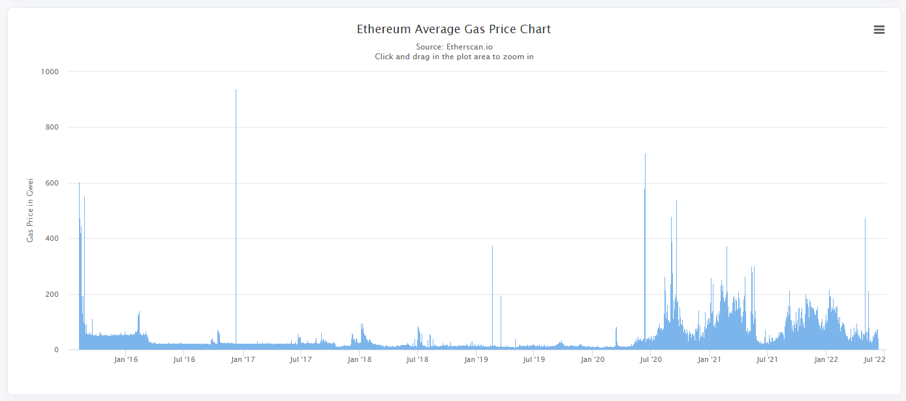

# Transactions and Gas

Every action on Ethereum costs **gas**. Gas measures work, and you pay for that work in **ETH**. Gas is the key contributing factor to what makes Solidity unique as compared to other languages. A clear understanding of gas and its impact on your design is a necessity for smart contract developers.

**Why gas?**

Ethereum use "gas" to keep the network **fair and usable** and to address the **halting problem**. In computing, the halting problem means you can’t reliably know in advance whether a program will ever stop. If smart contracts were free, someone could run code that never ends and clog the network. By charging gas, Ethereum puts a **budget** on every transaction so long-running code eventually stops and spam becomes costly.

---

## 1. Gas Units

https://ethereum.org/en/developers/docs/gas/

**Gas** = computational effort required for EVM operations.

**Example**: Common operations

    ETH transfer: 21,000 gas
    Storage write: 20,000 gas
    Storage read: 200 gas

👉 ETH transfers cost exactly 21,000 gas - defined in the Ethereum Protocol Yellow Paper https://ethereum.github.io/yellowpaper/paper.pdf (Appendix G) covering signature verification, data processing, and balance updates.


---

## 🛠️ Lab Practise: Minimum Transaction Cost

-   **Install packages**

    ```bash
    npm i
    ```

-   **Start Hardhat Console**

    ```bash
    hh console
    ```

-   **Send 1 wei to accounts[1]**

    ```js
    const { ethers } = require("hardhat");
    let accounts = await ethers.getSigners();
    response = await accounts[0].sendTransaction({
        to: accounts[1].address,
        value: 1,
    });
    receipt = await response.wait();
    ```

-   **Analyse the result**

    -   The transaction response indicates that the gasPrice was set at `1875000000`. This settings is configured in hardhat.config.js but can be overridden by passing an options object at the send of sendTraction().
    -   Once the transaction is mined, it returns a receipt which contains the gasUsed - `21000`.

    ```js
    > response
    {
        hash: '0x5266cf8d88c1f8fd171b4a0eb1e8869344fa781a8b127c8a1060930e1f68fe08',
        type: 2,
        to: '0x70997970C51812dc3A010C7d01b50e0d17dc79C8',
        from: '0xf39Fd6e51aad88F6F4ce6aB8827279cffFb92266',
        gasPrice: 1875000000n,
        maxPriorityFeePerGas: 1000000000n,
        maxFeePerGas: 2750000000n,
        ...
        value: 1n,
        ...
    }
    > receipt
    {
        gasUsed: 21000n,
        ...
    }
    ```

---

## 2. Transaction Cost

**Transaction cost** = sum of all EVM operations in your transaction.

**Example**: Writing to storage

    Base transaction:  21,000 gas
    SSTORE (write):    20,000 gas
    ─────────────────────────────
    Total:            ~41,000 gas

👉 As Solidity developers, we usually care about the **transaction cost** rather than individual opcode gas, because we think in terms of function calls, not low-level operations.

---

## 3. Gas Price

**Gas price** = how much ETH you pay per gas unit (market-driven).

**Example**: Storage write with 20 gwei gas price

    Transaction cost:   41,000 gas
    Gas price:              20 gwei
    ───────────────────────────────
    Total fee:         820,000 gwei = 0.00082 ETH

👉 Higher gas price → transaction confirmed faster.  
👉 Lower gas price → transaction may be delayed, but costs less.

---

## 4. Gas Fees before 2021

Earlier, Ethereum used a simple auction: every user set a single **gas price** and hoped miners would pick their transaction.

### Gas Fee Problem

-   **Guesswork:** If you set gas price too low, your transaction might sit pending for hours.
-   **Overpaying:** To avoid being stuck, many users overbid and wasted ETH.
-   **Congestion spikes:** During popular events (like token launches or CryptoKitties in 2017), gas prices jumped 10–50× in minutes.

**Example:**  
During the CryptoKitties boom in 2017, average gas fees shot up from just a few gwei to over 500 gwei in a matter of hours. That meant a simple ETH transfer, which normally cost only a few cents, could suddenly cost more than $50. Regular users were priced out, while only those willing to drastically overpay saw their transactions included.

Ethereum gas prices are highly volatile. It historically hovers around 20-50 gwei in general but can easily cross the 100 gwei mark during peak. (the highest recorded spike is more than 900).



👉 The result: fees were unpredictable, stressful, and unfair to regular users.

---

## 🛠️ Lab Practice: Transfer ETH with GasPrice (pre-EIP-1559)

This is an extension of the previous example on **Transfer ETH** by overriding the send transaction with an explicit gasPrice.

Sends 1 wei from accounts[0] to accounts[1] with a gasPrice of 10 gwei.

```js
> response = await accounts[0].sendTransaction(
    {
        to: accounts[1].address,
        value:1,
        gasPrice: ethers.parseUnits("10","gwei")
    }
)
> response.gasPrice
// 10000000000n
```

---

## 5. Gas Fees: After 2021

### EIP-1559 Fees

In August 2021, Ethereum introduced **EIP-1559** to fix these problems. Instead of one unpredictable auction price, fees were split into clear parts:

| Before EIP-1559 (Pre-2021)                                                                                    | After EIP-1559 (2021+)                                                                                                               |
| ------------------------------------------------------------------------------------------------------------- | ------------------------------------------------------------------------------------------------------------------------------------ |
| **Single Gas Price**: Users set one price and hope miners pick their transaction                              | **Base Fee**: Protocol-set minimum per gas unit; adjusts each block (burned)                                                         |
| **Unpredictable**: Guesswork on pricing; too low = pending, too high = overpaying                             | **Priority Fee**: Small tip you add (e.g. 1–2 gwei) to validator for faster inclusion                                                |
| **Volatile**: Gas prices jumped 10–50× during congestion (e.g., CryptoKitties: few gwei → 500+ gwei in hours) | **Max Fee**: Your budget cap per gas unit; unused portion refunded                                                                   |
| **Example**: Set gas price to 50 gwei, pay exactly 50 gwei per gas regardless of network conditions           | **Example**: Set max fee 30 gwei, priority tip 2 gwei. If base fee is 15 gwei, you pay 17 gwei (base + tip), and 13 gwei is refunded |
| **Result**: Stressful, unfair to regular users, frequent overpaying                                           | **Result**: Predictable fees; set a safe max, protocol handles the rest                                                              |

**Example**: ETH transfer with EIP-1559 fees

    Base fee:              15 gwei (protocol-set)
    Priority tip:           2 gwei (your choice)
    Max fee:               30 gwei (your cap)
    ────────────────────────────
    Effective price:       17 gwei (base + tip)

    Transaction cost:  21,000 gas
    Effective price:       17 gwei
    ────────────────────────────
    Total fee:         357,000 gwei = 0.000357 ETH

Base fee is burned, tip goes to validator, unused budget refunded.

👉 Now fees are predictable: you don’t need to guess, you just set a safe max and let the protocol handle the rest.

---

## 🛠️ Lab Practice: Transfer ETH with EIP-1559 Fees

In this example, instead of setting a gasPrice, we set a maxPriorityFeePerGas (tip) and maxFeePerGas (cap).

-   **Estimate the base fee**

    The base fee is dynamic and is based on the blockchain's network congestion. It can only be known after a block is mined but will be bound by ±12.5% of the previous block's base fee.

    In the Hardhat console, run the following to estimate the current base fee:

    ```js
    const block = await ethers.provider.getBlock("latest");
    console.log(
        "Estimated base fee gwei:",
        ethers.formatUnits(block.baseFeePerGas, "gwei")
    );
    // Sample Output:
    // Estimated base fee gwei: 1.0
    ```

-   **Transfer with custom tip and cap**

    -   Sends 1 gwei from accounts[0] to accounts[1].
    -   Set a maxPriorityFeePerGas(tip) of 1 gwei.
    -   Set the maxFeePerGas(cap) of 3 gwei (est. base fee + tip < 3 gwei)

    ```js
    > amt = ethers.parseUnits("1","gwei")
    > tx = await accounts[0].sendTransaction(
        {
            to: accounts[1].address,
            value:amt,
            maxPriorityFeePerGas: ethers.parseUnits("1","gwei"),
            maxFeePerGas: ethers.parseUnits("3","gwei")
        }
    )
    // Sample Output:
    // {
    //   ...
    //   maxPriorityFeePerGas: 1000000000n,
    //   maxFeePerGas: 3000000000n,
    //   value: 1000000000n,
    ```

    Find the gasUsed after the transaction is confirmed.

    ```js
    > receipt = await tx.wait();
    > gasUsed = receipt.gasUsed;
    // Sample Output:
    // 21000n
    ```

-   **Check Balance**

    Check the balance after transaction.

    ```js
    > await ethers.provider.getBalance(accounts[0].address)
    // 9999999960624000000000n
    ```

-   **Calculate and confirm the effective gas price**

    **Part 1 - Calculate the gas fee paid**

    -   Original balance: `10000000000000000000000` (10,000 ETH)

    -   New balance: `9999999960624000000000` (9,999.9960624 ETH)

    -   Gas Fee paid:

        ```js
        > delta = 10000000000000000000000n - 9999999960624000000000n
        // 39376000000000n
        > gasFee = delta - amt
        > ethers.formatUnits(gasFee, "gwei")
        // '39375.0'
        ```

    -   Fee per gas unit:

        ```js
        > ethers.formatUnits(gasFee / gasUsed, "gwei")
        // '1.875'
        ```

    **Part 2 - Confirm with on-chain data**

    -   Find the actual base fee from the block:

        ```js
        > block = await ethers.provider.getBlock("latest")
        > baseFee = block.baseFeePerGas
        // 875000000n
        ```

    -   Calculate the effective gas price:

        ```js
        > priorityFee = ethers.parseUnits("1","gwei")
        // 1000000000n
        > effectiveGasPrice = baseFee + priorityFee
        // 1875000000n
        > ethers.formatUnits(effectiveGasPrice, "gwei")
        // '1.875'
        ```

    The effective gas price calculated from the balance change matches the on-chain data.

---

## 6. Real-World Cost Considerations

Understanding transaction costs is crucial for practical Ethereum development:

### USD Cost Calculation

To calculate the real-world cost of transactions:

```
USD Cost = Gas Fee (in ETH) × ETH Price (in USD)
```

**Example**: If a transaction costs 0.000023 ETH and ETH is $4,000:

-   USD Cost = 0.000023 × $4,000 = $0.093 (about 9.3 cents)

---

## 🛠️ Lab Practice: Calculate USD Costs

-   **Calculate gas cost from transaction receipt**

    ```js
    > gasUsed = receipt.gasUsed
    // 21000n
    > block = await ethers.provider.getBlock("latest")
    > baseFee = block.baseFeePerGas
    // 875000000n
    > priorityFee = tx.maxPriorityFeePerGas
    // 1000000000n
    > effectiveGasPrice = baseFee + priorityFee
    // 1875000000n
    > gasCost = gasUsed * effectiveGasPrice
    // 23255859375000n
    > gasFeeInETH = ethers.formatEther(gasCost)
    // '0.000023255859375'
    ```

-   **Calculate USD cost (assuming ETH = $4000)**

    ```js
    > gasFeeInUSD = gasFeeInETH * 4000
    // 0.093023437  // Approximately $0.093
    ```

---

## 7. Gas Limit

**Gas limit** = maximum gas you're willing to spend on a transaction (safety cap).

### a) Example 1 - Deploying a simple contract:

Some contracts are simple (like a basic ERC-20).

    Estimated gas:     41,000 gas
    Gas limit set:     50,000 gas (buffer for safety)
    Actual gas used:   41,000 gas
    ────────────────────────────
    Unused gas:         9,000 gas (refunded to you)

👉 Gas limit sufficient → unused portion refunded

### b) Example 2 - Deploying a complex contract:

Bigger contracts take more gas to deploy because the constructor runs more code and stores more data. If there were no cap, a mistake in your code (e.g., pre-minting thousands of tokens, seeding registries, or writing large data) could burn through unlimited ETH.

    Estimated gas:    1,200,000 gas
    Gas limit set:       50,000 gas (buffer for safety)
    Actual gas used:     50,000 gas
    ────────────────────────────
    Unused gas:               0 gas (refunded to you)

👉 Gas limit too low → transaction fails, gas spent is lost
👉 You are safeguarded from overspending.

---

## 🛠️ Lab: Estimate Deployment Cost

### Create `test/deploymentTest.js`

```js
describe("Contract Deployment Cost Comparison", () => {
    it("Deploy Counter Contract", async () => {
        const counterFactory = await ethers.getContractFactory("Counter");
        const counter = await counterFactory.deploy(5); // initial count = 5
        const receipt = await counter.deploymentTransaction().wait();

        console.log(`Counter deployment gas: ${receipt.gasUsed}`);
    });

    it("Deploy ERC20 Contract", async () => {
        const [owner] = await ethers.getSigners();
        const erc20Factory = await ethers.getContractFactory("ERC20");
        const totalSupply = ethers.parseUnits("1000", 18);

        const erc20 = await erc20Factory.deploy(
            "TestToken",
            "TUT",
            totalSupply,
            owner.address
        );
        const receipt = await erc20.deploymentTransaction().wait();

        console.log(`ERC20 deployment gas: ${receipt.gasUsed}`);
    });
});
```

### Run the deployment test:

```bash
hh test test/deploymentTest.js
```

**Expected results:**

-   **Counter**: ~150,000-200,000 gas (simple contract)
-   **ERC20**: ~800,000-1,200,000 gas (complex contract with mappings, events)
-   **Ratio**: ERC20 costs 4-6x more than Counter
-   **Key factors**: Contract size, storage initialization, constructor complexity

---
