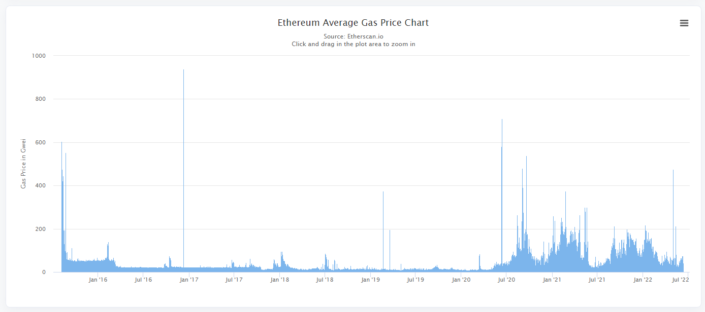

# 交易和 Gas

以太坊上的每个操作都消耗 **Gas**。Gas 衡量工作量，您需要为这项工作支付 **ETH**。Gas 是使 Solidity 与其他语言相比独特的关键因素。清楚了解 Gas 及其对设计的影响是智能合约开发者的必要条件。

**为什么使用 Gas？**

以太坊使用"Gas"来保持网络**公平和可用**，并解决**停机问题**。在计算中，停机问题意味着您无法可靠地提前知道程序是否会停止。如果智能合约是免费的，有人可以运行永不停止的代码并阻塞网络。通过收取 Gas，以太坊为每笔交易设定**预算**，使长时间运行的代码最终停止，垃圾邮件变得昂贵。

---

## 1. Gas 单位

https://ethereum.org/en/developers/docs/gas/

**Gas** = EVM 操作所需的计算工作量。

**示例**：常见操作

    ETH 转账：21,000 gas
    存储写入：20,000 gas
    存储读取：200 gas

👉 ETH 转账正好消耗 21,000 gas - 在以太坊协议黄皮书（https://ethereum.github.io/yellowpaper/paper.pdf 附录 G）中有定义，包括签名验证、数据处理和余额更新。


---

## 🛠️ 实验实践：最低交易成本

-   **安装软件包**

    ```bash
    npm i
    ```

-   **启动 Hardhat 控制台**

    ```bash
    hh console
    ```

-   **发送 1 wei 给 accounts[1]**

    ```js
    const { ethers } = require("hardhat");
    let accounts = await ethers.getSigners();
    response = await accounts[0].sendTransaction({
        to: accounts[1].address,
        value: 1,
    });
    receipt = await response.wait();
    ```

-   **分析结果**

    -   交易响应表明 gasPrice 设置为 `1875000000`。这在 hardhat.config.js 中配置，但可以通过在 sendTransaction() 的选项对象中传递来覆盖。
    -   交易被挖掘后，它返回一个包含 gasUsed 的收据 - `21000`。

    ```js
    > response
    {
        hash: '0x5266cf8d88c1f8fd171b4a0eb1e8869344fa781a8b127c8a1060930e1f68fe08',
        type: 2,
        to: '0x70997970C51812dc3A010C7d01b50e0d17dc79C8',
        from: '0xf39Fd6e51aad88F6F4ce6aB8827279cffFb92266',
        gasPrice: 1875000000n,
        maxPriorityFeePerGas: 1000000000n,
        maxFeePerGas: 2750000000n,
        ...
        value: 1n,
        ...
    }
    > receipt
    {
        gasUsed: 21000n,
        ...
    }
    ```

---

## 2. 交易成本

**交易成本** = 交易中所有 EVM 操作的总和。

**示例**：写入存储

    基础交易：  21,000 gas
    SSTORE（写入）：   20,000 gas
    ─────────────────────────────
    总计：            ~41,000 gas

👉 作为 Solidity 开发者，我们通常关心**交易成本**而不是单独的 opcode gas，因为我们是按函数调用而不是底层操作来思考。

---

## 3. Gas 价格

**Gas 价格** = 每单位 Gas 支付多少 ETH（市场驱动）。

**示例**：以 20 gwei 的 Gas 价格写入存储

    交易成本：   41,000 gas
    Gas 价格：      20 gwei
    ───────────────────────────────
    总费用：     820,000 gwei = 0.00082 ETH

👉 Gas 价格越高 → 交易确认越快。  
👉 Gas 价格越低 → 交易可能会延迟，但成本更低。

---

## 4. 2021 年之前的 Gas 费用

早期，以太坊使用简单的拍卖：每个用户设置一个单一的 **Gas 价格**，希望矿工会选择他们的交易。

### Gas 费用问题

-   **猜测**：如果 Gas 价格设置得太低，您的交易可能会等待数小时。
-   **多付**：为避免被卡住，许多用户出价过高，浪费了 ETH。
-   **拥堵高峰**：在热门活动期间（如 2017 年的代币发行或 CryptoKitties），Gas 价格在几分钟内上涨 10-50 倍。

**示例：**  
在 2017 年 CryptoKitties 热潮期间，平均 Gas 费用在几小时内从仅仅几 gwei 飙升至超过 500 gwei。这意味着一笔简单的 ETH 转账（通常只花费几美分）可能突然花费超过 50 美元。普通用户被价格拒之门外，而只有愿意大幅多付的用户才能看到他们的交易被包含。

以太坊 Gas 价格波动很大。它历史上通常在 20-50 gwei 左右，但在高峰期很容易超过 100 gwei。（记录的最高峰值超过 900）。



👉 结果：费用不可预测，对普通用户压力大，经常多付。

---

## 🛠️ 实验实践：使用 GasPrice 转账 ETH（EIP-1559 之前）

这是之前 **转账 ETH** 示例的扩展，通过使用显式 gasPrice 覆盖发送交易。

从 accounts[0] 发送 1 wei 给 accounts[1]，gasPrice 为 10 gwei。

```js
> response = await accounts[0].sendTransaction(
    {
        to: accounts[1].address,
        value:1,
        gasPrice: ethers.parseUnits("10","gwei")
    }
)
> response.gasPrice
// 10000000000n
```

---

## 5. 2021 年之后的 Gas 费用

### EIP-1559 费用

2021 年 8 月，以太坊引入了 **EIP-1559** 来解决这些问题。费用不再是一个不可预测的拍卖价格，而是被分成清晰的部分：

| EIP-1559 之前（2021 年前）                                                                                    | EIP-1559 之后（2021 年+）                                                                                                               |
| ------------------------------------------------------------------------------------------------------------- | ------------------------------------------------------------------------------------------------------------------------------------ |
| **单一 Gas 价格**：用户设置一个价格，希望矿工选择他们的交易                              | **基础费用**：协议设定的每单位 Gas 最低费用；每个区块调整（销毁）                                                         |
| **不可预测**：定价猜测；太低 = 待处理，太高 = 多付                                     | **优先费用**：您添加的小费（如 1-2 gwei）给验证者以更快包含                                                |
| **波动**：在拥堵期间 Gas 价格跳跃 10-50 倍（如 CryptoKitties：几 gwei → 几小时内 500+ gwei） | **最高费用**：您每单位 Gas 的预算上限；未使用部分退还                                                                   |
| **示例**：设置 Gas 价格为 50 gwei，无论网络条件如何都精确支付 50 gwei                              | **示例**：设置最高费用 30 gwei，优先费 2 gwei。如果基础费用是 15 gwei，您支付 17 gwei（基础 + 费），退还 13 gwei |
| **结果**：压力大，对普通用户不公平，经常多付                                           | **结果**：可预测的费用；设置安全的最高费用，协议处理其余部分                                                              |

**示例**：使用 EIP-1559 费用的 ETH 转账

    基础费用：              15 gwei（协议设定）
    优先费：               2 gwei（您的选择）
    最高费用：             30 gwei（您的上限）
    ────────────────────────────
    有效价格：           17 gwei（基础 + 费）

    交易成本：         21,000 gas
    有效价格：           17 gwei
    ────────────────────────────
    总费用：         357,000 gwei = 0.000357 ETH

基础费用被销毁，优先费给验证者，未使用的预算退还。

👉 现在费用可预测：您不需要猜测，只需设置安全的最高费用，让协议处理其余部分。

---

## 🛠️ 实验实践：使用 EIP-1559 费用转账 ETH

在这个示例中，我们不是设置 gasPrice，而是设置 maxPriorityFeePerGas（费）和 maxFeePerGas（上限）。

-   **估算基础费用**

    基础费用是动态的，基于区块链的网络拥堵。它只能在区块被挖掘后知道，但将受前一个区块基础费用的 ±12.5% 限制。

    在 Hardhat 控制台中，运行以下命令来估算当前基础费用：

    ```js
    const block = await ethers.provider.getBlock("latest");
    console.log(
        "Estimated base fee gwei:",
        ethers.formatUnits(block.baseFeePerGas, "gwei")
    );
    // 示例输出：
    // Estimated base fee gwei: 1.0
    ```

-   **使用自定义费率和上限转账**

    -   从 accounts[0] 发送 1 gwei 给 accounts[1]。
    -   设置 maxPriorityFeePerGas（费）为 1 gwei。
    -   设置 maxFeePerGas（上限）为 3 gwei（估算基础费用 + 费 < 3 gwei）

    ```js
    > amt = ethers.parseUnits("1","gwei")
    > tx = await accounts[0].sendTransaction(
        {
            to: accounts[1].address,
            value:amt,
            maxPriorityFeePerGas: ethers.parseUnits("1","gwei"),
            maxFeePerGas: ethers.parseUnits("3","gwei")
        }
    )
    // 示例输出：
    // {
    //   ...
    //   maxPriorityFeePerGas: 1000000000n,
    //   maxFeePerGas: 3000000000n,
    //   value: 1000000000n,
    ```

    交易确认后找到 gasUsed。

    ```js
    > receipt = await tx.wait();
    > gasUsed = receipt.gasUsed;
    // 示例输出：
    // 21000n
    ```

-   **检查余额**

    检查交易后的余额。

    ```js
    > await ethers.provider.getBalance(accounts[0].address)
    // 9999999960624000000000n
    ```

-   **计算并确认有效 Gas 价格**

    **第 1 部分 - 计算支付的 Gas 费用**

    -   原始余额：`10000000000000000000000`（10,000 ETH）

    -   新余额：`9999999960624000000000`（9,999.9960624 ETH）

    -   Gas 费用：

        ```js
        > delta = 10000000000000000000000n - 9999999960624000000000n
        // 39376000000000n
        > gasFee = delta - amt
        > ethers.formatUnits(gasFee, "gwei")
        // '39375.0'
        ```

    -   每单位 Gas 的费用：

        ```js
        > ethers.formatUnits(gasFee / gasUsed, "gwei")
        // '1.875'
        ```

    **第 2 部分 - 用链上数据确认**

    -   从区块中找出实际基础费用：

        ```js
        > block = await ethers.provider.getBlock("latest")
        > baseFee = block.baseFeePerGas
        // 875000000n
        ```

    -   计算有效 Gas 价格：

        ```js
        > priorityFee = ethers.parseUnits("1","gwei")
        // 1000000000n
        > effectiveGasPrice = baseFee + priorityFee
        // 1875000000n
        > ethers.formatUnits(effectiveGasPrice, "gwei")
        // '1.875'
        ```

    从余额变化计算的有效 Gas 价格与链上数据匹配。

---

## 6. 现实世界成本考虑

理解交易成本对于实际的以太坊开发至关重要：

### 美元成本计算

要计算交易的现实世界成本：

```
美元成本 = Gas 费用（ETH）× ETH 价格（美元）
```

**示例**：如果一笔交易花费 0.000023 ETH，ETH 价格为 $4,000：

-   美元成本 = 0.000023 × $4,000 = $0.093（约 9.3 美分）

---

## 🛠️ 实验实践：计算美元成本

-   **从交易收据计算 Gas 成本**

    ```js
    > gasUsed = receipt.gasUsed
    // 21000n
    > block = await ethers.provider.getBlock("latest")
    > baseFee = block.baseFeePerGas
    // 875000000n
    > priorityFee = tx.maxPriorityFeePerGas
    // 1000000000n
    > effectiveGasPrice = baseFee + priorityFee
    // 1875000000n
    > gasCost = gasUsed * effectiveGasPrice
    // 23255859375000n
    > gasFeeInETH = ethers.formatEther(gasCost)
    // '0.000023255859375'
    ```

-   **计算美元成本（假设 ETH = $4000）**

    ```js
    > gasFeeInUSD = gasFeeInETH * 4000
    // 0.093023437  // 约 $0.093
    ```

---

## 7. Gas 限制

**Gas 限制** = 您愿意在交易上花费的最大 Gas（安全上限）。

### a) 示例 1 - 部署一个简单合约：

一些合约很简单（如基础 ERC-20）。

    估算 Gas：     41,000 gas
    Gas 限制设置： 50,000 gas（安全缓冲）
    实际使用：    41,000 gas
    ────────────────────────────
    未使用 Gas：   9,000 gas（退还给您）

👉 Gas 限制足够 → 未使用部分退还

### b) 示例 2 - 部署一个复杂合约：

更大的合约需要更多 Gas 来部署，因为构造函数运行更多代码并存储更多数据。如果没有上限，您的代码中的错误（如预铸造数千个代币、种子注册表或写入大量数据）可能会烧掉无限的 ETH。

    估算 Gas：    1,200,000 gas
    Gas 限制设置：  50,000 gas（安全缓冲）
    实际使用：     50,000 gas
    ────────────────────────────
    未使用 Gas：        0 gas（丢失）

👉 Gas 限制太低 → 交易失败，已花费的 Gas 丢失
👉 您被保护免于超支。

---

## 🛠️ 实验：估算部署成本

### 创建 `test/deploymentTest.js`

```js
describe("Contract Deployment Cost Comparison", () => {
    it("Deploy Counter Contract", async () => {
        const counterFactory = await ethers.getContractFactory("Counter");
        const counter = await counterFactory.deploy(5); // initial count = 5
        const receipt = await counter.deploymentTransaction().wait();

        console.log(`Counter deployment gas: ${receipt.gasUsed}`);
    });

    it("Deploy DemoToken Contract", async () => {
        const [owner] = await ethers.getSigners();
        const erc20Factory = await ethers.getContractFactory("DemoToken");
        const totalSupply = ethers.parseUnits("1000", 18);

        const erc20 = await erc20Factory.deploy(totalSupply, owner.address);
        const receipt = await erc20.deploymentTransaction().wait();

        console.log(`DemoToken deployment gas: ${receipt.gasUsed}`);
    });
});
```

### 运行部署测试：

```bash
hh test test/deploymentTest.js
```

**预期结果：**

-   **Counter**：约 150,000-200,000 gas（简单合约）
-   **ERC20**：约 800,000-1,200,000 gas（复杂合约，有映射、事件）
-   **比率**：ERC20 比 Counter 贵 4-6 倍
-   **关键因素**：合约大小、存储初始化、构造函数复杂性

---
