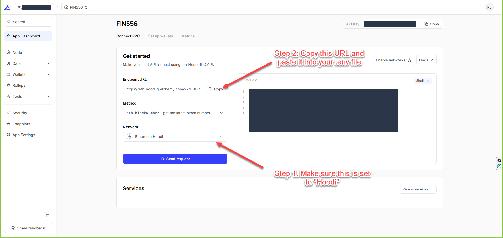
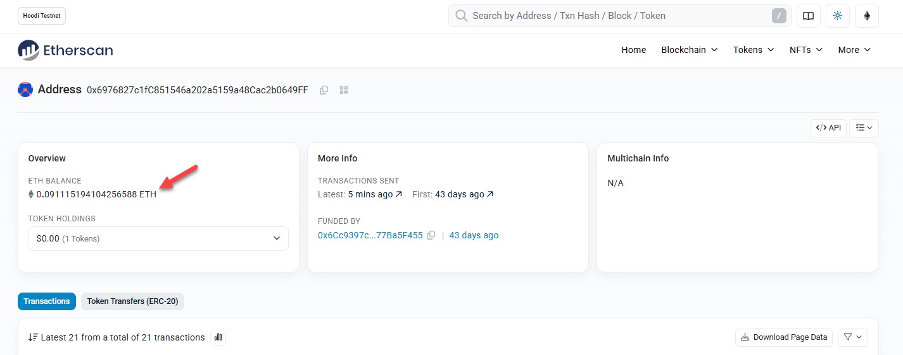
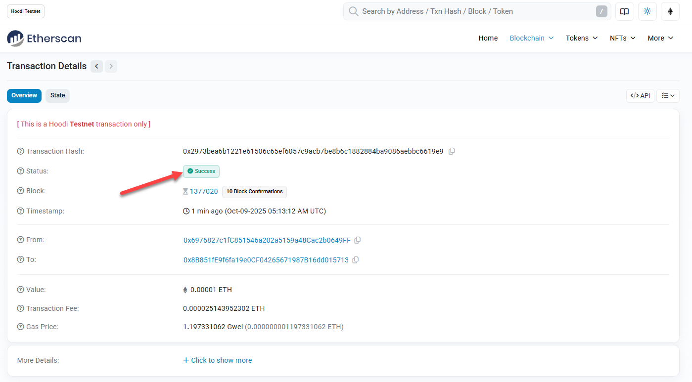

# Deploying ERC20 Tokens on Testnet

⚠️ You must have completed the previous lesson on HD Wallets before you can continue with this lesson. Otherwise, please refer to:

-   [Hierarchical Deterministic Wallets](../../day-1/home-assignments/06-hd-wallet/README.md)
    -   You need to understand how .env file works and because you will need to configure the network settings for testnet.
    -   The account created using the mnemonic will be used to receive test ETH and deploy the smart contracts.

By now you should be familiar with writing and deploying smart contracts on a local Hardhat Network. In this lab, you will apply what you have learnt onto a public testnet called **Hoodi**. Hoodi is a fork of the Ethereum mainnet and is used for testing purposes. More information about Hoodi can be found here: https://github.com/eth-clients/hoodi

There are 2 parts to this lab:

1. Sending Transaction on Public Testnet
2. Deploying ERC20 tokens on Public Testnet

## 🛠️ Lab Practise: Sending Transaction on Public Testnet

💀⚠️ **IMPORTANT: NEVER USE YOUR REAL PRODUCTION WALLET KEY FOR LAB**

### Step 1: Generate a Mnemonic Phrase for Test Wallet

Since we are no longer using the default Hardhat Network for this lab, we will need to create our own test wallet account using a mnemonic phrase.

-   Copy the **.env** file created from the previous lesson [Hierarchical Deterministic Wallets](../../day-1/home-assignments/06-hd-wallet/README.md) to this directory.

    Your `.env` file should look similar to this:

    ```.env
    FIN556_MNEMONIC=replace this with your passphrase
    ```

-   Take note of the account address as you will be needing it to collect test ETH later.

    If you have "lost" your address, you can get it from hardhat console:

    ```js
    > accounts = await ethers.getSigners();
    > accounts[0].address
    // Sample Output:
    // '0x6976827c1fC851546a202a5159a48Cac2b0649FF'
    ```

### Step 2: Signup for an account with Alchemy

Alchemy is a web3 gateway provider. They do not own the testnet, they simply provide access to nodes that are connected to the testnet.
To use their API, you will need to create an account with Alchemy and obtain an API key.

a) Signup an account with Alchemy (https://www.alchemy.com/)

b) Create new app:

-   Name: FIN556
-   Description: FIN556 Testing
-   Choose Chains: Ethereum
-   Choose Network: Hoodi

c) Note down the **Network URL** provided.



### Step 3: Configure Hardhat for Hoodi

a) Create a `.env` file with the mnemonic and Alchemy URL and API Key.

```.env
FIN556_MNEMONIC=replace this with your passphrase
FIN556_ALCHEMY_URL=replace this with Alchemy URL
```

b) Update hardhat.config.js with a network entry for Hoodi below.

```js
require("@nomicfoundation/hardhat-ethers");
require("dotenv").config();
module.exports = {
    solidity: "0.8.20",
    networks: {
        localhost: {
            url: "http://127.0.0.1:8545",
            accounts: {
                mnemonic: process.env.FIN556_MNEMONIC,
            },
        },
        hoodi: {
            chainId: 560048,
            url: process.env.FIN556_ALCHEMY_URL,
            accounts: {
                mnemonic: process.env.FIN556_MNEMONIC,
            },
        },
        hardhat: {
            accounts: {
                mnemonic: process.env.FIN556_MNEMONIC,
            },
        },
    },
};
```

### Step 5: Request for test ETH

**NOTE:** Make sure you are using the Test Wallet address obtained in Step 2 above when requesting for test ETH.

a) Go to this repository https://github.com/pk910/PoWFaucet and refer to the link for "Hoodi Testnet". Follow the instruction to mine the test ETH.

### Step 6: Check your test ETH balance using Etherscan

-   Go to Etherscan (https://hoodi.etherscan.io) and enter your wallet address obtained in Step 2 above. Eg. https://hoodi.etherscan.io/address/0x...

-   You should see the test ETH balance in your wallet.

    

### Step 7: Transfer ETH using Hardhat console

-   Start Hardhat console by connecting to Hoodi network

    ```bash
    hh console --network hoodi
    ```

-   Get the list of accounts

    ```javascript
    > const { ethers } = require("hardhat");
    > let accounts = await ethers.getSigners();
    ```

-   Check the balance of the first account

    ```javascript
    > await ethers.provider.getBalance(accounts[0].address);

    // Sample Output:
    // 91150338056558588n
    ```

    If you have received the test ETH, you should see a non-zero balance.
    Otherwise, stop here and review the previous steps.

-   Send 0.00001 ETH from the first account to the second account

    ```javascript
    > let tx = await accounts[0].sendTransaction({
        to: accounts[1].address,
        value: ethers.parseEther("0.00001", "ether"),
    });
    > await tx.wait();
    > console.log(`txHash = ${tx.hash}`);
    // Sample Output:
    // txHash = 0x2973bea6b1221e61506c65ef6057c9acb7be8b6c1882884ba9086aebbc6619e9
    ```

-   Check the transaction on etherscan using the transaction hash above. Eg. https://hoodi.etherscan.io/tx/0x...

    It should look similar to the screenshot below.

    

---

## 🛠️ Lab Practise: Deploying ERC20 and Crowdsale token on Public Testnet

In this section, you will learn how to deploy ERC20 token contract which you have learned in **Lesson 8 (ERC20 Token Standard Advanced)** to the Hoodi testnet.

### Step 1. Write the deployment and buy token scripts

-   Create `deployToken.js` in the `scripts` directory.

    This script will deploy the `OwnableMintableDemoToken` contract with 1 ether initial supply to the deployer's address.

    **scripts/deployToken.js**

    ```javascript
    const { ethers } = require("hardhat");
    async function main() {
        // Get the first signer/account to deploy the contract
        const signer = (await ethers.getSigners())[0];
        console.log(`Using account: ${await signer.getAddress()}`);

        // Deploy the OwnableMintableDemoToken contract
        const factory = await ethers.getContractFactory(
            "OwnableMintableDemoToken"
        );
        const demoToken = await factory.deploy(
            ethers.parseUnits("1", "ether"),
            signer.address
        );
        await demoToken.waitForDeployment();
        demoTokenAddress = await demoToken.getAddress();
        console.log(`DemoToken deployed to: ${demoTokenAddress}`);

        // Check gas usage
        const deploymentTx = demoToken.deploymentTransaction();
        const receipt = await ethers.provider.getTransactionReceipt(
            deploymentTx.hash
        );
        console.log(`Gas used: ${receipt.gasUsed.toString()}`);
        console.log(
            `Gas price: ${ethers.formatUnits(
                deploymentTx.gasPrice,
                "gwei"
            )} gwei`
        );
        const totalCost = receipt.gasUsed * deploymentTx.gasPrice;
        console.log(
            `Total deployment cost: ${ethers.formatEther(totalCost)} ETH`
        );
    }
    main().catch((error) => {
        console.error(error);
        process.exitCode = 1;
    });
    ```

-   Create `deployCrowdsale.js` in the `scripts` directory with the following code.

    This script will deploy the `Crowdsale` contract and transfer the ownership of the `OwnableMintableDemoToken` contract to the `Crowdsale` contract.

    **NOTE:** that the `deployCrowdsale.js` script requires the `DEMO_TOKEN_ADDRESS` environment variable to be set. This means `OwnableMintableDemoToken` must be deployed first. After that, the `DEMO_TOKEN_ADDRESS` environment variable should be used in the deployment of the `Crowdsale` contract.

    **scripts/deployCrowdsale.js**

    ```javascript
    const { ethers } = require("hardhat");
    require("dotenv").config();

    let demoTokenAddress = process.env.DEMO_TOKEN_ADDRESS;

    async function main() {
        if (!demoTokenAddress) {
            throw new Error(
                "Please export DEMO_TOKEN_ADDRESS environment variable."
            );
        }

        // Deploy the Crowdsale contract
        const CrowdsaleFactory = await ethers.getContractFactory("Crowdsale");
        const crowdsale = await CrowdsaleFactory.deploy(
            demoTokenAddress,
            1000 // 1 ETH = 1000 DemoTokens
        );
        await crowdsale.waitForDeployment();
        crowdsaleAddress = await crowdsale.getAddress();
        console.log(`Crowdsale deployed to: ${crowdsaleAddress}`);

        // Transfer token ownership to the Crowdsale contract
        const demoToken = await ethers.getContractAt(
            "OwnableMintableDemoToken",
            demoTokenAddress
        );
        const transferTx = await demoToken.transferOwnership(crowdsaleAddress);
        await transferTx.wait();
        console.log(
            `Transferred token ownership to Crowdsale at: ${crowdsaleAddress}`
        );
    }
    main().catch((error) => {
        console.error(error);
        process.exitCode = 1;
    });
    ```

-   Create `buyTokens.js` in the `scripts` directory.

    This script will buy 0.0001 ether worth of tokens from the `Crowdsale` contract and show the balance of the buyer after the purchase.

    **NOTE:** that the `buyToken.js` script requires the `CROWDSALE_ADDRESS` environment variable to be set for it to work.

    **scripts/buyTokens.js**

    ```js
    const { ethers } = require("hardhat");
    require("dotenv").config();
    let crowdsaleAddress = process.env.CROWDSALE_ADDRESS;

    async function main() {
        if (!crowdsaleAddress) {
            throw new Error(
                "Please export CROWDSALE_ADDRESS environment variable."
            );
        }

        // Get the first signer/account to buy the tokens
        const signer = (await ethers.getSigners())[0];
        console.log(
            `Purchasing tokens with account: ${await signer.getAddress()}`
        );

        // Get the Crowdsale contract
        const crowdsale = await ethers.getContractAt(
            "Crowdsale",
            crowdsaleAddress,
            signer
        );
        console.log(`CrowdSale contract: ${crowdsaleAddress}`);

        // Buy tokens
        const ethAmount = ethers.parseUnits("0.0001", "ether"); // 0.0001 ether worth of tokens
        const tx = await crowdsale.buyTokens({
            value: ethAmount,
        });
        console.log(`Transaction sent: ${tx.hash}`);
        await tx.wait();

        // Check balance
        const tokenAddr = await crowdsale.token();
        const token = await ethers.getContractAt(
            "OwnableMintableDemoToken",
            tokenAddr
        );
        const balance = await token.balanceOf(signer.getAddress());
        console.log(`Token address: ${tokenAddr}`);
        console.log(
            `Tokens purchased: ${ethers.formatUnits(balance, 18)} DEMO`
        );
    }

    main().catch((error) => {
        console.error(error);
        process.exitCode = 1;
    });
    ```

### Step 2. Test the scripts on local Hardhat Network

-   Start a local Hardhat Network

    ```bash
    hh node
    ```

-   In another terminal, run the deployment script to deploy the `OwnableMintableDemoToken` contract to the local Hardhat Network.

    ```bash
    hh run scripts/deployToken.js --network localhost

     # Sample output:
     # Using account: 0x6976827c1fC851546a202a5159a48Cac2b0649FF
     # DemoToken deployed to: 0xa0fd5073B66aB43a76523e9c648af62D72560A09
     # Gas used: 1187601
     # Gas price: 1.875 gwei
     # Total deployment cost: 0.002226751875 ETH
    ```

-   Now run the deployment script to deploy the `Crowdsale` contract to the local Hardhat Network by passing the `DEMO_TOKEN_ADDRESS` environment variable.

    ```bash
    DEMO_TOKEN_ADDRESS=replace-with-demo-token-address hh run scripts/deployCrowdsale.js --network localhost

     # Sample output:
     # Crowdsale deployed to: 0x8E7d01da12C167B35604A8F288Ad4a6d3F099412
     # Transferred token ownership to Crowdsale at: 0x8E7d01da12C167B35604A8F288Ad4a6d3F099412
    ```

-   Now, run the buy token script to buy tokens from the `Crowdsale` contract by passing the `CROWDSALE_ADDRESS` environment variable.

    ```bash
    CROWDSALE_ADDRESS=replace-with-crowdsale-address hh run scripts/buyTokens.js --network localhost
     # Sample output:
     # Purchasing tokens with account: 0x6976827c1fC851546a202a5159a48Cac2b0649FF
     # CrowdSale contract: 0x1D05A2919220e944bDDc54C5A37d4738D2944110
     # Transaction sent: 0xcdc1cb51b952a8e835eceae9b9519b700d25acbc1bdcbdd3d4461c5cab93d184
     # Token address: 0xa0fd5073B66aB43a76523e9c648af62D72560A09
     # Tokens purchased: 1.4 DEMO
    ```

-   You can run the buy token script multiple times to buy more tokens and each time you should see the token balance increasing by 0.1 DEMO.

### Step 3. Run the scripts on testnet

-   Run the deployment script to deploy the `OwnableMintableDemoToken` contract to testnet

    ```bash
    hh run scripts/deployToken.js --network hoodi

     # Sample output:
    ```

-   Now run the deployment script to deploy the `Crowdsale` contract to the local Hardhat Network by passing the `DEMO_TOKEN_ADDRESS` environment variable.
    **NOTE:** Make you are using the `DEMO_TOKEN_ADDRESS` from the output of testnet deployment above.

    ```bash
    DEMO_TOKEN_ADDRESS=replace-with-demo-token-address hh run scripts/deployCrowdsale.js --network hoodi

     # Sample output:
    ```

-   Now, run the buy token script to buy tokens from the `Crowdsale` contract by passing the `CROWDSALE_ADDRESS` environment variable.
    **NOTE:** Make you are using the `CROWDSALE_ADDRESS` from the output of testnet deployment above.

    ```bash
    CROWDSALE_ADDRESS=replace-with-crowdsale-address hh run scripts/buyTokens.js --network hoodi

     # Sample output:
    ```
