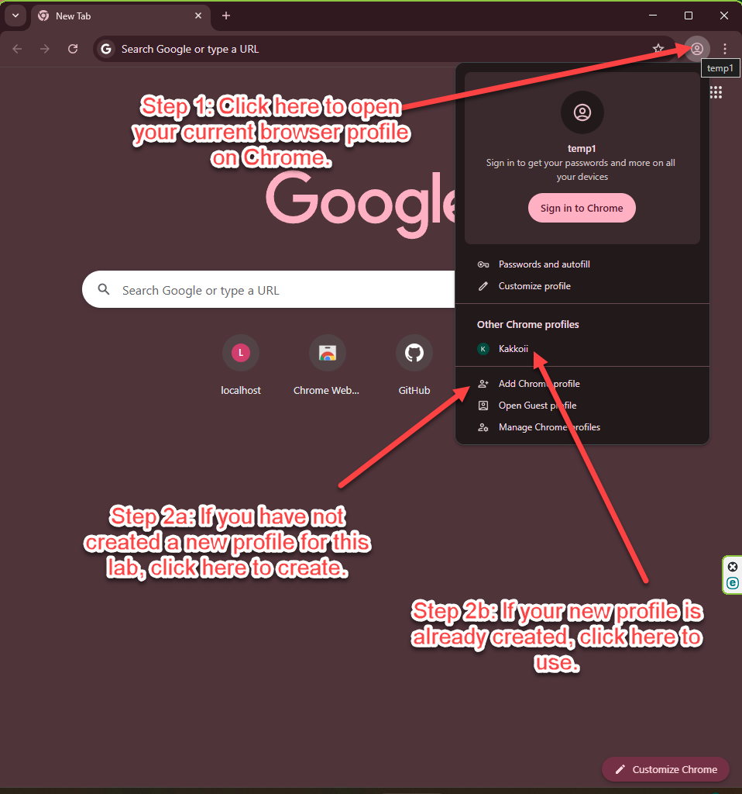
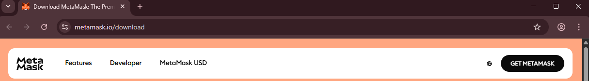
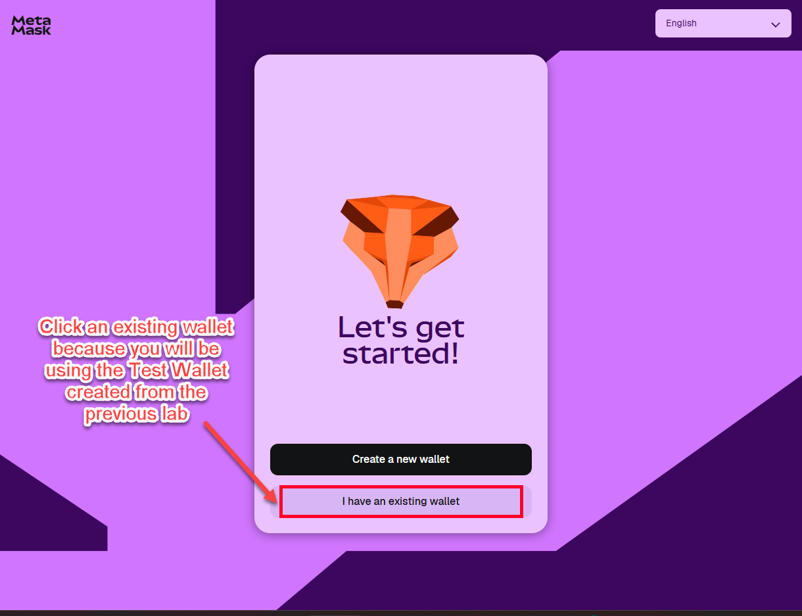
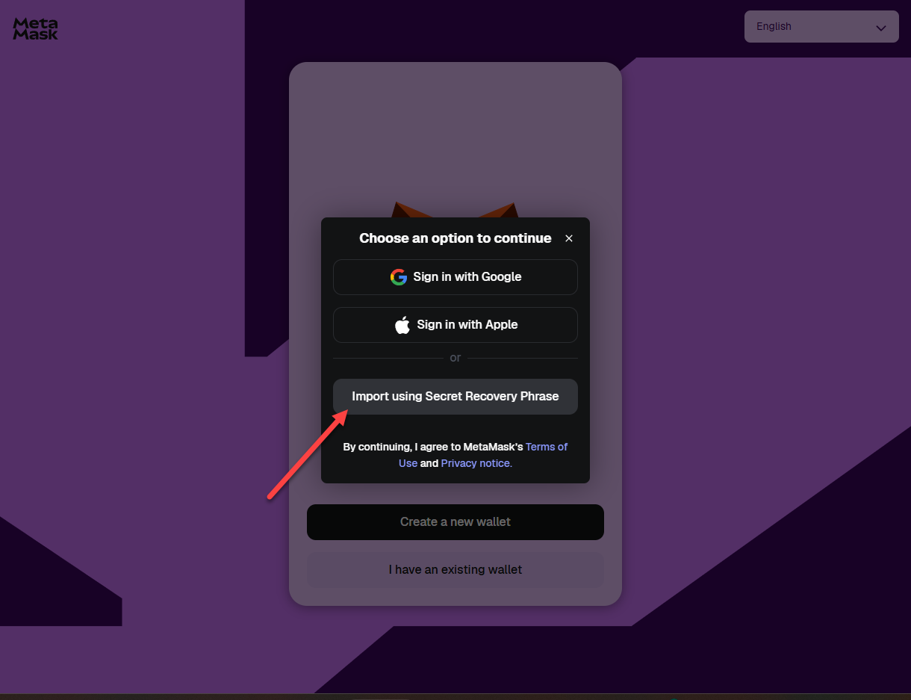
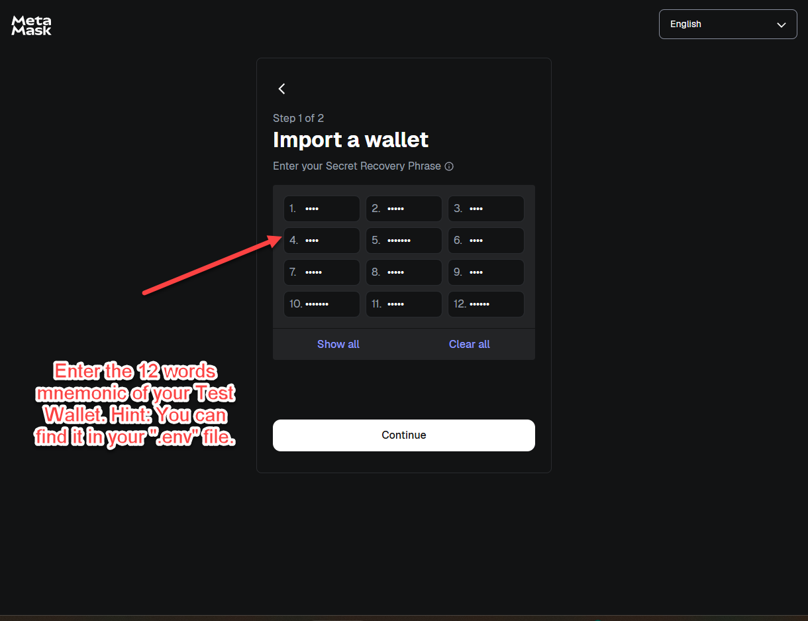
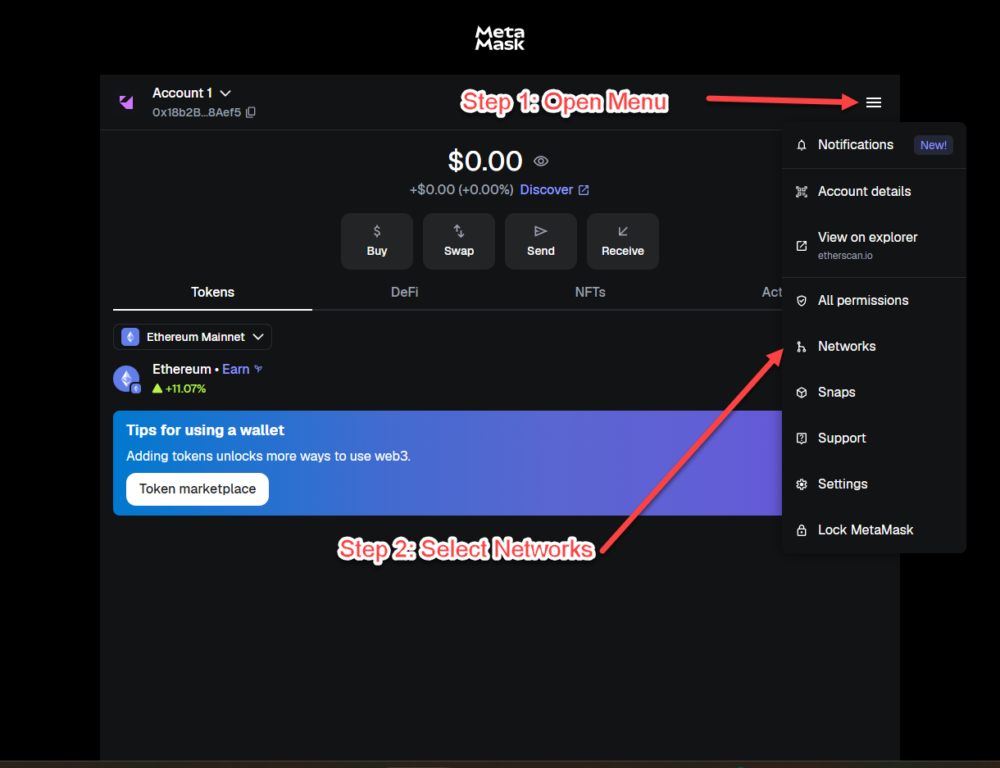
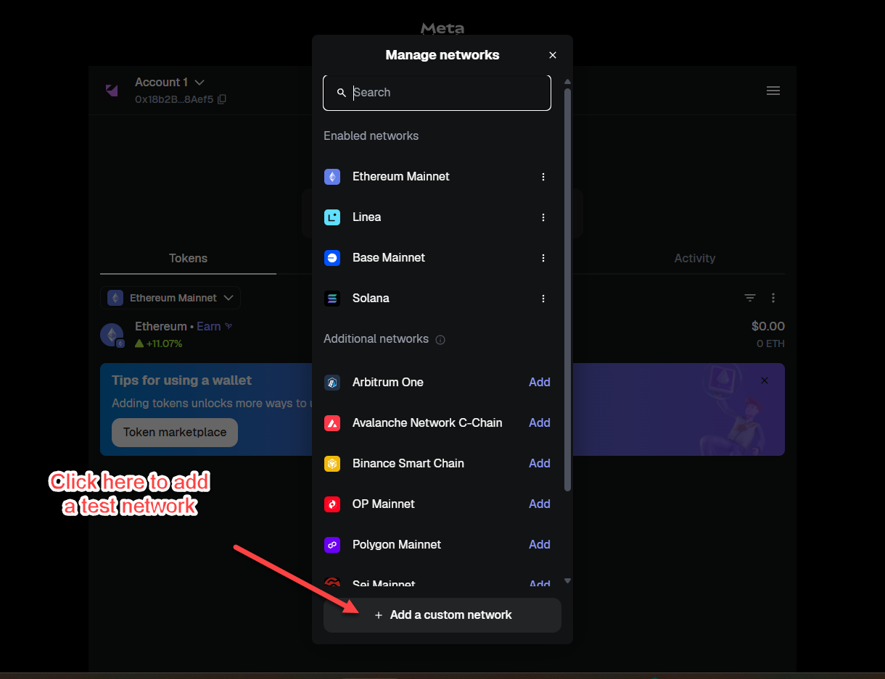
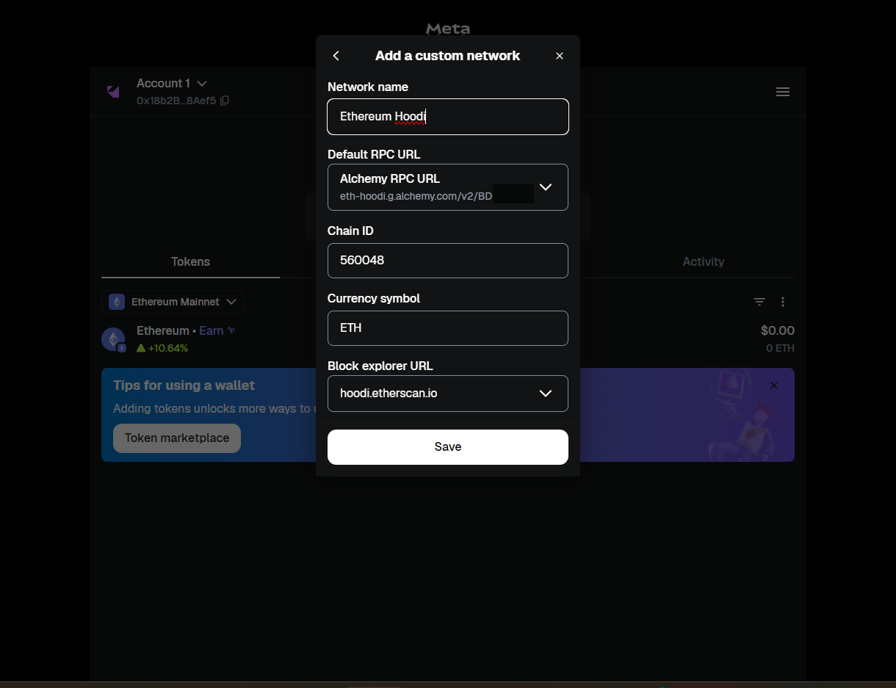
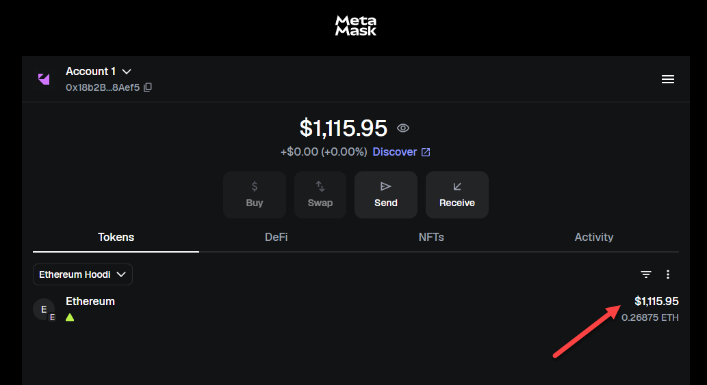

# MetaMask 钱包

⚠️ 您必须先完成上一节[在测试网上部署 ERC20 代币](../../day-3/12-testnet/README.md) 才能继续本课程。否则，请参考：

-   [在测试网上部署 ERC20 代币](../../day-3/12-testnet/README.md)
    -   您需要了解如何为钱包创建助记词短语，因为您需要将助记词短语导入 Metamask。
    -   您需要连接到测试网并在钱包中查看您的测试 ETH 余额。

💀⚠️ **重要：切勿将您的真实生产钱包密钥用于实验**

在本实验之前，您应该已经使用 Hardhat 生成的助记词完成了"测试网"实验，并配置了您的 hardhat 网络以使用该助记词。

在本实验中，您将创建一个新的 MetaMask 钱包，并配置您的 Hardhat 网络使用与您的 MetaMask 钱包相同的助记词。这样，您就可以使用您的 MetaMask 钱包与您的测试网进行交互。

## 🛠️ 实验实践：创建新的 Metamask 钱包

### 步骤 1：安装 Metamask 并创建新钱包

💀⚠️ **重要：运行本实验时，切勿错误使用您的个人 Metamask 钱包。**

-   **安装 Chrome 浏览器**

    为确保最大兼容性，我们将为本实验使用 Chrome 浏览器。如果您没有安装 Chrome，请先安装（https://www.google.com/chrome/）。

    注意：如果您选择使用不同的浏览器，屏幕截图和说明可能略有不同。请确保浏览器与 Metamask 兼容，并且您知道如何在浏览器中创建新配置文件。

-   **在 Chrome 浏览器中创建新配置文件**

    为避免错误使用您的个人 Metamask 钱包，我们将在 Chrome 浏览器中创建一个新配置文件，并使用该配置文件进行本实验。
    按照此处的说明在 Chrome 浏览器中创建新配置文件：https://support.google.com/chrome/answer/2364824?hl=en

    屏幕可能看起来与下面类似，但由于 Chrome 界面更新可能略有不同。如有疑问，请按照上面链接中的说明操作。

    

-   **下载并安装 Metamask 插件**

    💀⚠️ **重要：切勿将您的真实生产钱包密钥用于实验**

    使用新配置文件登录后，按照此处的说明（https://metamask.io/download/）。点击"Get Metamask"并按照说明安装 Chrome 的 Metamask 扩展。

    

-   **首次运行 Metamask**

    安装扩展后，系统将要求您导入现有钱包或创建新钱包。

    在本实验中，您将使用从测试钱包生成的助记词导入现有钱包。

    

-   **点击"使用秘密恢复短语导入"**

    

-   **输入助记词**

    输入上一节课为测试钱包生成的以下助记词（12 个单词）。

    

-   **输入 Metamask 钱包的密码**

    系统将要求您输入钱包的密码。**输入您能记住的密码，否则您必须卸载并重新安装 Metamask。**

-   **完成**

### 步骤 2：将 Metamask 连接到测试网

-   **从 Metamask 菜单下拉列表中选择"网络"。**

    

-   **点击"+添加自定义网络"**

    

-   **输入以下信息：**

    -   网络名称 = "Ethereum Hoodi"
    -   默认 RPC URL = 输入您在上节课中创建的 Alchemy Hoodi 测试网 URL
    -   Chain ID = 560048
    -   货币符号 = "ETH"
    -   区块浏览器 URL = "https://hoodi.etherscan.io"

    

-   **点击"保存"**

-   **连接后，您应该在上节课的钱包中看到 `xxx ETH`。**

    

### 步骤 3：[可选] 将 Metamask 连接到 Hardhat 独立网络

您可以将 Metamask 连接到您的本地 Hardhat 网络。

-   **转到上一节课的目录**

    注意：在开始此步骤之前，应该已完成之前的实验 **12-testnet**。应该有一个 `.env` 文件，其中包含您用于连接到测试网的助记词，这与您用于创建 Metamask 钱包的助记词相同。

    ```bash
    cd ../12-testnet
    ```

-   **启动 hardhat 节点**

    ```bash
    hh node
    ```

-   **添加网络**

    重复上述步骤在 Metamask 中添加自定义网络，但改用以下信息：

    -   网络名称 = "Hardhat"
    -   默认 RPC URL = "http://localhost:8545"
    -   Chain ID = 31337
    -   货币符号 = "ETH"

-   **连接后，您应该从 hardhat 节点看到钱包中有 `10000 ETH`。**
