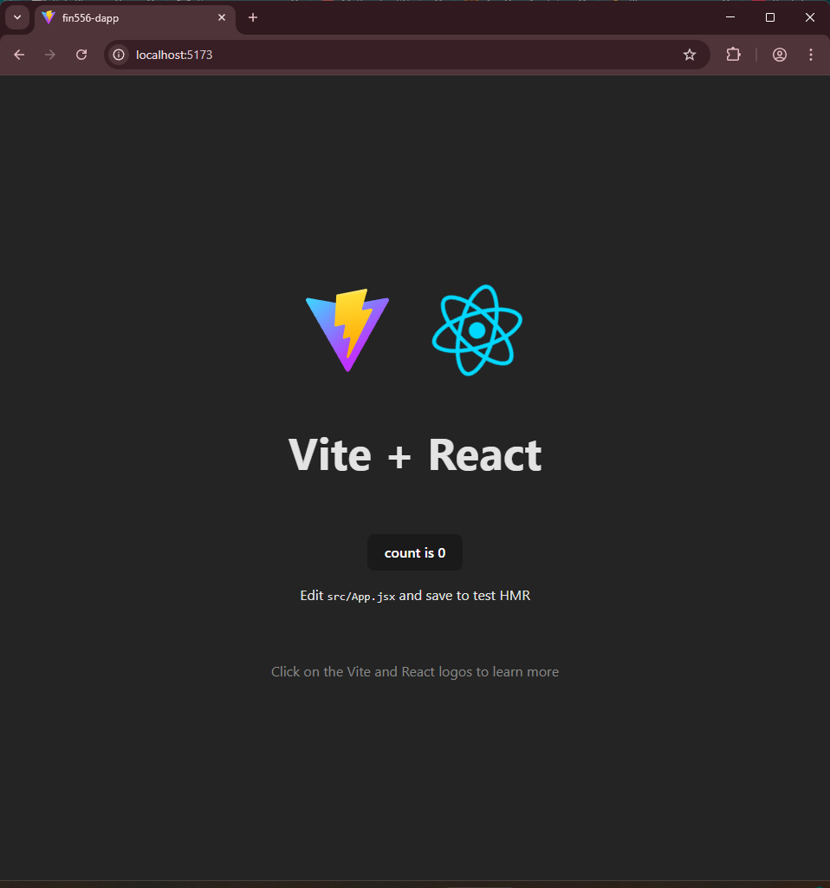
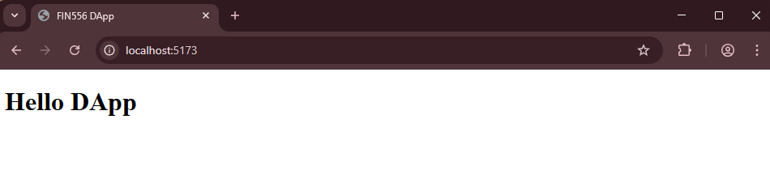

## 🛠️ Lab Practise: Setting Up The Web Framework (React)

**High-Level DApp Objectives:**

The DApp we are going to build will have the following features:

-   Connects to Metamask wallet.
-   Interacts with contracts deployed on local Hardhat node.
-   Shows the current token balances of the user.
-   Show the current pool reserves.
-   Allow the user to swap tokens.

The lab will be divided into the following parts:

a) Setting up the web framework (React) - this part ✅  
b) Create a mock-up of the DApp with hardcoded data  
c) Extend the DApp to integrate with Metamask  
d) Deploy Uniswap contracts to local Hardhat node  
e) Complete the DApp to allow token swaps

**NOTE: This is not a course on React.**

React code will be provided for you to build upon in this lab and you are not required to understand the React code in detail. The focus of the lesson is to learn how to extend the React code to integrate with the blockchain using ethers.js library. If you are interested to learn more about React, please refer to the [React documentation](https://react.dev/).

We will start by setting up an empty React (web framework) project and strip it down to the bare minimum so that we can build our DApp UI from scratch.

### Step 1: Setup

1. **Go to the day-4/14-DApp directory**

    ```bash
    cd /workspace/day-4/15-dapp/a-dapp-react
    ```

### Step 2: Create React Project

1. **Create project directory fin556-dapp**

    Create a new React project using Vite.

    NOTE: If you have already created the **fin556-dapp** directory, it will throw an error. You can delete the directory **fin556-dapp** and re-run the command.

    ```bash
    npm create vite@8.0.2 fin556-dapp -- --template react --no-interactive
    ```

    Notice that the command will generate a **fin556-dapp** directory within your current directory.

    This directory will be your React project directory and contains the code needed to start and run a React server for browser testing.

    Make sure you are in the correct directory when you are writing code for DApp.

    Change into the **fin556-dapp** directory.

    ```bash
    cd fin556-dapp
    ```

2. **Install React dependencies**

    ```bash
    npm i
    ```

3. **Start React server**

    ```bash
    npm run dev

     # Sample output:
     # VITE v7.1.9  ready in 310 ms
     #
     # ➜  Local:   http://localhost:5173/
     # ➜  Network: use --host to expose
     # ➜  press h + enter to show help

    ```

4. **Open browser at http://localhost:5173**

    If you can see the following page, that means your React server is running correctly and you are able to connect to it from your browser.

    

    - **Troubleshooting**

        If you see an error page, it could be due to one of the following reasons:

        - **Conflicting port** That means you have another server running on the same port. You can stop the other server if you know which one it is. Or you can change the port of the React server by editing the **package.json** file and adding the following line in the "scripts" section.

            ```json
            "dev": "vite --port 5174",
            ```

            Then stop the React server by pressing `Ctrl + C` in the terminal and restart it using `npm run dev`.

        - **Firewall blocking the port** Your local firewall could be blocking the port. On Windows, you can stop the firewall temporarily to test if that is the issue. On macOS, you can go to System Preferences > Security & Privacy > Firewall and turn off the firewall temporarily to test if that is the issue. If it is, then you can add an exception in the firewall settings to allow traffic on that port.

5. **Stop React server**

    Go back to terminal and press `Ctrl + C` to stop the server.

### Step 3: Clean Up Unnecessary Files

1. **Create a clean src directory**

    From within the fin556-dapp directory, delete **index.html** and **README.md** files since we will be creating our own from scratch.

    ```bash
    rm index.html
    rm README.md
    ```

    Next, delete all files in the **src** and **public** directories and create new empty directories.

    ```bash
    rm -rf src public
    mkdir src public
    ```

2. **Check directory structure**

    To confirm that you are on the right track, run the following command to check your directory structure from within the **fin556-dapp** directory.

    ```bash
    tree -I node_modules

     # Make sure the output looks like this:
     # .
     # ├── eslint.config.js
     # ├── package-lock.json
     # ├── package.json
     # ├── public
     # ├── src
     # └── vite.config.js
    ```

3. **Create fin556-dapp/src/main.jsx**

    In **fin556-dapp/src** directory, create a new file **main.jsx** and add the following code.

    ```jsx
    import { createRoot } from "react-dom/client";
    import App from "./App.jsx";

    createRoot(document.getElementById("root")).render(<App />);
    ```

4. **Create fin556-dapp/src/App.jsx**

    In **fin556-dapp/src** directory, create a new file **App.jsx** and add the following code.

    ```jsx
    import React from "react";
    const App = () => {
        return <h1>Hello DApp</h1>;
    };
    export default App;
    ```

5. **Create fin556-dapp/index.html**
   In **fin556-dapp** directory, create a new file **index.html** and add the following code.

    ```html
    <!DOCTYPE html>
    <html lang="en">
        <head>
            <meta charset="UTF-8" />
            <meta
                name="viewport"
                content="width=device-width, initial-scale=1.0"
            />
            <title>FIN556 DApp</title>
        </head>
        <body>
            <div id="root"></div>
            <script type="module" src="/src/main.jsx"></script>
        </body>
    </html>
    ```

### Step 4: Run the DApp

1. **Start React server again**

    Once these 3 files are created, you can start the React server again

    ```bash
    npm run dev
    ```

2. **Open browser at http://localhost:5173**

    Open the browser at http://localhost:5173. You should see an empty page with "Hello DApp" text.

    

3. **Stop React server**

    Go back to terminal and press `Ctrl + C` to stop the server.

4. **Task completed ✅**

    You have successfully set up an empty React project and are ready to build your DApp UI from scratch.
