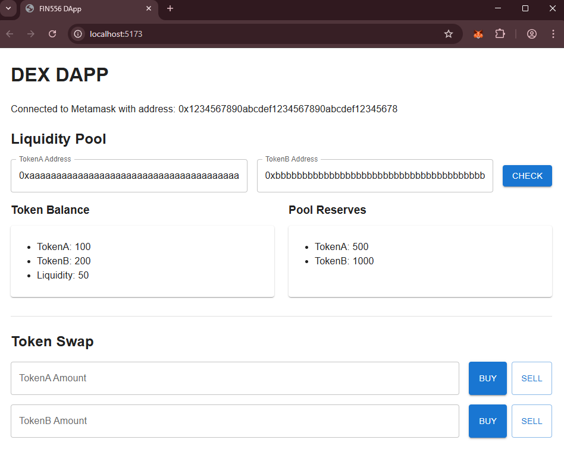

## 🛠️ 实验实践：创建模型

**DApp 高级目标：**

我们要构建的 DApp 将具有以下功能：

-   连接到 Metamask 钱包并显示钱包地址。
-   与部署在本地 Hardhat 节点上的合约交互。
-   显示用户当前的代币余额。
-   显示当前池储备。
-   允许用户交换代币。

实验将分为以下部分：

a) 设置 Web 框架（React）
b) 使用硬编码数据创建 DApp 模型 - 这部分 ✅
c) 扩展 DApp 以集成 Metamask
d) 将 Uniswap 合约部署到本地 Hardhat 节点
e) 完成 DApp 以允许代币交换

您之前已经创建了一个[空 React 项目](../a-dapp-react/README.md)，现在我们将扩展 React 代码来创建一个只包含 UI 和硬编码数据而没有任何区块链集成的模型。我们将在未来的迭代中逐步向此 React 代码添加区块链集成代码。

### 步骤 1：设置

1.  **确保您在 React 项目目录中**

    ```bash
    cd /workspace/day-4/15-dapp/b-dapp-mockup/fin556-dapp
    ```

2.  **安装 Material UI**

    我们将安装一个第三方 UI 组件库，以便在我们的 DApp 中使用预建的 UI 组件。此库被导入到 **App.jsx** 中。

    ```bash
    npm i @mui/material @emotion/react @emotion/styled
    ```

### 步骤 2：更新 App.jsx

3.  **打开 App.jsx**

    打开 **fin556-dapp/src/App.jsx** 文件。

    **注意：** 确保您引用的是正确的文件。

4.  **删除文件中的所有内容**

    删除文件中的所有内容，使其为空。

5.  **将以下代码添加到 App.jsx**

    -   **导入 React 包**

        导入 React 中的 `useEffect` 和 `useState` 来处理副作用和状态管理。这不是 React 课程，所以不需要详细了解这些是如何工作的。只需知道 `useEffect` 用于在组件加载时运行代码，`useState` 用于在 Web 应用程序中存储状态变量。

        <!-- prettier-ignore -->
        ```js
        import React, { useState, useEffect } from "react";
        ```

    -   **导入 Material UI 组件**

        <!-- prettier-ignore -->
        ```js
        import {
            CssBaseline,
            Container,
            Card,
            Button,
            TextField,
            Box,
            Divider,
            CircularProgress,
        } from "@mui/material";
        ```

    -   **添加一个空的 App() 组件并导出它。**

        <!-- prettier-ignore -->
        ```js
        const App = () => {        

            // 在此处插入后续代码

        }
        export default App;
        ```

    -   **将后续代码插入到 App() 中**

        我们将首先创建要在 UI 中显示的模拟数据，这样您就可以知道数据来自哪里。然后我们将创建 UI 组件来显示数据。

        -   **为签名者创建状态变量**

            签名者是包含私钥并可用于签署交易的账户的另一个术语。下面的代码创建了一个名为 `signer` 的状态变量，用于存储从 Metamask 返回的账户。

            插入下面的代码。

              <!-- prettier-ignore -->

            ```js
            const [signer, setSigner] = useState({
                address: "0x1234567890123456789012345678901234567890",
            });
            ```

            **解释：**

            -   `useState` 返回一个包含两个元素的数组：状态变量的当前值和更新它的函数。我们使用数组解构将这些元素分配给单独的变量。

            -   在上面的代码中，`signer` 用地址 `"0x1234567890123456789012345678901234567890"` 的对象初始化。

                ```js
                console.log(signer);
                // 输出：
                // {
                // address: "0x1234567890123456789012345678901234567890"
                // }
                ```

            -   我们可以通过使用新值调用 `setAddress` 函数来更改 `address` 的值。例如，在下面的代码中，我们将签名者设置为 `null`。

                ```js
                setAddress(null);
                console.log(address);
                // 输出: null
                ```

        -   **为代币地址 A 创建状态变量**

            插入下面的代码。

            <!-- prettier-ignore -->
            ```js
            const [tokenAddrA, setTokenAddrA] = useState(
                "0xaaaaaaaaaaaaaaaaaaaaaaaaaaaaaaaaaaaaaaaa"
            );
            ```

        -   **为代币地址 B 创建状态变量**  
            插入下面的代码。

            <!-- prettier-ignore -->
            ```js
            const [tokenAddrB, setTokenAddrB] = useState(
                "0xbbbbbbbbbbbbbbbbbbbbbbbbbbbbbbbbbbbbbbbb"
            );
            ```

        -   **为 Uniswap 路由器和工厂地址创建状态变量**

            插入下面的代码。

            <!-- prettier-ignore -->
            ```js
            const [uniswapRouterAddress, setUniswapRouterAddress] = useState(
                "0xcccccccccccccccccccccccccccccccccccccccc"
            );
            const [uniswapFactoryAddress, setUniswapFactoryAddress] = useState(
                "0xdddddddddddddddddddddddddddddddddddddddd"
            );
            ```

        -   **为余额数据创建状态变量**  
            插入下面的代码。

            <!-- prettier-ignore -->
            ```js
            const [balance, setBalance] = useState({
                balanceA: 100,
                balanceB: 200,
                liquidity: 50,
                reservesA: 500,
                reservesB: 1000,
            });
            ```

        -   **渲染 UI 组件**

            将 return() 部分插入 App() 中。这将使用名为 JSX 的类 HTML 语法在浏览器上渲染 UI 组件。

            不需要了解下面代码的细节。请注意：

            -   `textField` 组件用于创建由之前创建的 `tokenAddrA`、`tokenAddrB`、`uniswapRouterAddress` 和 `uniswapFactoryAddress` 状态变量使用的文本框。
            -   `card` 组件用于显示来自 `balance` 状态变量的数据块。
            -   `button` 组件将在点击时用于调用某些函数。

            插入下面的代码。
            <!-- prettier-ignore -->
            ```js
            return (
                <>
                    <CssBaseline />
                    <Container>
                        <h1>DEX DAPP</h1>
                        <p>Connected to Metamask with address: {signer?.address}</p>
                        <h2 style={{ marginBottom: "16px" }}>Contract Configuration</h2>
                        <Box sx={{ display: "flex", gap: 2, mb: 2 }}>
                            <TextField
                                label='Uniswap Router Address'
                                sx={{ flex: 1 }}
                                value={uniswapRouterAddress}
                                onChange={(e) => {
                                    setUniswapRouterAddress(e.target.value);
                                }}
                            />
                            <TextField
                                label='Uniswap Factory Address'
                                sx={{ flex: 1 }}
                                value={uniswapFactoryAddress}
                                onChange={(e) => {
                                    setUniswapFactoryAddress(e.target.value);
                                }}
                            />
                        </Box>
                        <Divider sx={{ my: 3 }} />                            
                        <h2 style={{ marginBottom: "16px" }}>Liquidity Pool</h2>
                        <Box
                            sx={{
                                display: "flex",
                                alignItems: "center",
                                justifyContent: "space-between",
                                gap: 2,
                                mb: 2,
                            }}
                        >
                            <TextField
                                id='tokenAddrA'
                                label='TokenA Address'
                                value={tokenAddrA}
                                sx={{ flex: 1 }}
                                onChange={(e) => {
                                    setTokenAddrA(e.target.value);
                                }}
                            ></TextField>                            
                            <TextField
                                id='tokenAddrB'
                                label='TokenB Address'
                                value={tokenAddrB}
                                sx={{ flex: 1 }}
                                onChange={(e) => {
                                    setTokenAddrB(e.target.value);
                                }}
                            ></TextField>
                            <Button variant='contained'>Check</Button>
                        </Box>
                        <Box sx={{ display: "flex", gap: 3, mb: 4 }}>
                            <Box
                                sx={{
                                    flex: 1,
                                    display: "flex",
                                    flexDirection: "column",
                                }}
                            >
                                <h3 style={{ marginTop: 0, marginBottom: "12px" }}>
                                    Token Balance
                                </h3>
                                <Card sx={{ p: 3, flexGrow: 1 }}>
                                    <ul style={{ margin: 0, paddingLeft: "20px" }}>
                                        <li>TokenA: {balance?.balanceA}</li>
                                        <li>TokenB: {balance?.balanceB}</li>
                                        <li>Liquidity: {balance?.liquidity}</li>
                                    </ul>
                                </Card>
                            </Box>
                            <Box
                                sx={{
                                    flex: 1,
                                    display: "flex",
                                    flexDirection: "column",
                                }}
                            >
                                <h3 style={{ marginTop: 0, marginBottom: "12px" }}>
                                    Pool Reserves
                                </h3>
                                <Card sx={{ p: 3, flexGrow: 1 }}>
                                    <ul style={{ margin: 0, paddingLeft: "20px" }}>
                                        <li>TokenA: {balance?.reservesA}</li>
                                        <li>TokenB: {balance?.reservesB}</li>
                                    </ul>
                                </Card>
                            </Box>
                        </Box>
                        <Divider sx={{ my: 3 }} />
                        <h2 style={{ marginBottom: "16px" }}>Token Swap</h2>
                        <Box sx={{ display: "flex", gap: 2, mb: 2 }}>
                            <TextField id='amtA' label='TokenA Amount' fullWidth />
                            <Box sx={{ display: "flex", gap: 1 }}>
                                <Button variant='contained'>Buy</Button>
                                <Button variant='outlined'>Sell</Button>
                            </Box>
                        </Box>
                        <Box sx={{ display: "flex", gap: 2, mb: 2 }}>
                            <TextField id='amtB' label='TokenB Amount' fullWidth />
                            <Box sx={{ display: "flex", gap: 1 }}>
                                <Button variant='contained'>Buy</Button>
                                <Button variant='outlined'>Sell</Button>
                            </Box>
                        </Box>
                    </Container>
                </>
            );
            ```

### 步骤 3 - 运行 DApp

1.  **启动 React 服务器**

    使用以下命令启动 React 服务器。

    ```bash
    npm run dev
    ```

2.  **在 [http://localhost:5173](http://localhost:5173) 打开浏览器**

    在浏览器中应该看起来像这样：

    

    -   **第一部分：合约配置**

        此部分允许用户输入 Uniswap 路由器和工厂合约地址。

        -   用户可以在"Uniswap Router Address"文本框中输入 Uniswap 路由器地址。

        -   用户可以在"Uniswap Factory Address"文本框中输入 Uniswap 工厂地址。

    -   **第二部分：流动性池**

        此部分本质上是一个用于显示用户代币余额和当前池储备的仪表板。

        -   它在顶部用两个文本框显示流动性池中两种储备代币的代币地址。

        -   在它下面，它显示用户拥有的代币余额（"Token Balance"）。

        -   在它旁边，它显示流动性池中两种代币的储备（"Pool Reserves"）。

        -   每次点击"CHECK"按钮时，它将刷新代币余额和池储备。实现该逻辑需要做。

    -   **第三部分：代币交换**

        此部分允许用户在流动性池中交换两种代币。

        -   用户必须首先决定是想用"TokenA"还是"TokenB"来交换，方法是在相应的文本框中输入金额。

        -   然后用户可以点击"BUY"或"SELL"按钮来执行交换。

        -   实现该逻辑需要做交换。

        -   **例如**

            如果用户想用 TokenA 支付以接收 100 TokenB，那么用户是"买入 100 TokenB"。为此，用户将在"TokenB Amount"文本框中输入"100"并点击旁边的"BUY"按钮。

            如果用户想支付 500 TokenA 以接收 TokenB，那么用户是"卖出 500 TokenA"。为此，用户将在"TokenA Amount"文本框中输入"500"并点击旁边的"SELL"按钮。

3.  **停止 React 服务器**

    返回终端并按 `Ctrl + C` 停止服务器。

4.  **任务完成 ✅**

    您已成功创建了带有硬编码数据的 DApp 模型，准备好在下一次骤中扩展 DApp 以集成 Metamask 和本地 Hardhat 节点。
