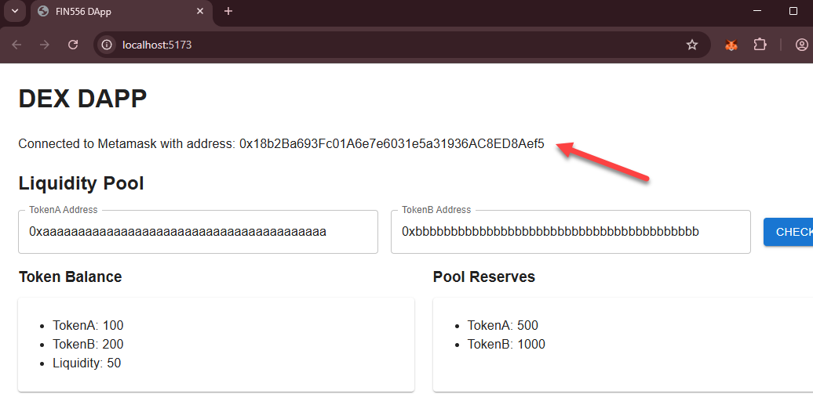

## 🛠️ 实验实践：集成 Metamask

**DApp 高级目标：**

我们要构建的 DApp 将具有以下功能：

-   连接到 Metamask 钱包。
-   与部署在本地 Hardhat 节点上的合约交互。
-   显示用户当前的代币余额。
-   显示当前池储备。
-   允许用户交换代币。

实验将分为以下部分：

a) 设置 Web 框架（React）
b) 使用硬编码数据创建 DApp 模型
c) 扩展 DApp 以集成 Metamask - 这部分 ✅
d) 将 Uniswap 合约部署到本地 Hardhat 节点
e) 完成 DApp 以允许代币交换

### 步骤 1：设置

1.  **转到 React 项目目录**

    ```bash
    cd /workspace/day-4/15-dapp/c-dapp-metamask/fin556-dapp
    ```

2.  **安装 React**

    ```bash
    npm i
    ```

3.  **安装 ethers.js**

    此包将被我们的脚本库用于与区块链交互。

    **注意：** 我们只安装 ethers.js，因为它将被打包到浏览器中。我们不能在浏览器中使用 hardhat，因为它是一个 node.js 库，不是为在浏览器中运行而设计的。

    ```bash
    npm i ethers
    ```

### 步骤 2：创建用于区块链交互的 React Hook 脚本库

我们希望将区块链交互代码与 Web 交互代码分开。这将使代码更清晰、更容易维护。  
因此，我们将在 React 项目中创建一个名为 **useDapp.js** 的单独脚本库文件用于区块链交互代码。这个库被称为"React Hook"，因为它使用 React 的 Hook 系统来管理状态和副作用。

1.  **创建 fin556-dapp/src/useDapp.js**

    在 React 项目的 **fin556-dapp/src** 目录中创建一个名为 **useDapp.js** 的新文件。

    > ⚠️ 这里要小心：
    >
    > -   此脚本由 React 项目使用，而不是由 Hardhat 使用，因此必须创建在 React 项目目录中。
    > -   确保您在之前创建 React 项目的 **fin556-dapp/src** 目录中创建它。
    > -   不要在错误的目录中创建它。

2.  **将以下代码添加到 useDapp.js**

    -   **导入 ethers**

        在文件顶部插入以下导入语句。

        ```js
        import { ethers } from "ethers";
        ```

    -   **创建一个空的 useDapp() 函数**

        创建一个名为 `useDapp()` 的空函数。

        `useDapp()` 将接受一个名为 `setSigner()` 的函数作为参数。当 DApp 连接到 Metamask 并获取连接的签名者时，它将调用此函数来更新 DApp UI 中的签名者。

        ```js
        const useDapp = ({ setSigner }) => {
            // 区块链交互代码将在此处
        };

        export default useDapp;
        ```

    -   **在 useDapp() 函数内插入以下代码**

        我们将添加代码以连接到 Metamask 并获取连接的账户。

        -   **添加 provider**

            我们希望获取 Metamask provider（`window.ethereum`），以便我们可以与浏览器中的 Metamask 钱包扩展进行交互。通过 Metamask，让我们向区块链发送命令。如果没有安装 Metamask，`window.ethereum` 将为 null，函数将返回 null，以便 DApp 可以向用户显示错误消息。

            **注意：** 在 Hardhat 中，我们使用 **hardhat.config.js** 文件配置 provider，但既然我们这里不使用 Hardhat，我们需要从 Metamask 获取 provider。

            在 `useDapp()` 函数内插入以下代码。

            ```js
            const provider = window.ethereum
                ? new ethers.BrowserProvider(window.ethereum)
                : null;
            ```

        -   **添加 connect() 函数**

            此函数将被 DApp 用于从 Metamask 获取签名者。在 Hardhat 中，我们能够使用 `ethers.getSigners()` 获取账户列表，因为我们已将密钥管理委托给 Hardhat。在 Metamask 中，您需要首先使用密码连接它以解锁钱包。这就是下面的代码中 `eth_requestAccounts` 命令所做的事情。

            在 `useDapp()` 函数内插入以下代码。

            ```js
            const connect = async () => {
                if (!provider) return null;

                await provider.send("eth_requestAccounts", []); // 登录到 metamask
                const signer = await provider.getSigner();

                const { chainId } = await provider.getNetwork();
                console.log("Connected to chainId:", chainId);

                // const DESIRED_CHAIN_ID = 31337; // 这是 hardhat 本地网络的默认 chain ID
                // if (chainId !== DESIRED_CHAIN_ID) {
                //     await provider.send("wallet_switchEthereumChain", [
                //         { chainId: `0x${DESIRED_CHAIN_ID.toString(16)}` }, // 必须是十六进制格式
                //     ]);
                // }

                // 获取并设置地址
                setSigner(signer);

                return signer;
            };
            ```

            **可选：** 我们还可以通过取消注释 `const signer = provider.getSigner();` 行后的代码来控制用户应该连接到的网络。如果您想确保用户连接到 localhost 而不是其他地方，这很有用。

        -   **从 useDapp() 返回函数**

            最后，我们需要返回 `connect()`，以便 DApp 可以使用它。

            在 `useDapp()` 函数内插入以下代码。

            ```js
            return {
                connect,
            };
            ```

### 步骤 3：更新 UI 以显示 Metamask 连接的地址

1.  **打开 App.jsx**

    打开 **fin556-dapp/src/App.jsx** 文件。

    **注意：** 确保您引用的是正确的文件。

2.  **将以下代码添加到 App.jsx**

    -   **导入 useDapp**

        在文件顶部从 **useDapp.js** 导入 `useDapp` 函数。

        ```js
        import useDapp from "./useDapp";
        ```

    -   **更新 App() 组件**

        在 `App()` 组件内插入以下代码以连接到 Metamask 并获取连接的地址。

        -   **初始化 signer 状态变量**

            替换以下行。

            ```js
            const [signer, setSigner] = useState({
                address: "0x1234567890123456789012345678901234567890",
            });
            ```

            为

            ```js
            const [signer, setSigner] = useState(null);
            ```

            -   将状态变量初始化为 null 而不是硬编码地址，这样我们就可以检测用户是否已连接。

        -   **加载 useDapp() hook**

            在状态变量声明后插入以下代码。

            ```js
            const { connect } = useDapp({ setSigner });
            ```

            -   这将加载 `useDapp()` hook 并获取我们之前定义的 `connect()` 函数。

        -   **从 Metamask 加载地址**

            在 `return()` 部分之前插入以下代码。

            <!-- prettier-ignore -->
            ```js
            useEffect(() => {
                const start = async () => {
                    const result = await connect();
                    if (result?.error) {
                        alert(
                            "MetaMask is not installed. Please install MetaMask to use this DApp."
                        );
                    }
                };
                start();
            }, []);
            ```

            -   代码将调用 `connect()` 函数以连接到 Metamask 并更新 signer 状态变量。
            -   如果未安装 Metamask，它将显示警报消息。

### 步骤 4：运行 DApp

-   **启动服务器**

    ```bash
    cd /workspace/day-4/15-dapp/c-dapp-metamask/fin556-dapp
    npm run dev
    ```

2.  **在 [http://localhost:5173](http://localhost:5173) 打开浏览器**

    在浏览器中应该看起来像这样：

    

3.  **停止 React 服务器**

    返回终端并按 `Ctrl + C` 停止服务器。

4.  **任务完成 ✅**

    您已成功更新 DApp 以连接到 Metamask 并显示连接的地址。
