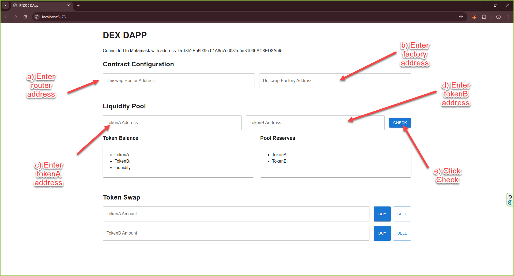
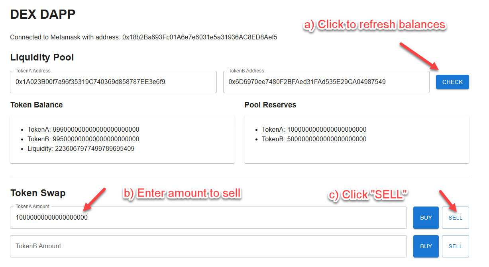
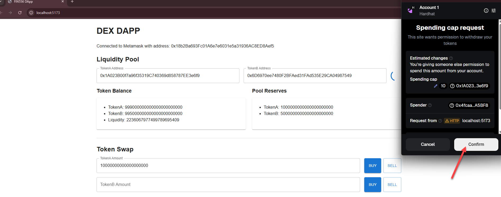
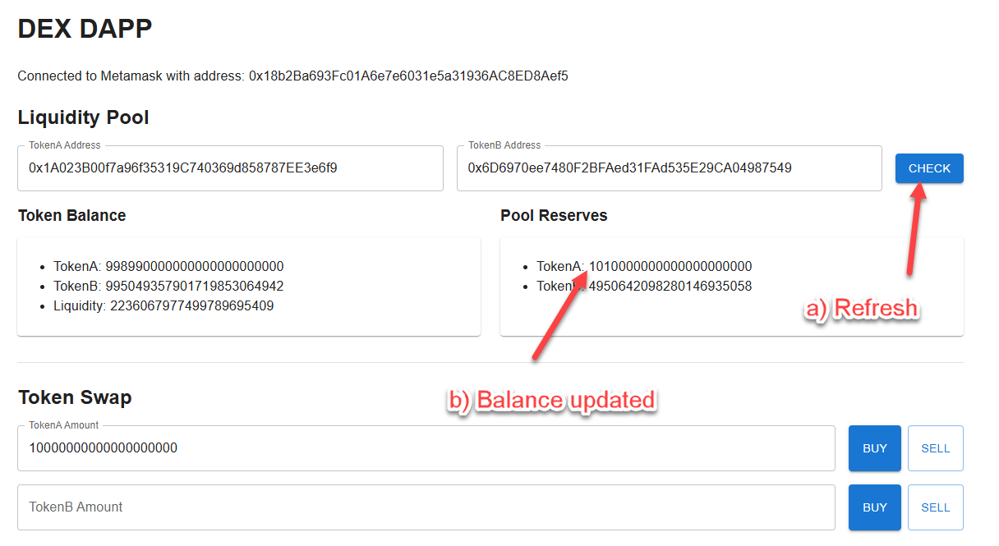

## 🛠️ Lab Practise: DApp - Deploy Contracts

**High-Level DApp Objectives:**

The DApp we are going to build will have the following features:

-   Connects to Metamask wallet.
-   Interacts with contracts deployed on local Hardhat node.
-   Shows the current token balances of the user.
-   Show the current pool reserves.
-   Allow the user to swap tokens.

The lab will be divided into the following parts:

a) Setting up the web framework (React)  
b) Create a mock-up of the DApp with hardcoded data  
c) Extend the DApp to integrate with Metamask  
d) Deploy Uniswap contracts to local Hardhat node  
e) Complete the DApp to allow token swaps - this part ✅

### Step 1: Setup

-   **Go to the React project directory**

    ```bash
    cd /workspace/day-4/15-dapp/e-dapp-uniswap/fin556-dapp
    ```

-   **Install dependencies**

    ```bash
    npm i
    ```

### 1. Update React hook script library

-   **Open the fin556-dapp/src/useDapp.js**

    Open the file **useDapp.js** in the **fin556-dapp/src** directory and make the following changes.

-   **Update useDapp parameters**

    Replace the following line.

    ```js
    const useDapp = ({ setSigner }) => {
    ```

    with this

    ```js
    const useDapp = ({
        setSigner,
        uniswapRouterAddress,
        uniswapFactoryAddress,
        tokenAddrA,
        tokenAddrB,
    }) => {
    ```

    This is to expand the list of arguments that can be passed into the useDapp hook to include other state variables such as the Uniswap router and factory addresses, and the token addresses.

-   **Insert the following code inside useDapp()**

    Insert the following code inside the `useDapp` function to implement the required functionalities.

    -   **Add getBalance() function**

        Add the following code to get the token balances of the user and reserve balances in the liquidity pool.

        ```js
        const getBalance = async (signer) => {
            const address = signer.address;

            const tokenA = new ethers.Contract(
                tokenAddrA,
                ["function balanceOf(address) view returns(uint)"],
                signer
            );

            const tokenB = new ethers.Contract(
                tokenAddrB,
                ["function balanceOf(address) view returns(uint)"],
                signer
            );

            // Pool
            const factory = new ethers.Contract(
                uniswapFactoryAddress,
                ["function getPair(address,address) view returns(address)"],
                signer
            );
            console.log(
                `Getting poolAddress for addressA(${tokenAddrA}) and addressB(${tokenAddrB})`
            );
            const poolAddress = await factory.getPair(tokenAddrB, tokenAddrA);
            console.log(
                `poolAddress for addressA(${tokenAddrA}) and addressB(${tokenAddrB}) is ${poolAddress}`
            );
            const pool = new ethers.Contract(
                poolAddress,
                [
                    "function getReserves() view returns(uint112 reserve0,uint112 reserve1,uint32)",
                    "function balanceOf(address) view returns(uint)",
                ],
                signer
            );

            // Get Reserves
            const { reserve0, reserve1 } = await pool.getReserves();
            const reservesA = tokenAddrA < tokenAddrB ? reserve0 : reserve1;
            const reservesB = tokenAddrA > tokenAddrB ? reserve0 : reserve1;

            return {
                balanceA: (await tokenA.balanceOf(address))?.toString(),
                balanceB: (await tokenB.balanceOf(address))?.toString(),
                liquidity: (await pool.balanceOf(address))?.toString(),
                reservesA: reservesA.toString(),
                reservesB: reservesB.toString(),
            };
        };
        ```

    -   **Add a private \_getAmountOut() function**

        Add the following code to swap tokens in the liquidity pool.

        NOTE: This function is only used internally by sellTokens and buyTokens functions that is why it is prefixed with an underscore(\_) as a convention to indicate that it is private.

        ```js
        function _getAmountOut(amountIn, reserveIn, reserveOut) {
            if (!amountIn || !reserveIn || !reserveOut) {
                throw new Error(
                    "Invalid input: amountIn, reserveIn, and reserveOut must be provided"
                );
            }
            const amountInWithFee =
                ethers.toBigInt(amountIn) * ethers.toBigInt(997);
            const numerator = amountInWithFee * ethers.toBigInt(reserveOut);
            const denominator =
                ethers.toBigInt(reserveIn) * ethers.toBigInt(1000) +
                amountInWithFee;
            return numerator / denominator;
        }
        ```

    -   **Add \_getReserves() function**

        Add the following code to get the reserves of the liquidity pool.

        NOTE: This function is only used internally by sellTokens and buyTokens functions that is why it is prefixed with an underscore(\_) as a convention to indicate that it is private.

        ```js
        const _getReserves = async (factory, { TOKEN_0, TOKEN_1 }, account) => {
            const poolAddress = await factory.getPair(TOKEN_0, TOKEN_1);
            if (poolAddress === ethers.ZeroAddress) {
                throw new Error("No pool found for the given token pair");
            }
            const pool = new ethers.Contract(
                poolAddress,
                [
                    "function getReserves() view returns(uint112 reserve0,uint112 reserve1,uint32)",
                ],
                account
            );
            const { reserve0, reserve1 } = await pool.getReserves();
            return {
                reserveA: TOKEN_0 < TOKEN_1 ? reserve0 : reserve1,
                reserveB: TOKEN_0 > TOKEN_1 ? reserve0 : reserve1,
            };
        };
        ```

    -   **Add sellTokens() function**

        Add the following code to sell tokens in the liquidity pool. This function will be called when the user clicks the "SELL" button by providing the input amount, input token address, output token address, and the user's account.

        ```js
        const sellTokens = async (inputAmt, inputAddr, outputAddr, account) => {
            // Get Reserves
            const factory = new ethers.Contract(
                uniswapFactoryAddress,
                ["function getPair(address,address) view returns(address)"],
                account
            );

            const reserves = await _getReserves(
                factory,
                {
                    TOKEN_0: inputAddr,
                    TOKEN_1: outputAddr,
                },
                account
            );

            console.log("Reserves:", reserves);

            if (!reserves || !reserves.reserveA || !reserves.reserveB) {
                throw new Error("Failed to fetch reserves from the pool");
            }

            // Get OutputAmt
            const outputAmt = _getAmountOut(
                inputAmt,
                reserves.reserveA,
                reserves.reserveB
            );

            // Load contract A and contract B
            const uniswap = new ethers.Contract(
                uniswapRouterAddress,
                [
                    `function swapExactTokensForTokens(uint,uint,address[],address,uint)`,
                ],
                account
            );

            // Approve router to withdraw 2000 TokenA from trader account
            const inputToken = new ethers.Contract(
                inputAddr,
                ["function approve(address,uint)"],
                account
            );
            const response = await inputToken.approve(
                uniswapRouterAddress,
                inputAmt
            );
            await response.wait();
            console.log("trade: approved. receipt=", response.hash);

            // Trade 2000 TokenA for 1662 TokenB using trader account
            const ts = (await provider.getBlock()).timestamp + 1000;
            await uniswap.swapExactTokensForTokens(
                inputAmt,
                outputAmt,
                [inputAddr, outputAddr],
                await account.getAddress(),
                ts
            );

            return outputAmt;
        };
        ```

    -   **Add buyTokens() function**

        You should implement this function on your own based on what you have learned so far. For now, calling this function will throw an error.

        ```js
        const buyTokens = async (inputAmt, inputAddr, outputAddr, account) => {
            throw new Error("Not implemented yet");
        };
        ```

    -   **Return the new functions from useDapp**

        Replace the following return statement.

        ```js
        return { connect };
        ```

        with this

        ```js
        return {
            connect,
            getBalance,
            sellTokens,
            buyTokens,
        };
        ```

### 2. Update App.jsx

-   **Open App.jsx**

    Open the file **App.jsx** in the **fin556-dapp/src** directory.

-   **Update the App component**

    Insert the following code inside the `App` component.

    -   **Add token address state variables**

        Replace the following lines.

        ```js
        const [tokenAddrA, setTokenAddrA] = useState(
            "0xaaaaaaaaaaaaaaaaaaaaaaaaaaaaaaaaaaaaaaaa"
        );
        const [tokenAddrB, setTokenAddrB] = useState(
            "0xbbbbbbbbbbbbbbbbbbbbbbbbbbbbbbbbbbbbbbbb"
        );
        const [uniswapRouterAddress, setUniswapRouterAddress] = useState(
            "0xcccccccccccccccccccccccccccccccccccccccc"
        );
        const [uniswapFactoryAddress, setUniswapFactoryAddress] = useState(
            "0xdddddddddddddddddddddddddddddddddddddddd"
        );
        const [balance, setBalance] = useState({
            balanceA: 100,
            balanceB: 200,
            liquidity: 50,
            reservesA: 500,
            reservesB: 1000,
        });
        ```

        with

        ```js
        const [tokenAddrA, setTokenAddrA] = useState("");
        const [tokenAddrB, setTokenAddrB] = useState("");
        const [uniswapRouterAddress, setUniswapRouterAddress] = useState("");
        const [uniswapFactoryAddress, setUniswapFactoryAddress] = useState("");
        const [balance, setBalance] = useState(null);
        ```

        -   Replace all hardcoded initial values with empty string or null to indicate that they are not set yet.

    -   **Add isLoading state variable to display a spinner while loading data**

        Add the following state variable to control the visual effect when loading data from the blockchain. This is useful to know that the DApp is working and not frozen.

        ```js
        const [isLoading, setIsLoading] = useState(false);
        ```

    -   **Add amtA and amtB state variables**
        Add the following state variables to store the amount of TokenA and TokenB to be swapped.

        ```js
        const [amtA, setAmtA] = useState(0);
        const [amtB, setAmtB] = useState(0);
        ```

    -   **Load the useDapp() hook**

        Replace the following line.

        ```js
        const { connect } = useDapp({ setSigner });
        ```

        with this

        ```js
        const { connect, getBalance, sellTokens } = useDapp({
            setSigner,
            uniswapRouterAddress,
            uniswapFactoryAddress,
            tokenAddrA,
            tokenAddrB,
        });
        ```

    -   **Create handleCheckBalance() function**

        Add the following function to handle the "Check" button click event.

        ```js
        const handleCheckBalance = async () => {
            setIsLoading(true);
            try {
                const balance = await getBalance(signer);
                console.log(balance);
                setBalance(balance);
            } catch (error) {
                console.error("Error fetching balances:", error);
                alert("Failed to fetch balances. Please try again.");
            } finally {
                setIsLoading(false);
            }
        };
        ```

        -   This function is called when the "Check" button is clicked.
        -   It sets the loading state variable to true to show the loading spinner.
        -   It calls the `getAccount()` function to get the signer from Metamask.
        -   If no account is found, it will show an alert message and set the loading state variable to false.
        -   If an account is found, it will call the `getBalance()` function to
            get the token balances and pool reserves from the blockchain.

    -   **Create handleSellA() and handleSellB() functions**
        Add the following functions to handle the "Sell" button click events.

        ```js
        const handleSell = async (aOrB) => {
            if (!amtA && !amtB) {
                alert("Invalid amount");
                return;
            }
            setIsLoading(true);
            try {
                if (aOrB === "A") {
                    const amtB = await sellTokens(
                        amtA,
                        tokenAddrA,
                        tokenAddrB,
                        signer
                    );
                    console.log(`Sold ${amtA} of A for ${amtB} of B`);
                    return;
                } else if (aOrB === "B") {
                    const amtA = await sellTokens(
                        amtB,
                        tokenAddrB,
                        tokenAddrA,
                        signer
                    );
                    console.log(`Sold ${amtB} of B for ${amtA} of A`);
                    return;
                } else {
                    throw new Error("Invalid token type. Must be 'A' or 'B'");
                }
            } catch (error) {
                console.error("Error selling tokens:", error);
                alert("Failed to sell tokens. Please try again.");
            } finally {
                setIsLoading(false);
            }
        };
        ```

        -   The function expects a parameter `aOrB` to be either "A" or "B" to indicate which token to sell.
        -   They check if the amount entered is valid (greater than 0).
        -   They set the loading state variable to true to show the loading spinner.
        -   It will call the `sellTokens()` function to swap the tokens in the liquidity pool.
        -   After the swap is done, it will log the result and set the loading state variable to false to hide the loading spinner.

    -   Update the **return** statement to replace the hardcoded values with the state variables and add the loading spinner.

        -   **Update the "Check" button to invoke handleCheckBalance()**

            Update the following line in the "Check" button.

            <!-- prettier-ignore -->
            ```js
                <Button variant='contained'>Check</Button>
            ```

            to

            <!-- prettier-ignore -->
            ```js
                {isLoading ? (
                    <CircularProgress />
                ) : (
                    <Button onClick={handleCheckBalance} variant='contained'>Check</Button>
                )}    
            ```

            -   If the loading state variable is true, show a loading spinner using the `CircularProgress` component from Material UI.
            -   If the loading state variable is false, show the "Check" button.
            -   Add an onClick event handler to the button to invoke the `handleCheckBalance()` function when the button is clicked.
            -   This will fetch the token balances and pool reserves from the blockchain and update the state variable `balance`.

            **NOTE:** It is important for the spinner and button to be mutually exclusive, ie. both cannot be shown at the same time. This is to prevent the user from clicking the button multiple times while the data is being fetched.

        -   **Update the "Sell" buttons to invoke handleSellA() and handleSellB()**

            Update the following lines in the "Sell" buttons.

            <!-- prettier-ignore -->
            ```js
                    <TextField id='amtA' label='TokenA Amount' fullWidth />
                    <Box sx={{ display: "flex", gap: 1 }}>
                        <Button variant='contained'>Buy</Button>
                        <Button variant='outlined'>Sell</Button>
                    </Box>
            ```

            to

            <!-- prettier-ignore -->
            ```js
                    <TextField
                        id='amtA'
                        label='TokenA Amount'
                        onChange={(e) => {
                            setAmtA(e.target.value);
                        }}
                        fullWidth
                    ></TextField>
                    <Box sx={{ display: "flex", gap: 1 }}>
                        <Button variant='contained'>Buy</Button>
                        <Button variant='outlined' onClick={() => handleSell("A")}>Sell</Button>
                    </Box>
            ```

            and

            <!-- prettier-ignore -->
            ```js
                    <TextField id='amtB' label='TokenB Amount' fullWidth />
                    <Box sx={{ display: "flex", gap: 1 }}>
                        <Button variant='contained'>Buy</Button>
                        <Button variant='outlined'>Sell</Button>
                    </Box>
            ```

            to

            <!-- prettier-ignore -->
            ```js
                    <TextField
                        id='amtB'
                        label='TokenB Amount'
                        onChange={(e) => {
                            setAmtB(e.target.value);
                        }}
                        fullWidth
                    ></TextField>
                    <Box sx={{ display: "flex", gap: 1 }}>
                        <Button variant='contained'>Buy</Button>
                        <Button variant='outlined' onClick={() => handleSell("B")}>Sell</Button>
                    </Box>

            ```

            -   If the loading state variable is true, show a loading spinner using the `CircularProgress` component from Material UI.
            -   If the loading state variable is false, show the "Sell" button.
            -   Add an onClick event handler to the button to invoke the `handleSellA()` or `handleSellB()` function when the button is clicked.
            -   This will swap the tokens in the liquidity pool and update the state variable `balance`.

### 3. Run the DApp

-   **Start the React development server**

    ```bash
    cd /workspace/day-4/15-dapp/e-dapp-uniswap/fin556-dapp
    npm run dev
    ```

-   **Open browser at http://localhost:5173**

-   **Enter the contract addresses**

    Enter the contract addresses using the **addresses.json** file from the scripts directory in the lab **d-dapp-network** (../../d-dapp-network/scripts/addresses.json).

    Refresh the balances by clicking the "Check" button.

    

-   **Check the token Balance for TokenA and TokenB**

    If you have provided the correct wallet address and token address, the token balance should be greater than 0.

    If the token balances are displayed as 0, check the following:

    -   Compare the wallet address in Metamask with the accounts[0] address in the hardhat node terminal. If they are different, that means the .env file contains a different mnemonic than the one used to create your Metamask wallet.

    -   Compare the token contract addresses with the ones in the **addresses.json** file from the scripts directory in the lab **d-dapp-network** (../../d-dapp-network/scripts/addresses.json). If they are different, update the contract addresses in the DApp accordingly.

-   **Swap pool reserves**

    If pool reserves are not displayed, check the router and factory contract addresses.

-   **Perform a token swap**

    b) Enter an amount in the "TokenA Amount" text box
    c) Click the "Sell" button next to it to swap TokenA for TokenB.

    

    d) Approve the transaction in Metamask.

    

    d) After the transaction is confirmed, refresh the balances by clicking the "Check" button again to see the updated balances.

    
