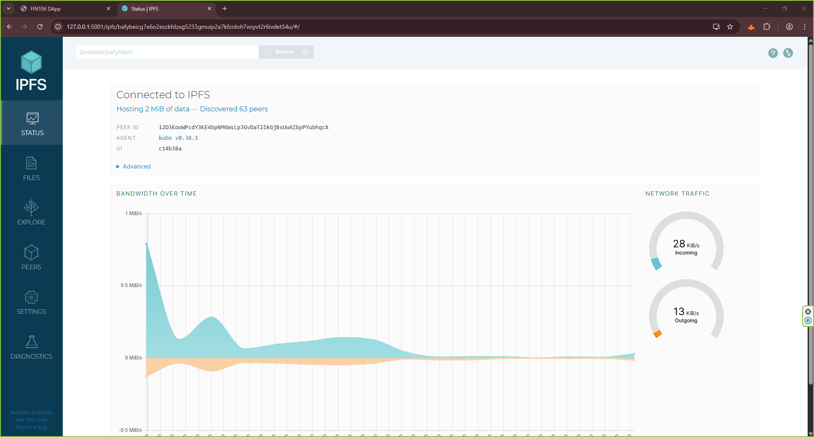

## 🛠️ 实验实践：IPFS

IPFS（星际文件系统）是一个点对点的分布式文件系统，旨在将所有计算设备与相同的文件系统连接起来。换句话说，IPFS是一种去中心化的存储和共享解决方案，允许用户以分布式方式托管和访问内容，而不依赖于中央服务器。IPFS在区块链中很重要的原因是，它是去中心化网络（Web3）生态系统中处理链下数据存储和共享的重要组成部分。

例如，在NFT应用中，实际的数字资产（图像、视频、音乐等）通常使用IPFS存储在链下，而元数据和所有权信息存储在链上。这是因为直接在区块链上存储大文件效率低下且成本高昂。

在DApp的情况下，IPFS可用于托管应用程序的前端代码（HTML、CSS、JavaScript），允许用户无需依赖集中式Web服务器即可访问DApp。

在本实验的这一部分中，您将学习如何在本地安装和运行IPFS节点，然后我们将在下一个实验实践中探索如何将DApp部署到IPFS。

### 步骤 1：安装和运行 IPFS

📌 您需要此步骤在 **Windows Terminal 或 Linux/Mac 的终端中运行，而不是从 Visual Studio Code 的 devcontainer 中运行**

-   打开您的终端（Windows 使用 WSL，Linux/Mac 使用终端）。

-   下载最新的 IPFS 版本（如果不同，请将 `v0.18.1` 替换为最新版本）：

    ```bash
    cd /tmp
    wget https://dist.ipfs.tech/kubo/v0.38.1/kubo_v0.38.1_linux-amd64.tar.gz
    ```

-   解压下载的文件并安装 IPFS：

    ```bash
    tar -xvzf kubo_v0.38.1_linux-amd64.tar.gz
    cd kubo
    sudo ./install.sh
    ```

    系统将提示您输入密码以授权安装。

-   验证安装：

    ```bash
    ipfs --version

     # ipfs version 0.38.1
    ```

-   初始化 IPFS：

    ```bash
    ipfs init

     # generating ED25519 keypair...done
     # peer identity: 12D3KooWPcdY3KE4bpNM6WsLpJGvDaT2ikGjBsUw6ZbpPYubhqcX
     # initializing IPFS node at /home/vscode/.ipfs
    ```

-   配置端口：

    由于 IPFS 使用的默认端口 5001 和 8080 经常被其他应用程序占用，我们将它们分别更改为 5501 和 48080。

    ```bash
    ipfs config Addresses.API /ip4/0.0.0.0/tcp/5501
    ipfs config Addresses.Gateway /ip4/0.0.0.0/tcp/48080
    ```

-   启动 IPFS 守护进程：

    ```bash
    ipfs daemon

        # RPC API server listening on /ip4/127.0.0.1/tcp/5501
        # WebUI: http://127.0.0.1:5501/webui
        # Gateway server listening on /ip4/127.0.0.1/tcp/48080
        # Daemon is ready
    ```

-   打开 Windows 浏览器并导航到 `http://127.0.0.1:5501/webui` 以访问 IPFS WebUI。

    

### 步骤 2：从 IPFS 添加和检索文件

-   **转到 /tmp 目录**

    ```bash
    cd /tmp
    ```

-   **向 IPFS 添加文件**

    创建一个示例文本文件并将其添加到 IPFS。

    ```bash
    echo "this is a test" > demo.txt
    ipfs add demo.txt

        # added QmYi7wrRFKVCcTB56A6Pep2j31Q5mHfmmu21RzHXu25RVR demo.txt
    ```

    请记下命令返回的哈希值（CID）（例如 `QmYi7wrRFKVCcTB56A6Pep2j31Q5mHfmmu21RzHXu25RVR`）。

-   **通过 IPFS CLI 检索文件**

    使用 CID 从 IPFS 检索文件。

    ```bash
    ipfs cat QmYi7wrRFKVCcTB56A6Pep2j31Q5mHfmmu21RzHXu25RVR

        # Hello, IPFS!
    ```

-   **通过 IPFS 本地网关检索文件**

    您也可以使用 Web 浏览器通过本地 IPFS 网关访问文件。

    打开浏览器并导航到以下 URL，将 `<CID>` 替换为上一步中的实际 CID。

    ```bash
    http://localhost:48080/ipfs/<CID>

        # for example:
        # http://localhost:48080/ipfs/QmYi7wrRFKVCcTB56A6Pep2j31Q5mHfmmu21RzHXu25RVR
    ```

-   **通过 IPFS 公共网关检索文件**

    您也可以使用 Web 浏览器通过公共 IPFS 网关访问文件。

    打开浏览器并导航到以下 URL，将 `<CID>` 替换为上一步中的实际 CID。

    ```bash
    https://dweb.link/ipfs/<CID>

        # for example:
        # https://dweb.link/ipfs/QmYi7wrRFKVCcTB56A6Pep2j31Q5mHfmmu21RzHXu25RVR
    ```

    📌 注意：如果说明
    如果您的 IPFS 节点未连接到 IPFS 网络，或者没有任何其他对等方托管内容，这些说明可能无法正常工作。通常此过程是自动的，但有时内容通过网络传播可能需要一些时间。要通过公共 IPFS 网关访问您的本地 IPFS 内容，您需要将 IPFS 节点连接到 IPFS 网络并宣布您正在托管该内容。您可以通过连接到知名的 IPFS 对等方并提供内容来做到这一点。

    -   找到知名的 IPFS 对等方

        ```bash
        ipfs swarm peers

            # /ip4/
            # /ip4/103.169.127.232/udp/4001/quic-v1/p2p/12D3KooWBdF3g6vSJFRPoZQo7BNnkNzaWb59gpyaVzsgtNTVeu8H
            # /ip4/135.125.96.137/udp/4001/quic-v1/p2p/12D3KooWFFeNh8CaLbUUfGgrGfPx42EuDDSKQkEBt5kpax4aizWE
            # /ip4/142.171.58.107/tcp/4001/p2p/12D3KooWHepEHGSGex1quwYC9aPsmZotdtWJaNxFcweSmNDX9W4W
            # ...
        ```

    -   连接到对等方并提供内容
        运行命令 `ipfs swarm connect`，使用从上一步获得的任何对等方地址
        ipfs swarm connect /ip4/<peer-ip>/tcp/<peer-port>/p2p/<peer-id>
        例如：

        ```bash
         # ipfs swarm connect /ip4/103.169.127.232/udp/4001/quic-v1/p2p/12D3KooWBdF3g6vSJFRPoZQo7BNnkNzaWb59gpyaVzsgtNTVeu8H
        ```

    -   宣布您正在托管内容
        使用命令 `ipfs routing provide <CID>` 宣布您正在托管具有给定 CID 的内容。例如：

        ```bash
         # ipfs routing provide QmYi7wrRFKVCcTB56A6Pep2j31Q5mHfmmu21RzHXu25RVR
        ```

---

## 🛠️ 实验实践：将 DApp 部署到 IPFS

您已成功构建了一个使用 Uniswap DEX 协议进行代币交换的 DApp，现在您想与全世界分享。
在本实验实践中，您将学习如何在不需要公共 Web 服务器的情况下部署和托管您的 DApp。

实现这一目标的方法是将您的 DApp 转换为静态文件并托管在文件服务器上供下载。您甚至可以通过电子邮件或消息应用程序发送压缩的静态文件（前提是没有安全限制）。关键是 DApp 完全可以仅在浏览器中运行，无需 Web 服务器后端。之所以可以这样工作，是因为 DApp 直接与区块链节点交互，以您的 Metamask 钱包作为签名器，不需要任何服务器端代码。

📌 项目目录的结构使得 Dapp 目录（fin556-dapp）在项目目录（16-dapp-deployment）内。
由于 fin556-dapp 和 16-dapp-deployment 都有自己的 package.json 文件，您需要在安装依赖或运行脚本时确保在正确的目录中。

### 步骤 1：为部署构建 DApp

📌 **从 Visual Studio Code 的 devcontainer 中运行以下步骤**

-   **从之前的实验复制 DApp**

    将之前实验的示例目录中的 React 目录复制过来。

    ```bash
    cd /workspace/day-5/16-ipfs/
    cp -rp /workspace/day-4/15-dapp/sample/fin556-dapp .
    ```

-   **进入 DApp 目录并安装依赖**

    ```bash
    cd fin556-dapp
    npm i
    ```

-   **配置 vite.config.js**

    当您将 DApp 部署到 IPFS 时，除非所有文件路径都是相对的（不以 / 开头），否则站点将无法正确加载。为此，您需要在 vite.config.js 中设置基础路径。

    打开 `vite.config.js` 并按如下方式进行修改：

    ```js
    import { defineConfig } from "vite";
    import react from "@vitejs/plugin-react";

    // https://vitejs.dev/config/
    export default defineConfig({
        plugins: [react()],
        base: "./", // Use relative paths so IPFS can serve the files correctly
    });
    ```

-   **构建生产包**

    确保您在 DApp 目录中

    ```bash
    npm run build

     # > fin556-dapp@0.0.0 build
     # > vite build

     # vite v7.1.11 building for production...
     # ✓ 1051 modules transformed.
     # dist/index.html                  0.35 kB │ gzip: 0.25 kB
     # dist/assets/index-CMmGqaf8.js  642.94 kB │ gzip: 216.67 kB
     #
     # (!) Some chunks are larger than 500 kB after minification. Consider:
     # - Using dynamic import() to code-split the application
     # - Use build.rollupOptions.output.manualChunks to improve chunking: https://rollupjs.org/configuration-options/#output-manualchunks
     # - Adjust chunk size limit for this warning via build.chunkSizeWarningLimit.
     # ✓ built in 3.79s
    ```

    这将在 `fin556-dapp` 文件夹中创建一个 `dist` 目录，其中仅包含一个文件 `index.html` 和一个 `assets` 文件夹。

### 步骤 2. 将 DApp 部署到 IPFS

📌 您需要此步骤在 **Windows Terminal 或 Linux/Mac 的终端中运行，而不是从 Visual Studio Code 的 devcontainer 中运行**

-   **启动 IPFS 守护进程**

    如果您在之前的实验实践中已经启动了 IPFS 守护进程，可以使用 `Ctrl+C` 停止它，然后重新启动以确保它正常运行。

    ```bash
    ipfs daemon

        # RPC API server listening on /ip4/127.0.0.1/tcp/5501
        # WebUI: http://127.0.0.1:5501/webui
        # Gateway server listening on /ip4/127.0.0.1/tcp/48080
        # Daemon is ready
    ```

-   **将您的 DApp 添加到 IPFS**

    确保您在 DApp 目录中

    ```bash
    cd ~/course/FIN556/day-5/16-ipfs/fin556-dapp
    ipfs add -r dist

     # Sample Output:

     # added QmUG4Zdj5kBbKsa7tARQ67dWCKgYVPRBspJNR3riqAReRC dist/assets/index-qsjpLWOP.js
     # added QmbwzsLWAexWZjMcZPGoZeQzpJDX9hc7Qcao98sUYHTK1B dist/index.html
     # added QmNx41RNNJ6kuKXjiNU5seBTQmXxkp7Y2jkg2evNqyCmmn dist/assets
     # added QmeBXKDYaPwZ2o9bNonp7FTvnYyeby2JBUYcDPURztC9qo dist

    ```

    请记下命令输出的最后一个哈希值（例如示例输出中的 QmeBXKDYaPwZ2o9bNonp7FTvnYyeby2JBUYcDPURztC9qo）。
    这是您的 DApp 在 IPFS 上的内容标识符（CID）。

-   **通过本地 IPFS 网关访问您的 DApp**

    打开浏览器并导航到以下 URL，将 `<CID>` 替换为上一步中的实际 CID。

    ```bash
    http://127.0.0.1:48080/ipfs/<CID>

     # for example:
     # http://127.0.0.1:48080/ipfs/QmeBXKDYaPwZ2o9bNonp7FTvnYyeby2JBUYcDPURztC9qo
    ```

-   **通过公共 IPFS 网关访问您的 DApp**

    通过公共 IPFS 网关访问您的 DApp，向全世界宣传。

    ```bash
    ipfs routing provide <CID>

     # for example:
     # ipfs routing provide QmeBXKDYaPwZ2o9bNonp7FTvnYyeby2JBUYcDPURztC9qo
    ```

    打开浏览器并导航到以下 URL，将 `<CID>` 替换为上一步中的实际 CID。

    ```bash
    https://dweb.link/ipfs/<CID>

     # for example:
     # https://dweb.link/ipfs/QmeBXKDYaPwZ2o9bNonp7FTvnYyeby2JBUYcDPURztC9qo
    ```

### 步骤 3. 将 DApp 与本地 Hardhat 节点一起使用

完成此步骤后，您已成功将 DApp 部署到 IPFS，可以通过本地和公共 IPFS 网关访问它。
要使用它，您需要启动本地 Hardhat 区块链节点，部署智能合约，并将您的 Metamask 钱包连接到它。

您可以参考之前的实验 15-dapp/d-dapp-network/README.md，了解如何设置本地 Hardhat 节点和部署智能合约的详细说明。
