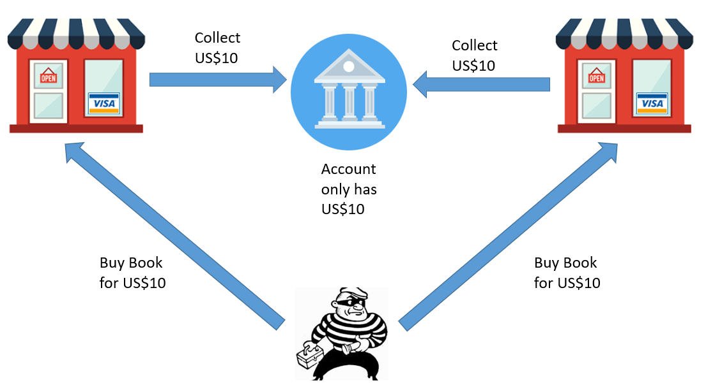
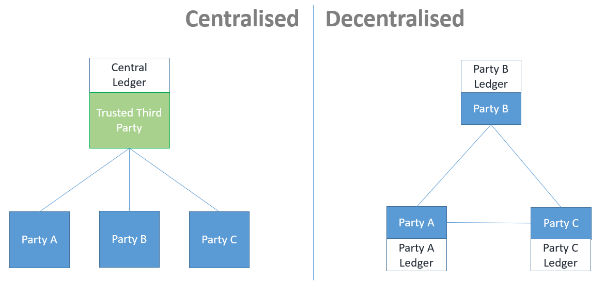
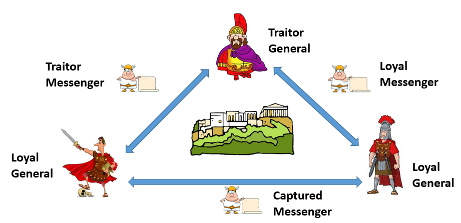
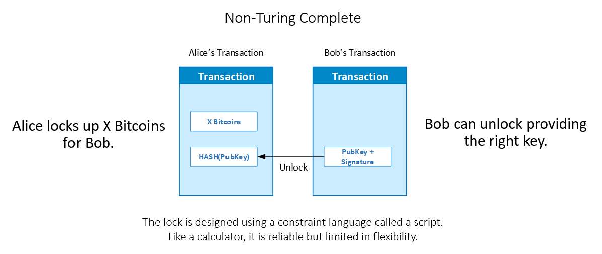

# 多链 - 第 1 部分

**注意：** 本课程必须完全从**终端**运行（即 Windows Terminal 或 macOS Terminal 应用程序），而不是从 **devcontainer** 中运行。

**注意：** 本文档大量使用 **Mermaid 图表**。请安装 Visual Studio Code 扩展 **"Markdown Preview Mermaid Support"(bierner.markdown-mermaid)** 并在预览模式下阅读此文件。

## 目的

本课程建立在之前 **以太坊区块链和 Solidity 编程**课程的基础上。其目标是扩展您对区块链技术的理解，超越以太坊——帮助您了解**区块链设计的多样性**及其与比特币协议的关系，以 MultiChain 作为主要学习平台。

虽然区块链技术最初是_由技术人员为技术人员创建的_，但本课程旨在以清晰易懂的方式呈现底层技术概念，使即使没有深厚技术背景的读者也能理解并获得对区块链系统工作原理的有意义见解。

## 1. 参考资料

https://www.multichain.com/developers/
https://github.com/MultiChain/multichain

---

## 2. 区块链入门

### a) 双重支付问题

让我们从回顾区块链设计要解决的根本问题开始。

从根本上说，每个区块链的存在都是为了防止双重支付问题——同一数字资产被多次花费的风险。

与物理世界不同，货币或商品不能被复制，而数字数据可以被重复复制和发送。例如，您可以轻松地同时将同一封电子邮件发送给 Alice 和 Bob。

然而，这在支付系统中是不可接受的。如果您只有十美元，您必须能够将其发送给 Bob 或 Alice——但绝不能同时发送给两者。确保这一规则得到执行而不依赖中央权威正是区块链技术要解决的挑战。

**双重支付问题**的传统解决方案是依赖**可信第三方**，该第三方维护**集中式账本**来记录和验证所有交易。该账本追踪每个参与者的余额，确保相同资金不能被花费两次。

然而，这种方法引入了一个关键限制——**缺乏透明度**。用户无法独立验证每个人的余额，因此必须相信中央权威机构诚实准确地管理账户。

虽然这种信任通常是理所当然的，但它存在固有风险：如果可信中介失败、破产或不诚实行事，用户可能会失去对其资金的访问权限。

广泛认可的可信第三方示例包括**中央银行**、**商业银行**、**支票清算所**、**PayPal** 和**微信支付**。这些机构通常被认为是可靠的，因为社会假设如果您不能信任它们，_就没有其他人可以信任了_。
然而，历史表明，即使是最有声望的实体也不能免于失败或管理不善——提醒我们信任不等于确定性。

### b) 拜占庭将军问题

理想情况下，我们希望在不依赖信任或中央第三方的情况下解决双重支付问题。这被称为无信任系统，它代表了区块链技术的主要目标。

然而，实现真正的无信任系统并不简单。它需要解决分布式计算中一个称为拜占庭将军问题（BGP）的基本挑战——这是一个经典的计算机科学问题，说明了在可能失败、沟通错误或恶意行为的分布式节点（或参与者）之间达成共识的困难。

**ELI5（简单解释）：**

-   想象您和您的朋友正在玩一个必须攻击和占领城堡的游戏。但有一个问题——你们都是将军，只能通过信使相互交流。一些将军可能是叛徒，想要破坏游戏并发出错误的命令。

    

-   问题是，如果将军们不同意同一个计划，有些人遵循叛徒将军的命令，而另一些人遵循忠诚者的命令，攻击就会失败，每个人都会输掉游戏。

-   那么，您如何确保所有将军都同意一个计划，即使其中一些人在说不同的事情？这就是被称为拜占庭将军问题的挑战。

---

### c) 分布式共识问题

从本质上讲，拜占庭将军问题突出了在参与者无法完全信任彼此的网络中达成一致的困难。

将这一挑战转化为现实世界的分布式系统，会揭示一个更深层次的问题：当一个节点与另一个节点通信时，它没有固有方式来验证收到的消息是否正确、被篡改甚至是真实的——除非有一种机制可以与其他节点交叉验证。

此外，在没有中央时钟或协调者的分布式环境中，无法知道丢失的消息是仅仅延迟了、从未发送还是因网络故障而丢失。这种不确定性可能导致消息丢失、重复或无法验证等问题——所有这些都使维护整个网络一致和可靠状态的过程变得复杂。

---

### d) 挖矿

有多种方法可以解决拜占庭将军问题（BGP），但大多数成本高昂，且仅限于节点相对较少的小型低延迟网络。每种方法都涉及权衡，将在以下部分讨论。

在其中，**比特币**是第一个使用**商品硬件**实现 BGP 的_实用化_、_全球规模_解决方案的系统——代表了去中心化共识的重大突破。

比特币点对点区块链网络的安全性取决于有足够多的节点参与共识过程。为了激励参与并保护网络免受攻击，比特币引入了一种人为奖励机制，向成功向区块链发布有效区块的节点授予新创建的币。

这种奖励机制产生了称为挖矿的过程，通过这个过程创建新的比特币并维护网络安全。实现这一点的底层共识协议称为**工作量证明（PoW）**。

### e) 验证

在私有区块链中，女巫攻击的风险很低，因为每个节点都经过认证并在中央控制下运行。在这种环境中，维护和保护网络的动力来自联盟的共同业务目标，而不是外部经济奖励。

因此，不需要像挖矿这样的人为激励机制，也不需要创建原生加密货币来奖励参与者。认证网络不依赖公有区块链中使用的工作量证明（PoW）共识，而是通常采用权威证明（PoA）协议，其中可信验证者被预先批准来创建和验证区块。

验证者一词并非私有区块链独有。例如，合并之后，以太坊从 PoW 过渡到权益证明（PoS）共识模型，其中验证者取代了矿工。这些验证者根据他们作为抵押品质押的加密货币数量被选中，因诚实参与而获得奖励，并因恶意行为而面临惩罚。

### f) 图灵完备性

在区块链世界中，交易可以比作物理世界中的锁和钥匙。就像我们使用不同类型的锁和钥匙来保护贵重物品一样，区块链网络使用脚本——充当数字锁和钥匙的数学表达式——来保护和验证交易。

每个区块链交易都是使用数学锁实现的，通过协议定义的脚本语言创建。发送者的脚本充当锁，指定花费交易所需的条件，而接收者的脚本充当钥匙，满足这些条件来解锁资金。

这种脚本语言的**表达能力**决定了区块链的图灵完备性——即它是否能表示通用计算机可以执行的任何计算。

支持或限制图灵完备性的理由在于灵活性和安全性之间的权衡。

像比特币这样的非图灵完备系统强调简单性和安全性，而像以太坊这样的图灵完备系统强调可编程性和灵活性，支持复杂的去中心化应用程序，但以增加错误和漏洞风险为代价。

-   **非图灵完备**

    如果脚本语言缺乏循环或条件分支等构造，区块链就是非图灵完备的——如比特币所示。

    

    非图灵完备区块链可以被视为全球计算器。它使用受限指令集执行有限的、定义明确的操作，最大限度地减少了错误和恶意行为的可能性。虽然这限制了多功能性，但增强了稳定性和可预测性。这些系统是专门的、专注于交易的用例的理想选择——它们的持续成功（如比特币所示）证明了它们的持久相关性。

-   **图灵完备**

    相反，如果区块链的脚本语言支持循环和条件等构造（如以太坊），则它是图灵完备的。以太坊通常被描述为一台全球计算机，能够通过智能合约执行任意代码。

    这种灵活性允许开发者构建复杂的去中心化应用程序，但也增加了在系统中引入漏洞或低效率的风险。

    因此，虽然图灵完备系统支持创新和多样化用例，但它们在设计、测试和执行方面需要更加谨慎。

-   **旁注：智能合约 ≠ 图灵完备性**

    尽管以太坊的图灵完备性支持复杂的智能合约，但图灵完备性并不是智能合约的先决条件。

    比特币虽然是非图灵完备的，但自其诞生以来就支持智能合约。其脚本系统支持有限形式的可编程性，例如多签名和时间锁定交易。这些仍然是智能合约——只是由于比特币故意限制的脚本设计，逻辑更简单、更受限。

---

### g) 私有区块链 vs 公有区块链

私有区块链和公有区块链之间的主要区别不在于优劣，而在于每种类型设计要服务的特定目的。公有区块链对任何人开放，优先考虑去中心化，但这以速度和效率为代价。相比之下，私有区块链限制授权实体参与，提供更好的性能、隐私和控制——使它们更适合企业和联盟应用。

-   **理解权衡**

    如[之前](#d-mining)所解释的，拜占庭将军问题（BGP）本身并不新鲜。比特币——世界上第一个区块链网络——在解决 BGP 方面与其他系统（如 Boe777）的区别在于解决问题的条件。

    理解这些底层条件对于掌握私有和公有区块链之间的设计差异至关重要。

    有多种方法可以解决拜占庭将军问题，选择的设计取决于在六个关键维度上做出的权衡：认证、权限、同步、延迟、容错和一致性。

    -   **认证**

        认证是分布式系统的重要组成部分，确保参与节点的有效性和可信度。通过对节点进行认证，我们可以验证其真实身份并防止未经授权的访问或操纵。共识协议对于在分布式节点之间达成协议至关重要，通常依赖投票机制。通过确保经过认证的节点参与投票过程，我们可以在系统中建立更可靠和安全的共识。

        

        为了说明这一点，让我们考虑一个选举场景。在选举日，我们都必须携带身份证件前往投票站。选举官员根据我们的身份证件验证身份，然后才允许我们投票。现在想象一下，如果没有身份验证进行选举会发生什么。您如何知道谁投了票，或者同一个人是否投了多次票？这通常被称为`女巫攻击`。

        

        女巫攻击是分布式系统中众所周知的攻击，攻击者创建多个虚假身份（称为女巫节点）以获得对系统的控制或操纵结果。通过对节点进行认证，我们可以降低与女巫攻击相关的风险并维护系统的完整性。

        在公有区块链中，不需要登录名和密码。您只需下载区块链客户端，连接到互联网，然后运行它。协议必须足够健壮，即使不知道参与者的身份也能管理共识。

        另一方面，私有区块链的复杂性较低，因为它要求对所有节点进行认证，以防止单一方控制多个虚假节点。

    -   **权限**

        权限基本上控制谁有权加入或离开网络，或在区块链上执行其他功能，例如创建交易或参与共识。

        公有区块链可以允许任何人在任何时候加入或离开网络，无需任何询问。这带来了巨大挑战，因为您甚至不知道选民规模来确定多少票构成多数。

        

        私有区块链的复杂性较低，因为所有节点都经过认证，只有经过认证的节点才有权加入网络。这使您能够更轻松地确定选民规模并确定多数票。

    -   **同步**

        

        同步是指以同步方式控制节点之间通信的能力。

        在同步网络中，通信的时序和顺序是可控的。这意味着您可以确定投票窗口的持续时间和选票被纳入计票过程的截止时间。

        在异步网络（如公共互联网）中，无法轻松控制这一点。不同的节点可能在不同的性能或网络条件下运行，因此无法判断系统是否失败，或者系统是否基于稍后到达的消息进行了投票。当您有大量来自不同地理区域的节点时尤其如此。

    -   **延迟**

        延迟是指分布式系统达成共识所需的时间延迟。延迟是许多涉及分布式系统的理论（如 CAP 定理）中的重要考虑因素。

        很自然地，窗口越长，多个系统之间管理共识就越容易。然而，如果窗口很短，那么实现准确共识将需要组件之间更高的同步性。

        就比特币而言，平均延迟约为 10 分钟。这对比特币有效，因为确认时间越长，协议中内置的低效率就越多，以防止 51% 攻击发生。

        与飞机设计相比，您每小时 10 亿笔交易中不能出现一个错误（https://www.cs.indiana.edu/classes/p545/post/lec/fault-tolerance/Driscoll-Hall-Sivencrona-Xumsteg-03.pdf）。

    -   **ELI5（简单解释）**

        -   想象您和您的朋友在不同桌子上用积木搭建塔楼。

        -   一致性意味着每当有人向塔楼添加积木时，其他人的塔楼都必须立即更新。因此，如果您添加一块积木，所有朋友的塔楼都必须立即显示相同的内容。

        -   可用性意味着即使您朋友的一些桌子或塔楼无法访问，他们仍然可以继续自己搭建。因此，如果您朋友的桌子被挡住了，他们仍然可以在不等待其他人的情况下向塔楼添加积木。

        -   分区容错意味着即使您看不到或无法与一些朋友交流，您仍然可以继续搭建自己的塔楼。如果有什么东西阻挡您看到或与他们交流，您仍然可以独立工作。

        -   所以基本上，当搭建塔楼时，您必须在以下之间做出选择：确保所有塔楼立即看起来相同（一致性），允许您的朋友继续搭建，即使他们的一些东西不工作（可用性），或者无论如何都继续搭建自己的塔楼（分区容错）。每种选择都有其优缺点，取决于您和您的朋友最重要的是什么。

-   **公有区块链的权衡**

    比特币协议的成功依赖于某些权衡。

    -   接受 10 分钟确认时间的高延迟。
    -   通常需要多次确认以确保交易有效性。
    -   由于 51% 攻击的风险，无法保证一致性，尽管很难实现。

    作为这些权衡的回报，比特币提供以下好处：

    -   解决拜占庭将军问题，无需身份和权限。
    -   允许节点使用廉价硬件在公共互联网上遍布世界各地。

    比特币的权衡之所以有效，是因为其独特条件和狭窄用例。

    -   当比特币创建时，它比低效的全球代理银行系统（SWIFT）更快。

    -   为了防止 51% 攻击，比特币通过使用激励机制鼓励大量节点参与。

    -   这导致了加密货币比特币的发明，它奖励参与的节点。

    -   随着越来越多的人相信比特币的安全性，更多人加入网络，使其更加安全，实现了自我实现的预言。

-   **私有区块链的权衡**

    在节点经过认证且权限受控的更规范商业环境中，区块链从公有转向商业世界。

    商业世界中的权衡是不同的。

    -   对高延迟的需求减少了，因为节点数量受到控制。

    -   51% 攻击的风险降低了，因为节点数量受到控制。

    -   对激励机制的需求减少了，因为节点数量受到控制。

    作为这些权衡的回报，私有区块链提供以下好处：

    -   可以控制身份和权限。

    -   可以保证一致性。

    -   对激励机制的需求减少了。

    权衡之所以有效，是因为商业世界中不同的条件和用例。

### h) 私有区块链 vs 传统数据库

私有区块链就像一本共享笔记本，多个企业可以一起写入条目。这与通常由一个组织控制的传统数据库不同。私有区块链的这种共享设置对于合作的企业来说非常好，因为它创建了一个可信且可验证的记录。

私有区块链还阻止任何人在写入后更改记录，这增加了企业之间的信任。

尽管传统数据库可能比私有区块链更快，但私有区块链具有内置备份功能，使它们更可靠。这种备份功能不会使系统更加复杂。然而，在传统数据库中，创建类似的备份系统可能复杂且昂贵。

## 5. 结论

本节是对基本区块链和加密货币概念的回顾。在下一章中，我们将探索 MultiChain 作为私有区块链以及比特币协议衍生产品的功能，并将其与之前关于以太坊课程中学到的概念进行对比。
