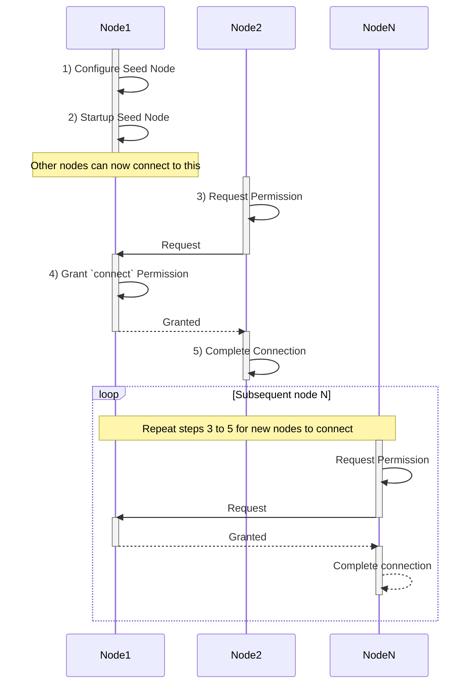
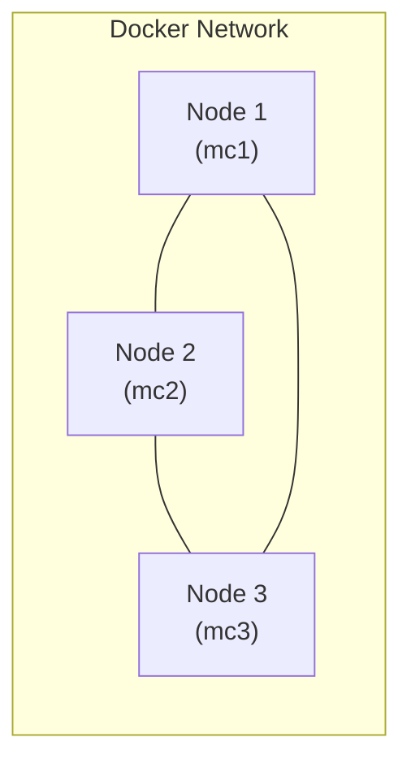

# MultiChain - Part 2

## 3. Introduction to MultiChain

MultiChain is an open-source, private, permissioned blockchain platform derived from a fork of the Bitcoin Core codebase.
Because of this shared foundation, many concepts and mechanisms in MultiChain are directly inherited from Bitcoin.

Throughout this course, the Bitcoin protocol will therefore be used as a reference point when explaining MultiChain’s core architecture and operations.
When we refer to Bitcoin, we are referring to the aspects of the Bitcoin protocol that are also common to MultiChain.
When we refer to MultiChain, we are focusing on its extensions and features that go beyond the original Bitcoin design.

The reason MultiChain is chosen for this class is that it is designed to work out of the box, requiring no deep technical expertise to set up or operate.
With its roots in both private and public blockchain architectures, MultiChain provides an excellent hands-on learning platform for exploring the practical aspects of blockchain operations — including network configuration, permission management, and transaction handling.

### Key Characteristics of MultiChain

- **Private and Permissioned**  
  MultiChain networks are private because new nodes cannot join without explicit authorization.  
  They are permissioned because granular access control extends beyond network participation — permissions can govern who may **connect**, **mine**, **send transactions**, or **issue assets**.

- **Non–Turing Complete**  
  Unlike Ethereum, MultiChain does not support Turing-complete smart contracts.  
  Its transaction logic is intentionally limited to a defined instruction set, ensuring simplicity, determinism, and predictability.

- **Consensus without Mining**  
  MultiChain does not rely on Proof-of-Work (PoW) mining for consensus.  
  Instead, it uses a **round-robin consensus protocol**, functionally similar to **Practical Byzantine Fault Tolerance (PBFT)**.  
  This design eliminates the need for cryptocurrency incentives and enables fast, low-cost transaction confirmation within trusted networks.

### Installing MultiChain

To install MultiChain, you can download the appropriate package for your operating system from the official MultiChain website: [https://www.multichain.com/download-community/](https://www.multichain.com/download-community/). 

There are 3 main files that you will be using in MultiChain:


-   **multichain-util:**

    -   This utility tool is used for creating new blockchains.
    -   It provides functionality to create and manage a new blockchain network.
    -   After the initial setup and creation of the blockchain, this file is seldom used, except in exceptional scenarios like cloning a blockchain node or performing non-standard administrative tasks.

-   **multichaind**:

    -   This is the main file that runs the Multichain service.
    -   When starting a Multichain node or connecting to another Multichain node, this file will be used.
    -   It handles the actual execution and management of the Multichain blockchain network.
    -   This file is responsible for validating and storing transactions, maintaining the blockchain ledger, and participating in the consensus mechanism.

-   **multichain-cli**:

    -   This command-line tool is used to control and send commands to the Multichain service.
    -   It provides an interactive interface for managing and interacting with the Multichain blockchain network.
    -   The majority of your time when working with Multichain will be spent using this command-line tool.
    -   With `multichain-cli`, you can perform various actions such as creating assets, issuing assets, granting permissions, publishing streams, and more.

---

### Setting up a Private Blockchain

When building a blockchain network, a **seed node** is the first node to be configured.  
It contains the initial configuration that defines how the blockchain will operate — including **network parameters**, **consensus rules**, and **permission structures**.

The following diagram gives a conceptual understanding on the process before we start the lab practice.



Assuming Node1 is the seednode and Node2 is the new node that is connecting to the seednode.

1. **Configure Seed Node:**

    - Node1 configures itself as the seed node, which is the initial node in the network.
    - This step involves setting up the necessary configurations for running the seed node.

        A new hidden directory called '.multichain' will be created in your home directory in this step.

        Within this directory, you will find another directory that is named after the name of the chain you have created. This is called the `data` directory.

        For example, if the name of your blockchain is called **chain1** then you will find `chain1` directory inside `~/.multichain` directory.

        

        Within the data directories, you will also be able to find 2 configuration files – called the blockchain parameters file and the runtime configuration file.

        -   **blockchain parameters file (params.dat)** contains mainly the settings for controlling the MultiChain’s protocol. It is important to note that this file must be configured before you start running the multichain service because once the protocol is started you may not be able to change some of the parameters later on.

        -   **runtime configuration file (multichain.conf)** contains the configuration that is applied only to individual nodes as opposed to the protocol settings from the blockchain parameters file.


2. **Startup Seed Node:**

    - Node1 starts running as the seed node.
    - The seed node is responsible for accepting connections from other nodes and facilitating the network's bootstrap process.

3. **Request Permission:**

    - Node2 wants to connect to the blockchain network and requests permission to do so.
    - This step indicates Node2's intention to join the network.

4. **Grant `connect` Permission:**

    - Node1 grants permission to Node2 to connect to the blockchain network.
    - This step allows Node2 to become a part of the network and interact with other nodes.

5. **Complete Connection:**

    - Node2 completes the connection process after receiving permission.
    - At this point, Node2 is fully connected to the blockchain network and can participate in transactions and share data.

After this, repeat step 3 to step 5 for each new node (Node N) that wants to join the network.

---

## 🛠️ Lab Practice: Setup a private blockchain network

Normally, setting up a private blockchain network requires several participants working together to create and manage the network.
For learning purposes, we’ll simplify this by simulating multiple participants on a single machine using Docker containers.

Each node will run in its own Docker container, where the MultiChain software is installed and configured separately.

In this lab, you’ll learn how to set up a private MultiChain network with three nodes — **mc1**, **mc2**, and **mc3** — all running on the same system.



### a) Setup the Network

1.  **Build the image**

    This is only required once for the image to built for your architecture. The process mirrors the instructions on MultiChain's [website](https://www.multichain.com/download-community/).

    ```bash
    cd ~/courses/FIN556/day-6/18-multichain
    . ./build.sh
    ```

2.  **Start the containers**

    Run the **start.sh** script to start up the 3 containers.

    ```bash
    . ./start.sh

     # [+] Running 4/4
     #  ✔ Network 18-multichain_default Created
     #  ✔ Container mc2 Started
     #  ✔ Container mc1 Started
     #  ✔ Container mc3 Started
    ```

    The containers will be running in the background, use the following command to verify:

    ```bash
    docker ps

     # CONTAINER ID   IMAGE              COMMAND            CREATED              STATUS              PORTS     NAMES
     # 71c28fdc7ba0   multichain:2.3.3   "sleep infinity"   About a minute ago   Up About a minute             mc2
     # 3ade58b6e2ae   multichain:2.3.3   "sleep infinity"   About a minute ago   Up About a minute             mc3
     # 240acdf56265   multichain:2.3.3   "sleep infinity"   About a minute ago   Up About a minute             mc1
    ```

    At the end of this lab, you can stop and remove the containers by running:

    ```bash
    . ./stop.sh
    ```

3.  **Connect to each container**

    You can run the scripts **mc1.sh**, **mc2.sh** and **mc3.sh** to connect to each of the 3 containers.

    You will need to open up 3 terminal windows/tabs to connect to each of the containers.

    The instructions below explains how to open up multiple terminal windows side-by-side but you can choose to open up individual terminal windows as you prefer.

    -   **Connect to mc1**

        Connect to the first container called **mc1**. This will be the seednode for the blockchain network.

        ```bash
        . ./mc1.sh
        ```

    -   **Connect to mc2**

        We will open up a parallel terminal so that you can control the second container called **mc2** side-by-side with **mc1**.

        -   For Windows Terminal:

            -   press the dropdown arrow next to the plus(+) icon.
            -   Hold down the **ALT** key and click on the Ubuntu terminal which you are using for this course.

        -   For macOS Terminal:
            -   From the menu bar, select **Shell > New Tab** or press **Command + T**.

        In the new terminal, connect to the second container called **mc2**. This will be the validator node for the blockchain network.

        ```bash
        cd ~/courses/FIN556/day-6/18-multichain
        . ./mc2.sh
        ```

    -   **Connect to mc3**

        Repeat the same steps as above to open up another parallel terminal and connect to the third container called **mc3**.

        ```bash
        cd ~/courses/FIN556/day-6/18-multichain
        . ./mc3.sh
        ```

    The final setup should look something like this:

    

---

### b) Configure Seed Node (Node1)

In this section, we will set up the seed node for the blockchain network inside the **mc1** container.

1. **Create the blockchain**

    In the terminal connected to the **mc1** container, run the following command to create a new blockchain called **chain1**.

    ```bash
    multichain-util create chain1
    ```

    This will create a new directory called **chain1** inside the **/root/.multichain/** directory.

    Verify that the hidden `.multichain` directory is created.

    ```bash
    ls -al
    ```

    

2. **Go to your data directory**

    Change your current working directory to the newly created data directory for the blockchain called **chain1**.

    ```bash
    cd ~/.multichain/chain1
    ```

3. **Edit the blockchain parameters file (params.dat)**

    Confirm that the `params.dat` file exists in your current directory.

    Open the `params.dat` file with the `nano` text editor.

    ```bash
    nano params.dat
    ```

    Scroll down and edit the following parameters:

    ```bash
    admin-consensus-admin = 0.6
    default-network-port = 2020
    default-rpc-port = 2021
    ```

    

    CTRL-X to exit the editor and save the file.

4. **Start the seed node**

    a) Start multichain service

    ```sh
    multichaind chain1
    ```

    b) Wait for the status `Node ready` to appear.

    **IMPORTANT:** At this point, take note of the IP address (**For example, the screen below shows IP as 172.18.0.2**) of the **mc1** container because you will need it later to connect other nodes to this seed node. In a real world, this would be the public IP address or domain name of the server hosting the seed node.

5. **Check the blockchain status**

    Because the `multichaind` process is running in the foreground, you will need to suspend it temporarily in order to enter commands in the terminal.

    a) Enter `CTRL-Z` to suspend the process. If you accidentally entered `CTRL-C` and terminated the process instead, you can restart the process with `multichaind chain1`.

    b) `CTRL-Z` will suspend the process and return you to the terminal prompt. In order to continue running the process in the background, enter the following command:

    ```sh
    bg
    ```

    

    c) To confirm that the service is running at the background, enter the following command:

    ```sh
    ps -aux | grep multichaind
    ```

    This command will show you the process ID (PID) of the multichaind service as shown in the sample screenshot below.

    

    Now, you can connect to the multichain service using the **multichain-cli** command line tool.

    d) Connect to the service using **multichain-cli**.

    ```sh
    multichain-cli chain1
    ```

    e) Enter the following command (within the CLI) to get the blockchain information.

    ```sh
    > getinfo
    ```

    If the service is running successfully, you will be able to see the blockchain information as shown in the sample screenshot below.

    

    f) Done.

### c) Connect Node2 to the Seed Node

In this section, we will connect the second node (**mc2**) to the seed node (**mc1**).

1. **mc2 connect to seed node**

    In the terminal connected to the **mc2** container, run the following command.
    In actual use, the seed node address and port would be communicated to you by the administrator of the seed node.

    ```bash
    multichaind chain1@<seed-node-ip-address>:<network-port>

     # Example:
     # <seed-node-ip-address> = 172.18.0.2 (from previous step when seed node was started)
     # <network-port> = 2020 (from previous step as configured in params.dat)
     #
     # multichaind chain1@172.18.0.2:2020

    ```

    The seed node will not allow the connection yet because the permission has not been granted. It will show a message similar to the one below.

    ```bash
     # MultiChain 2.3.3 Daemon (Community Edition, latest protocol 20013)
     #
     # Retrieving blockchain parameters from the seed node 172.18.0.2:2020 ...
     # Blockchain successfully initialized.
     #
     # Please ask blockchain admin or user having activate permission to let you connect   and/or #  transact:
     # multichain-cli chain1 grant 19Sd3zhRBRi32SNVtcwdCGQi2fnhV2nQ4ZwyRH connect
     # multichain-cli chain1 grant 19Sd3zhRBRi32SNVtcwdCGQi2fnhV2nQ4ZwyRH connect,send,    receive
    ```

    This is not an error message. It is simply informing you that the connection request has been received but permission to connect has not been granted yet.

    You need to provide the address shown in the message to the administrator of the seed node so that they can grant you permission to connect. For example, in the message above, the address is `19Sd3zhRBRi32SNVtcwdCGQi2fnhV2nQ4ZwyRH`.

    

2. **Grant `connect` permission to mc2**

    Switch back to the terminal connected to the **mc1** container (the seed node).

    In actual use, you would have received a request to grant permission from the new node (mc2) externally with mc2's address.

    a) You should already be running the **multichain-cli** command line tool since the previous step.

    If you are connected, you should see the prompt as:

    ```sh
    chain1:
    ```

    b) Enter the following command (within the CLI) to grant `connect` permission to the address shown in the previous step.

    ```sh
    > grant <mc2-address> connect,send,receive

     # Example:
     # <mc2-address> = 19Sd3zhRBRi32SNVtcwdCGQi2fnhV2nQ4ZwyRH (from previous step)
     #
     # grant 19Sd3zhRBRi32SNVtcwdCGQi2fnhV2nQ4ZwyRH connect,send,receive
    ```

    You should see a transaction ID being returned as shown in the sample screenshot below.

3. **mc2 reconnect to seed node**

    Switch back to the terminal connected to the **mc2** container.

    a) In actual use, you will be notified by the administrator of the seed node that your permission to connect has been granted. You can now reconnect to the seed node.

    ```bash
    multichaind chain1@<seed-node-ip-address>:<network-port>

     # Example:
     # <seed-node-ip-address> = 172.18.0.2 (from previous step when seed node was started)
     # <network-port> = 2020 (from previous step as configured in params.dat)
     # multichaind chain1@172.18.0.2:2020
    ```

    b) This time, the connection should be successful and shows `Node ready.` at the end of the output.

    

4. **Run multichain-cli**

    Similar to the previous section in **Configure Seed Node (Node1)**, you will need to suspend the `multichaind` process temporarily in order to enter commands in the terminal.

    a) Enter `CTRL-Z` to suspend the process.
    b) Type the following command to continue running the process in the background:

    ```sh
    bg
    ```

    c) Run the **multichain-cli** command line tool to connect to the multichain service.

    ```sh
    multichain-cli chain1
    ```

    d) Enter the following command to check your connected peers.

    ```sh
    > getpeerinfo
    ```

    

    If the connection is successful, you should be able to see the peer information of the seed node as shown in the sample screenshot above.

### d) Repeat for Node3

Repeat the same steps as in the previous section to connect the third node (**mc3**) to the seed node (**mc1**).


Run multichain-cli in **mc3** to verify the connection. And run getpeerinfo to see the connected peers.

**getpeerinfo** in **mc3** should show both **mc1** and **mc2** as connected peers.


