# 多链 - 第 2 部分

## 3. MultiChain 简介

MultiChain 是一个开源的、私有的、需授权的区块链平台，源自比特币核心代码库的分叉。
由于这种共享基础，MultiChain 中的许多概念和机制直接从比特币继承。

因此，在本课程中，比特币协议将作为解释 MultiChain 核心架构和操作的参考点。
当我们提到比特币时，我们指的是比特币协议中与 MultiChain 共通的方面。
当我们提到 MultiChain 时，我们专注于其超越原始比特币设计的扩展和功能。

选择 MultiChain 作为本课程的原因是，它设计为开箱即用，无需深厚的技术专业知识即可设置或操作。
MultiChain 兼具私有和公有区块链架构的特性，为探索区块链操作的实践方面提供了优秀的动手学习平台——包括网络配置、权限管理和交易处理。

### MultiChain 的关键特性

- **私有和需授权**  
  MultiChain 网络是私有的，因为新节点需要明确授权才能加入。
  它们是需授权的，因为细粒度的访问控制超越了网络参与——权限可以控制谁可以**连接**、**挖矿**、**发送交易**或**发行资产**。

- **非图灵完备**  
  与以太坊不同，MultiChain 不支持图灵完备的智能合约。
  其交易逻辑有意限制为定义的指令集，确保简单性、确定性和可预测性。

- **无需挖矿的共识**  
  MultiChain 不依赖工作量证明（PoW）挖矿来达成共识。
  相反，它使用**轮询共识协议**，功能上类似于**实用拜占庭容错（PBFT）**。
  这种设计消除了对加密货币激励的需求，并在可信网络内实现快速、低成本的交易确认。

### 安装 MultiChain

要安装 MultiChain，您可以从官方 MultiChain 网站为您的操作系统下载适当的软件包：[https://www.multichain.com/download-community/](https://www.multichain.com/download-community/)。

在 MultiChain 中您将使用 3 个主要文件：

-   **multichain-util:**

    -   此工具用于创建新区块链。
    -   它提供创建和管理新区块链网络的功能。
    -   在区块链的初始设置和创建之后，此文件很少使用，除非在特殊情况下，如克隆区块链节点或执行非标准管理任务。

-   **multichaind**:

    -   这是运行 Multichain 服务的主文件。
    -   在启动 Multichain 节点或连接到另一个 Multichain 节点时，将使用此文件。
    -   此文件负责验证和存储交易、维护区块链账本，并参与共识机制。

-   **multichain-cli**:

    -   此命令行工具用于向 Multichain 服务发送命令和控制它。
    -   提供用于管理和交互 Multichain 区块链网络的交互式界面。
    -   在使用 Multichain 时，您的大部分时间将使用此命令行工具。
    -   使用 `multichain-cli`，您可以执行各种操作，如创建资产、发行资产、授予权限、发布流等。

---

### 设置私有区块链

在构建区块链网络时，**种子节点**是首先配置的节点。
它包含定义区块链运行方式的初始配置——包括**网络参数**、**共识规则**和**权限结构**。

在开始实验实践之前，以下图表给出了该过程的概念理解。

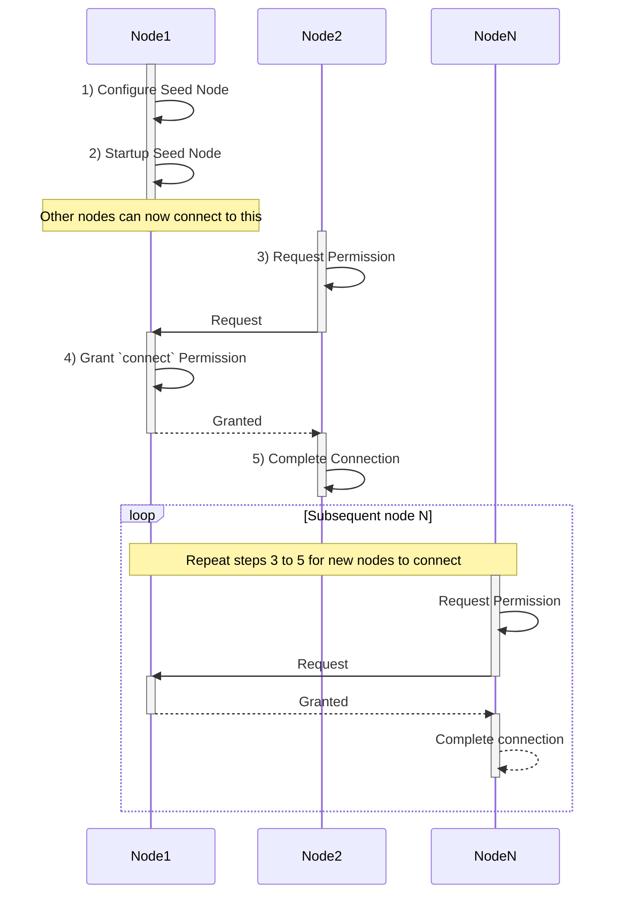

假设 Node1 是种子节点，Node2 是连接到种子节点的新节点。

1.  **配置种子节点：**

    -   Node1 将自己配置为种子节点，这是网络中的初始节点。
    -   此步骤涉及设置运行种子节点所需的配置。

        在此步骤中，您的主目录下将创建一个名为 '.multichain' 的隐藏目录。

        在此目录中，您将找到另一个以您创建的链名称命名的目录。这称为 `data` 目录。

        例如，如果您的区块链名称为 **chain1**，那么您将在 `~/.multichain` 目录中找到 `chain1` 目录。

        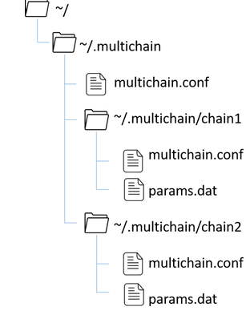

        在数据目录中，您还可以找到 2 个配置文件——称为区块链参数文件和运行时配置文件。

        -   **区块链参数文件 (params.dat)** 主要包含用于控制 MultiChain 协议设置。请注意，此文件必须在您开始运行 multichain 服务之前配置，因为一旦协议启动，您可能无法更改某些参数。

        -   **运行时配置文件 (multichain.conf)** 包含仅应用于各个节点的配置，而不是区块链参数文件中的协议设置。

2.  **启动种子节点：**

    -   Node1 开始作为种子节点运行。
    -   种子节点负责接受来自其他节点的连接并促进网络的启动过程。

3.  **请求权限：**

    -   Node2 想要连接到区块链网络并请求权限。
    -   此步骤表示 Node2 加入网络的意图。

4.  **授予 `connect` 权限：**

    -   Node1 授予 Node2 连接到区块链网络的权限。
    -   此步骤允许 Node2 成为网络的一部分并与其他节点交互。

5.  **完成连接：**

    -   Node2 在收到权限后完成连接过程。
    -   此时，Node2 已完全连接到区块链网络，可以参与交易和共享数据。

之后，对每个想要加入网络的新节点（节点 N）重复步骤 3 到 5。

---

## 🛠️ 实验实践：设置私有区块链网络

通常，设置私有区块链网络需要多个参与者共同努力创建和管理网络。
为了学习目的，我们将通过使用 Docker 容器在单台机器上模拟多个参与者来简化此过程。

每个节点将在自己的 Docker 容器中运行，其中 MultiChain 软件已单独安装和配置。

在本实验中，您将学习如何设置具有三个节点的私有 MultiChain 网络——**mc1**、**mc2** 和 **mc3**——都在同一系统上运行。

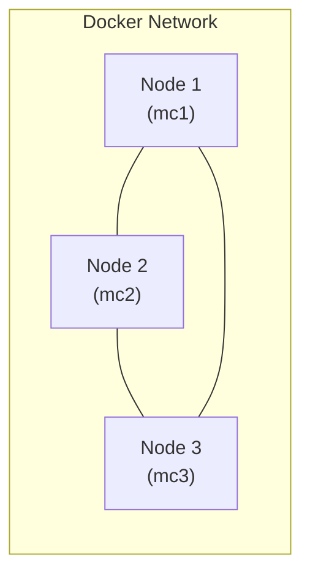

### a) 设置网络

1.  **构建镜像**

    这仅需要为您的架构构建一次镜像。该过程与 MultiChain [网站](https://www.multichain.com/download-community/)上的说明一致。

    ```bash
    cd ~/courses/FIN556/day-6/18-multichain
    . ./build.sh
    ```

2.  **启动容器**

    运行 **start.sh** 脚本以启动 3 个容器。

    ```bash
    . ./start.sh

     # [+] Running 4/4
     #  ✔ Network 18-multichain_default Created
     #  ✔ Container mc2 Started
     #  ✔ Container mc1 Started
     #  ✔ Container mc3 Started
    ```

    容器将在后台运行，使用以下命令进行验证：

    ```bash
    docker ps

     # CONTAINER ID   IMAGE              COMMAND            CREATED              STATUS              PORTS     NAMES
     # 71c28fdc7ba0   multichain:2.3.3   "sleep infinity"   About a minute ago   Up About a minute             mc2
     # 3ade58b6e2ae   multichain:2.3.3   "sleep infinity"   About a minute ago   Up About a minute             mc3
     # 240acdf56265   multichain:2.3.3   "sleep infinity"   About a minute ago   Up About a minute             mc1
    ```

    在本实验结束时，您可以通过运行以下命令停止并移除容器：

    ```bash
    . ./stop.sh
    ```

3.  **连接到每个容器**

    您可以运行脚本 **mc1.sh**、**mc2.sh** 和 **mc3.sh** 来连接到 3 个容器中的每一个。

    您需要打开 3 个终端窗口/标签页来连接到每个容器。

    下面的说明解释了如何并排打开多个终端窗口，但您也可以根据自己的喜好单独打开终端窗口。

    -   **连接到 mc1**

        连接到名为 **mc1** 的第一个容器。这将是区块链网络的种子节点。

        ```bash
        . ./mc1.sh
        ```

    -   **连接到 mc2**

        我们将打开一个并行终端，以便您可以与 **mc1** 并排控制第二个名为 **mc2** 的容器。

        -   对于 Windows Terminal：

            -   按下加号(+)图标旁边的下拉箭头。
            -   按住 **ALT** 键并点击您用于本课程的 Ubuntu 终端。

        -   对于 macOS 终端：
            -   从菜单栏中选择 **Shell > New Tab** 或按 **Command + T**。

        在新终端中，连接到名为 **mc2** 的第二个容器。这将是区块链网络的验证节点。

        ```bash
        cd ~/courses/FIN556/day-6/18-multichain
        . ./mc2.sh
        ```

    -   **连接到 mc3**

        重复上述相同步骤，打开另一个并行终端并连接到第三个名为 **mc3** 的容器。

        ```bash
        cd ~/courses/FIN556/day-6/18-multichain
        . ./mc3.sh
        ```

    最终设置应如下所示：

    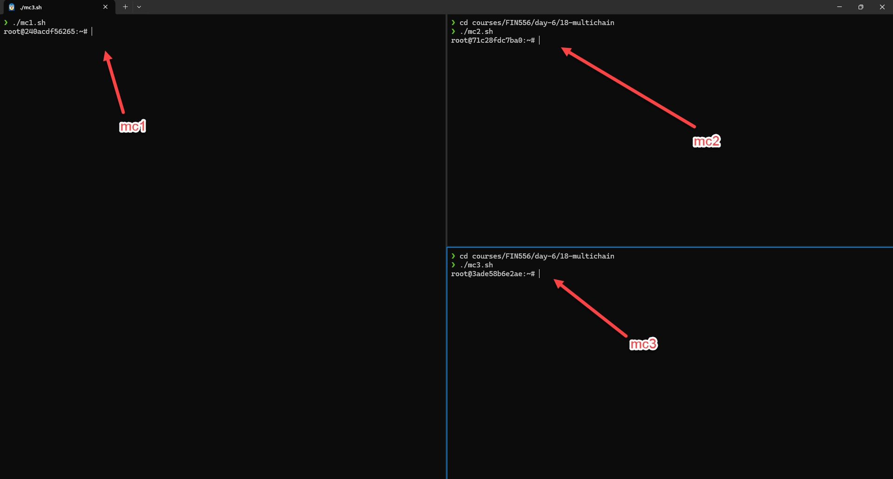

---

### b) 配置种子节点 (Node1)

在本节中，我们将在 **mc1** 容器内为区块链网络设置种子节点。

1.  **创建区块链**

    在连接到 **mc1** 容器的终端中，运行以下命令创建一个名为 **chain1** 的新区块链。

    ```bash
    multichain-util create chain1
    ```

    这将在 **/root/.multichain/** 目录中创建一个名为 **chain1** 的新目录。

    验证隐藏的 `.multichain` 目录已创建。

    ```bash
    ls -al
    ```

    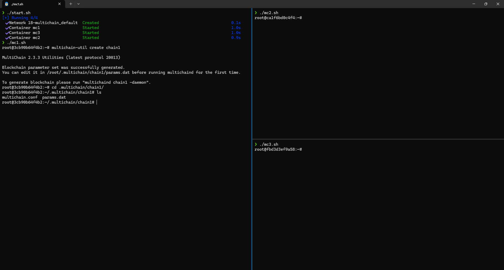

2.  **进入数据目录**

    将您当前的工作目录更改为为名为 **chain1** 的区块链新创建的数据目录。

    ```bash
    cd ~/.multichain/chain1
    ```

3.  **编辑区块链参数文件 (params.dat)**

    确认 `params.dat` 文件存在于当前目录中。

    使用 `nano` 文本编辑器打开 `params.dat` 文件。

    ```bash
    nano params.dat
    ```

    向下滚动并编辑以下参数：

    ```bash
    admin-consensus-admin = 0.6
    default-network-port = 2020
    default-rpc-port = 2021
    ```

    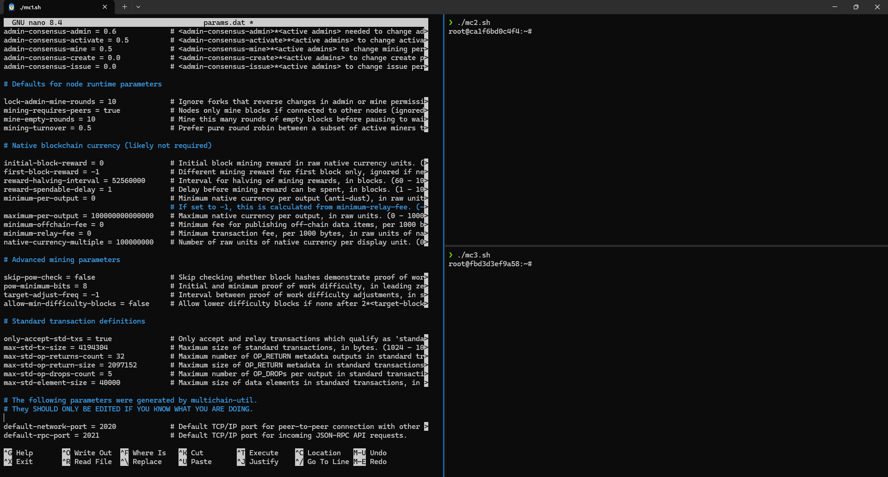

    按 CTRL-X 退出编辑器并保存文件。

4.  **启动种子节点**

    a) 启动 multichain 服务

    ```sh
    multichaind chain1
    ```

    b) 等待状态 `Node ready` 出现。

    **重要：** 此时，请记下 **mc1** 容器的 IP 地址（例如下面的屏幕显示 IP 为 172.18.0.2），因为稍后您需要它来连接其他节点到这个种子节点。在现实世界中，这将是托管种子节点的服务器的公网 IP 地址或域名。

5.  **检查区块链状态**

    因为 `multichaind` 进程正在前台运行，您需要暂时挂起它以便在终端中输入命令。

    a) 输入 `CTRL-Z` 挂起进程。如果您不小心输入了 `CTRL-C` 并终止了进程，可以使用 `multichaind chain1` 重新启动进程。

    b) `CTRL-Z` 将挂起进程并返回到终端提示符。要继续在后台运行进程，请输入以下命令：

    ```sh
    bg
    ```

    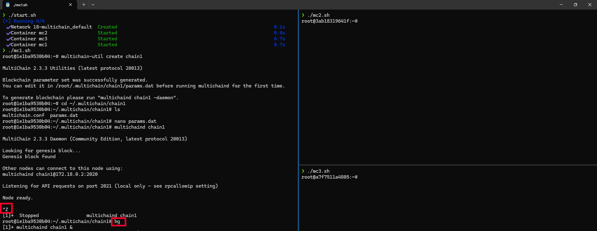

    c) 要确认服务正在后台运行，请输入以下命令：

    ```sh
    ps -aux | grep multichaind
    ```

    此命令将向您显示 multichaind 服务的进程 ID (PID)，如下面的示例屏幕截图所示。

    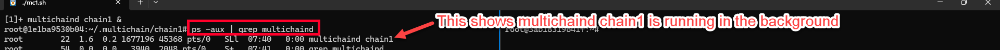

    现在，您可以使用 **multichain-cli** 命令行工具连接到 multichain 服务。

    d) 使用 **multichain-cli** 连接到服务。

    ```sh
    multichain-cli chain1
    ```

    e) 输入以下命令（在 CLI 内）获取区块链信息。

    ```sh
    > getinfo
    ```

    如果服务成功运行，您将能够看到如下面的示例屏幕截图所示的区块链信息。

    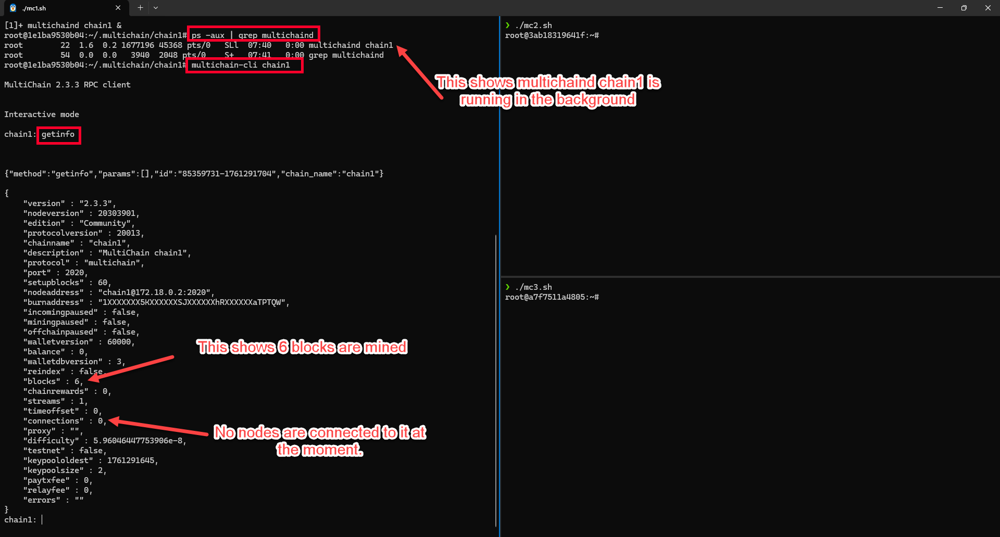

    f) 完成。

### c) 将 Node2 连接到种子节点

在本节中，我们将第二个节点（**mc2**）连接到种子节点（**mc1**）。

1.  **mc2 连接到种子节点**

    在连接到 **mc2** 容器的终端中，运行以下命令。
    在实际使用中，种子节点管理员会向您传达种子节点地址和端口。

    ```bash
    multichaind chain1@<seed-node-ip-address>:<network-port>

     # 示例：
     # <seed-node-ip-address> = 172.18.0.2 (从之前启动种子节点时的步骤)
     # <network-port> = 2020 (从之前在 params.dat 中配置的步骤)
     #
     # multichaind chain1@172.18.0.2:2020

    ```

    种子节点此时尚不允许连接，因为权限尚未授予。它将显示类似于以下的消息。

    ```bash
     # MultiChain 2.3.3 Daemon (Community Edition, latest protocol 20013)
     #
     # Retrieving blockchain parameters from the seed node 172.18.0.2:2020 ...
     # Blockchain successfully initialized.
     #
     # Please ask blockchain admin or user having activate permission to let you connect   and/or #  transact:
     # multichain-cli chain1 grant 19Sd3zhRBRi32SNVtcwdCGQi2fnhV2nQ4ZwyRH connect
     # multichain-cli chain1 grant 19Sd3zhRBRi32SNVtcwdCGQi2fnhV2nQ4ZwyRH connect,send,    receive
    ```

    这不是错误消息。它只是通知您连接请求已收到，但连接权限尚未授予。

    您需要将消息中显示的地址提供给种子节点管理员，以便他们授予您连接权限。例如，在上面的消息中，地址是 `19Sd3zhRBRi32SNVtcwdCGQi2fnhV2nQ4ZwyRH`。

    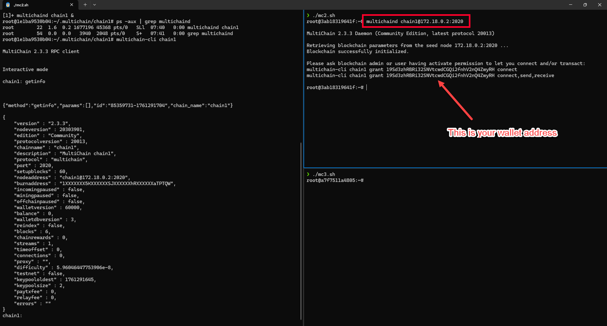

2.  **授予 mc2 `connect` 权限**

    切换回连接到 **mc1** 容器的终端（种子节点）。

    在实际使用中，您将收到来自新节点（mc2）的外部请求授予权限，并附带 mc2 的地址。

    a) 您应该已经在运行 **multichain-cli** 命令行工具，因为这是上一步。

    如果已连接，您应该看到如下提示：

    ```sh
    chain1:
    ```

    b) 输入以下命令（在 CLI 内）授予上一步显示的地址 `connect` 权限。

    ```sh
    > grant <mc2-address> connect,send,receive

     # 示例：
     # <mc2-address> = 19Sd3zhRBRi32SNVtcwdCGQi2fnhV2nQ4ZwyRH (从上一步)
     #
     # grant 19Sd3zhRBRi32SNVtcwdCGQi2fnhV2nQ4ZwyRH connect,send,receive
    ```

    您应该看到返回一个交易 ID，如下面的示例屏幕截图所示。

3.  **mc2 重新连接到种子节点**

    切换回连接到 **mc2** 容器的终端。

    a) 在实际使用中，种子节点管理员将通知您已授予连接权限。现在您可以重新连接到种子节点。

    ```bash
    multichaind chain1@<seed-node-ip-address>:<network-port>

     # 示例：
     # <seed-node-ip-address> = 172.18.0.2 (从之前启动种子节点时的步骤)
     # <network-port> = 2020 (从之前在 params.dat 中配置的步骤)
     # multichaind chain1@172.18.0.2:2020
    ```

    b) 这次，连接应该成功，并在输出末尾显示 `Node ready。`

    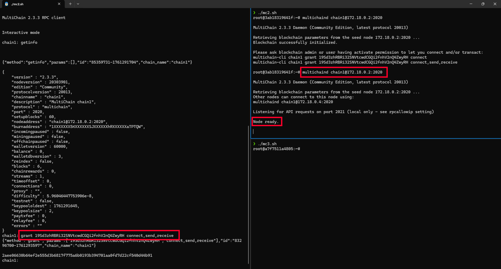

4.  **运行 multichain-cli**

    与上一节**配置种子节点 (Node1)**类似，您需要暂时挂起 `multichaind` 进程以便在终端中输入命令。

    a) 输入 `CTRL-Z` 挂起进程。
    b) 输入以下命令以继续在后台运行进程：

    ```sh
    bg
    ```

    c) 运行 **multichain-cli** 命令行工具连接到 multichain 服务。

    ```sh
    multichain-cli chain1
    ```

    d) 输入以下命令检查您连接的节点。

    ```sh
    > getpeerinfo
    ```

    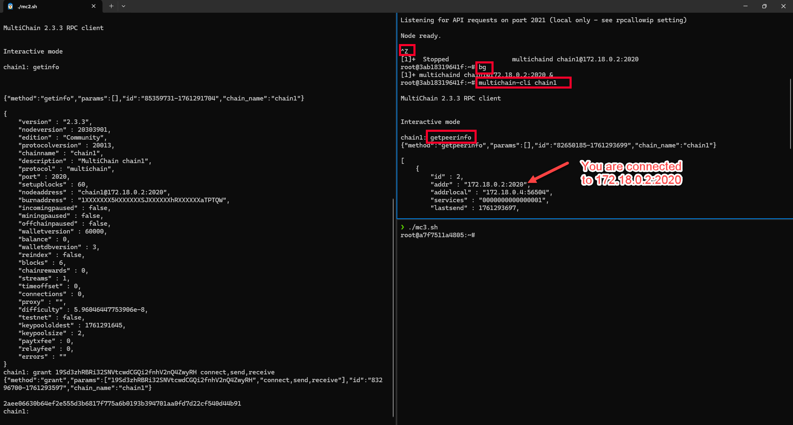

    如果连接成功，您应该能够看到如上面的示例屏幕截图所示的种子节点信息。

### d) 对 Node3 重复

重复上一节的相同步骤，将第三个节点（**mc3**）连接到种子节点（**mc1**）。

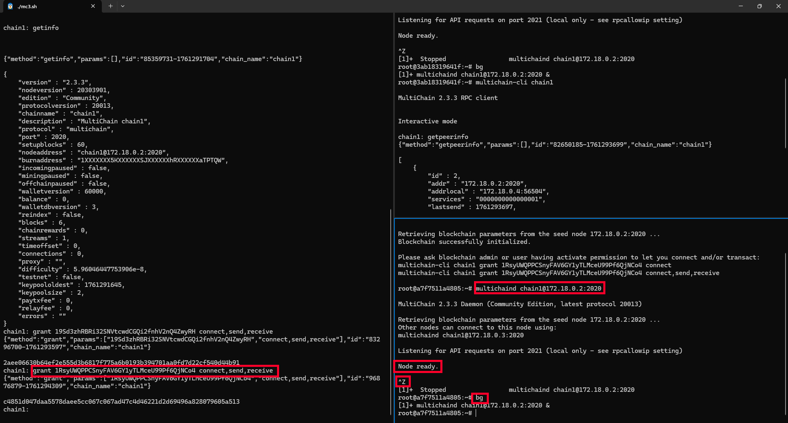

在 **mc3** 中运行 multichain-cli 以验证连接。并运行 getpeerinfo 查看连接的节点。

**mc3** 中的 **getpeerinfo** 应显示 **mc1** 和 **mc2** 都作为连接的节点。

