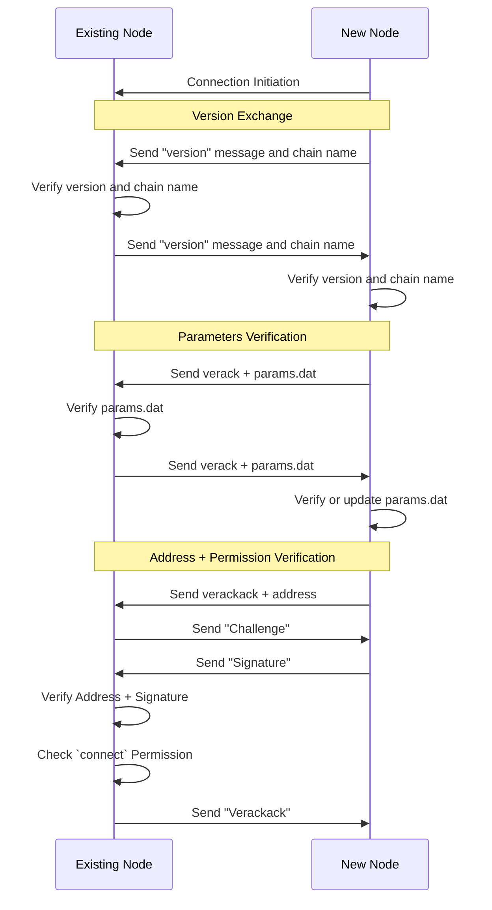
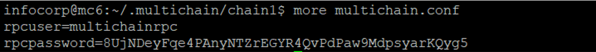
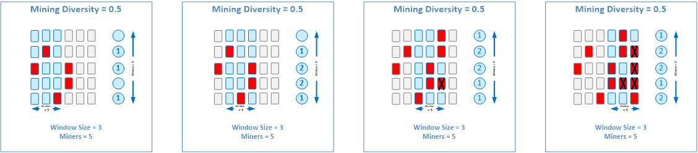

# MultiChain 概念

## 点对点握手协议

在之前的实验课程中，您已经完成了通过将新节点连接到种子节点来创建私有区块链的过程。

MultiChain 节点相互连接的过程称为握手协议，分为四个主要步骤：

1. 连接启动：

    - "新节点"通过向"现有节点"发送连接启动消息来启动连接。

2. 版本交换和验证：

    - 两个节点交换版本消息和链名称以建立兼容性。
    - 它们验证收到的版本和链名称以确保兼容性。

3. 参数验证：

    - 节点通过交换 verack 消息并验证收到的 params.dat 文件来验证区块链参数。
    - 如果这是 NewNode 第一次连接，它将包含一个部分的 params.dat 文件，需要从 ExistingNode 下载文件的其余部分。

4. 地址和权限验证：
    - 节点验证连接地址和权限。
    - 它们交换 verackack 和挑战消息以验证地址和签名。
    - "现有节点"检查"新节点"是否具有必要的"连接"权限。

**注意**：值得注意的是，您可以尝试连接到网络上的任何节点。不一定是种子节点。但种子节点是最方便的连接节点，因为它是第一个设置和运行的节点。而且连接权限不一定由种子节点授予。可以由任何具有管理员或激活权限的节点授予。



---

## 区块链参数文件 (params.dat)

区块链参数文件包含应用于整个 Multichain 区块链网络的协议设置。此文件在创建种子节点时生成。

如果您需要有关可用参数及其配置的更多信息，可以参考 MultiChain 提供的官方文档。共享[链接](https://www.multichain.com/developers/blockchain-parameters/)提供了参数完整列表及其解释和可能值。此资源将帮助您了解可用选项并在配置区块链网络时做出明智的决策。

我们将在下面介绍一些有用的参数。

### default-network-port

-   默认网络端口号是节点允许其他节点连接到它的端口号。

-   配置此端口号时，还必须记住您使用的端口未被防火墙阻止。

-   这就是为什么在首次设置 Azure 虚拟机时，必须为端口 2020 配置入站规则，以便节点可以连接到您。

回忆在之前的实验中，种子节点必须使用以下内容更新其 **params.dat** 文件：

```bash
default-network-port = 2020
default-rpc-port = 2021
```

这就是为什么在之前的实验中，连接节点必须指定种子节点的 IP 地址和端口号，`multichaind chain1@{replace-with-ip}:`**2020**。

### default-rpc-port

-   默认远程过程调用 (RPC) 端口是 multichaind 服务接收 API 命令的端口号。

-   此端口号由 multichain-cli 使用，但您自己的应用程序也可以使用它来发出 API 命令。

**重要：** 值得注意的是，更改链启动后某些参数可能不可能。因此，建议在启动区块链网络之前修改区块链参数文件，以确保从一开始就应用所需的设置。

### admin-concensus-admin

为防止单个节点做出所有关键决策，您应该让多个节点做出集体决策。

在这种情况下，admin-consensus-admin 参数用于设置必须同意修改地址管理权限的管理员比例。

例如，如果 admin-consensus-admin 设置为 0.6，这意味着您需要大约三分之二的管理员节点批准管理交易才能执行。

如果您最初只有 2 个管理员节点，并且想要添加第三个管理员节点。任何一位管理员都无法做到这一点，因为他们只代表 50% 的管理员。因此，两个管理员节点都需要授予第三个节点权限成为管理员。

### mining-diversity

MultiChain 使用轮询协议，mining-diversity 用于控制协议行为。挖矿多样性的概念将在下文讨论。此参数接受的值为 0（表示无约束）到 1（表示每个节点都必须参与挖矿）。

### mine-empty-rounds

挖矿空轮参数用于节省磁盘空间，以便挖矿节点在若干轮没有提交交易的情况下不必产生任何区块。

### target-block-time

目标区块时间用于确定链上挖矿区块的延迟。默认为 10，意味着平均每 10 秒生成一个区块。最小值为 1，意味着每秒生成一个区块。但总是存在权衡，因为如果区块创建延迟太低，意味着每个矿工将非常快速地提交节点，并可能导致更多分叉。

### maximum-block-size

最大区块大小决定了在提交到区块链之前您可以将多少数据打包到一个区块中。此大小也将决定您可以发送的交易数量。因此，如果您可以将 1000 笔交易打包到一个区块中，意味着如果该区块被挖掘，1000 笔交易将上链。

最大区块大小参数也将受目标区块时间影响，如果目标区块时间非常短但区块非常小，那么平均交易吞吐量仍将受限。

---

## 运行时配置文件 (multichain.conf)

运行时配置文件，也称为 `multichain.conf`，用于确定 Multichain 区块链网络中单个节点的配置设置。该文件可以在节点的两个不同位置找到：

1. `.multichain` 目录中的文件适用于服务器上运行的所有链。此文件中配置的任何设置都将适用于所有链。
2. `chain` 目录中的文件特定于某个链，并且仅适用于与该链关联的节点。

运行时配置文件最常见的用途是配置允许远程访问节点的设置。通过修改此文件中的设置，您可以控制和管理从远程位置访问节点的权限。当您想以编程方式与节点交互或远程管理节点时，这尤其有用。

### RPC API 认证

如果您打开 `multichain.conf` 文件，您会看到默认情况下它只包含 2 个条目，即 RPC API 用于认证的用户名和密码，我们将在下面进一步解释。



---

## MultiChain RPC API

MultiChain RPC API 是可以发送到 `multichaind` 服务的一组命令，通过[默认 RPC 端口](#default-rpc-port)（在这种情况下为 `2021`）执行特定操作。

### 使用 multichain-cli 的 RPC API

在之前的实验中，您使用了 `multichain-cli` 命令行工具连接到 MultiChain 服务并向其发送 `getinfo` 命令。`getinfo` 是 API 提供的命令示例。

multichain-cli 工具可以直接连接到本地 multichaind 服务，因为它知道 multichain.conf 文件中指定的用户名和密码。

```
rpcuser=multichainrpc
rpcpassword=...
```

### 通过 HTTP 进行 RPC API 认证

值得一题的是，此 RPC 端口并不仅限于 Multichain 命令行工具使用。因为区块链是一个后端系统，类似于数据库，除非您可以编写与之交互的应用程序，否则您能做的事情不多。因此，RPC 端口还允许外部应用程序通过 [默认 RPC 端口](#default-rpc-port) 通过 HTTP 发送命令。在这种情况下，rpcuser 和 rpcpassword 必须使用基本认证显式编码在 http 头中。

### 通过公共互联网的 RPC API

请注意，RPC 端口适用于本地主机。它运行在 HTTP 上，因此不通过加密通道，不能直接用于公共互联网。然而，为本课程的目的，我们将允许 RPC 端口通过公共互联网访问，以便我们可以演示从本地机器使用 http 向 Azure 上的 multichaind 服务发送命令。

这是通过在 multichain.conf 文件中添加以下内容来完成的。

```
rpcuser=multichainrpc
rpcpassword=...
rpcallowip=0.0.0.0/0
```

**重要：** 开放 RPC 远程访问存在安全风险。这就是为什么您需要将 `rpcallowip` 添加到 .multichain.conf 以允许外部工具连接到它。

一旦允许远程连接，您可以自己尝试以下示例。

#### 通过 HTTP 发送 MultiChain RPC API 命令的示例：

以下是使用 curl 向 multichaind 服务发送 `getinfo` 命令的示例。

```
curl --user multichainrpc:{replace-with-rpcpassword} --data-binary '{"jsonrpc": "1.0", "id":"curltest", "method": "getinfo", "params": [] }' -H 'content-type: text/plain;' {replace-with-ip-address}:{replace-with-default-rpc-port}
```

#### 连接 multichain-cli 到远程 multichaind 的示例：

```bash
multichain-cli -rpcconnect={ip-address} -rpcport={rpc-port} -rpcuser={rpc-user} -rpcpassword={rpc-password} {chain-name}
```

---

## MultiChain 权限

MultiChain 支持两种类型的权限：全局权限和实体级权限。

### 全局权限

MultiChain 支持 8 种不同的全局权限设置，"连接"只是其中之一。这些设置是全局的，因为它们适用于整个区块链网络。

| 权限类型 | 权限范围 | 权限级别 |
| ------- | --------------------------------------------------- | --------- |
| connect | 连接到网络 | low |
| send | 发送 multichain 资产 | low |
| receive | 接收 multichain 资产 | low |
| issue | 发行 multichain 资产 | medium |
| create | 创建 multichain 流 | medium |
| activate | 授予操作员权限（connect、send、receive） | medium |
| mining | 参与挖矿 | high |
| admin | 更改任何权限 | high |

**注意：** 可以通过更改 **anyone-can-???** 设置在 params.dat 文件中禁用权限。但是，一旦部署区块链，设置将变为永久性的。

-   **connect** 权限通常用于私有区块链（如 MultiChain），新节点需要获得连接到现有节点的权限才能成为网络的一部分。

-   **send** 和 **receive** 权限用于支持 MultiChain 资产的交易。这些权限允许节点在区块链网络内发送和接收资产。这些权限通常是低权限的，可以授予大多数节点。

-   另一方面，**issue** 和 **create** 权限更敏感，专为操作员使用而设计。issue 权限允许创建新资产，而 create 权限用于创建 Multichain 流。流创建将在后面讨论。这些权限由有权发行新资产和管理流的操作员使用。

-   **activate** 权限允许节点向其他节点授予低权限权限。这类似于在传统系统中授予操作员用户管理访问权限。

-   **mining** 和 **admin** 是高权限权限，应受到限制和控制。mining 权限允许节点参与区块的共识和挖矿。这意味着如果具有 mining 权限的节点操纵区块，它们可以直接影响网络的安全。同样，admin 权限授予所有权限以及向其他节点授予 admin 权限的能力。由于这两个权限至关重要并会显著影响网络的安全，这些权限控制的操作应需要多个节点的共识批准。这有助于确保涉及挖矿和管理操作的决策是由集体而非单个节点做出。

### 实体级权限

在上一节中，全局权限 "create" 和 "issue" 授予地址发行任何资产和创建任何流的能力。如果您只想授予地址发行特定资产或创建特定流的权限怎么办？

这就是实体级权限的用武之地。实体级权限用于授予特定资产或流的权限。这允许您授予特定资产或流的权限，而无需授予发行任何资产或创建任何流的权限。

如何授予全局和实体级权限的命令将在下一课中讨论，届时我们将学习 MultiChain RPC API 命令。

---

## 去中心化共识治理

在去中心化共识治理中，网络决策和控制分布在多个独立组织或节点之间。这种方法有助于防止权力集中，并给予所有参与者平等的发言权。

这种去中心化治理的一个例子是向新节点授予管理员权限。无需自由发放这些关键权限，而是需要其他管理员节点的共识协议。这确保了授予管理员权限的决策由一组高权限节点集体做出，由独立组织拥有。

这种基于共识的方法有助于通过确保重要决策不是单方面做出，而是通过集体协议来维护网络的完整性和安全。它防止任何单一实体获得对系统的过多控制，促进透明度和公平性。

去中心化共识治理在区块链网络内培养更具民主性和包容性的决策过程，促进共享所有权并减少权力集中。


<!-- <div style="text-align:center">
    
</div> -->

### 配置去中心化治理

要将 MultiChain 配置为使用去中心化共识治理，您可以将 **params.dat** 文件的 [admin-consensus-admin](#admin-concensus-admin) 参数设置为 0 到 1 之间的值。该值表示必须同意修改地址管理权限的允许管理员节点的比例。

---

## 轮询共识协议

MultiChain 使用的轮询共识协议旨在将挖矿区块的机会分配给所有允许的挖矿节点，以防止节点集中。这有助于确保区块不会由同一节点重复挖掘，促进更去中心化的网络。

在轮询共识协议中，每个挖矿节点按顺序和循环方式轮流挖掘区块。这意味着每个允许的挖矿节点都有同等机会参与区块挖矿过程。挖矿顺序可能基于网络中节点的位置或其他标准等因素确定。

通过以轮询方式将挖矿区块的机会分配给所有允许的挖矿节点，该协议旨在防止任何单个节点主导挖矿过程。这促进了一个公平和去中心化的网络，多个节点为保护区块链做出贡献。

与公有区块链不同，私有区块链（如 MultiChain）不需要发行本机加密货币或依赖工作量证明共识协议。在私有区块链中，经过认证的节点减少了女巫攻击的威胁，因为节点是已知实体。因此，私有区块链中共识协议的焦点通常是在更高效和受控的方式在可信参与者之间达成共识。

在 MultiChain 中使用轮询共识协议有助于避免节点集中，增强网络的公平性，并确保挖矿区块的责任在参与节点之间均匀分配。


<!-- <div style="text-align:center">
    
</div> -->

---

## 挖矿多样性

挖矿多样性在决定轮询共识协议的行为方面起着关键作用。它指的是协议在防止矿工勾结挖掘区块方面的严格或宽松程度。挖矿多样性级别可能影响网络的稳定性和安全性。

例如，当挖矿多样性设置为 50% 时，意味着一个挖矿节点挖掘区块后，必须等待超过 50% 的其他矿工也挖掘区块后才能再次挖掘。此规则确保没有单一挖矿节点主导挖矿过程，并有助于在参与节点之间公平分配挖矿机会。

让我们考虑一个 5 个挖矿节点以 50% 挖矿多样性运行轮询的示例。在这种情况下，5 的 50% 是 2。因此，一个节点挖掘区块后，必须等待另外 2 个不同的节点挖掘它们的区块，然后才能再次挖掘。此限制防止任何单个节点挖掘多个连续区块，保持更去中心化和公平的网络。

然而，如果多个节点在同一轮次中成功挖掘区块，则会发生分叉。这意味着区块链现在有多个竞争版本，网络需要解决平局。分叉的解决通常需要等待未来的轮次，其中一个版本的区块链将最终添加更多区块，成为主导版本，而另一个版本变得孤立。



挖矿多样性的选择取决于区块链网络的具体要求和考虑。较高的挖矿多样性有助于防止勾结，但可能增加创建和解锁分叉的机会。另一方面，较低的挖矿多样性允许单个节点更多灵活性，但如果某些节点持续比其他节点挖掘更多区块，可能导致集中化。

确定适当的挖矿多样性级别需要根据区块链系统的具体目标和限制，平衡网络稳定性、安全性、公平性和性能等因素。

### 配置挖矿多样性

挖矿多样性可以通过将 **params.dat** 文件的 [mining-diversity](#mining-diversity) 参数设置为 0 到 1 之间的值来配置。该值表示节点再次挖矿前必须挖矿的允许挖矿节点的比例。

