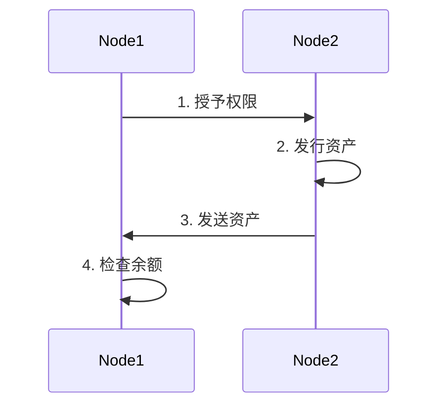

# MultiChain 资产

本课程的重点是介绍如何创建和使用 multichain 资产。

## 1. 概述

下图描述了在 MultiChain 上发行和转移资产的一般流程。



在此图中，Node1 是一个管理员节点，Node2 是希望发行资产的节点。

---

## 2. 原生资产与原生货币的区别

在 MultiChain 中，"原生"一词指的是协议本身内置的功能。原生加密货币由协议生成，并由区块链节点验证。它作为区块链生态系统内的交换媒介，通常具有启用交易、奖励矿工或验证者以及支付交易费用等功能。

另一方面，MultiChain 中的原生资产不是由协议生成的。它们是由有权使用钱包地址发行资产的个人创建的。尽管是外部创建的，原生资产在协议层面得到认可和验证，类似于原生加密货币。这意味着它们获得与原生货币同等的认可和待遇。

---

## 3. MultiChain 资产与其他区块链资产的区别

MultiChain 资产与其他区块链资产之间的关键区别是什么？

值得注意的是，原生资产概念是 MultiChain 特有的，因为其他区块链平台，特别是比特币和以太坊，没有原生资产概念。

在比特币中，资产使用彩色币或侧链等变通方法表示。在以太坊中，资产使用智能合约表示，ERC20 和 ERC721 等代币标准通过智能合约实现。资产或代币本身在协议层面不被认可或验证。由于智能合约中的 bug，可能出现负余额，但协议无法检测到它。

基本上，在资产方面它比比特币好，在降低资产管理风险方面不如以太坊灵活。如果您想要的是使用代币化资产进行简单的价值转移，这是一个非常好的权衡。

---

## 4. MultiChain 资产命令

### a. "issue" 命令

此命令用于在 MultiChain 上发行资产。

**语法：**

```sh
issue "address" "asset-name"|asset-params quantity ( smallest-unit native-amount custom-fields )
```

**参数：**

1. **"address" (string, required)**: 发送新创建资产的地址。
2. **"asset-name" (string, required)**: 资产名称，应该唯一。

或者

2. **asset-params (object, required)**: 包含资产参数的 JSON 对象

    ```json
    {
        "name" : "asset-name"         (string, optional) 资产名称
        "open" : true|false           (boolean, optional, default false) 是否允许后续发行
        "restrict" : "restrictions"   (string, optional) 权限字符串，用逗号分隔。可能的值：send,receive
        "unrestrict" : "issue"        (string, optional) 如果设置，则后续发行不需要发行权限。可能的值：issue
        "fungible" : true|false       (boolean, optional, default true) 如果资产单位是非同质化则为 false
        "canopen" : true|false        (boolean, optional, default false) 资产管理员是否可以打开资产（更改开放性）
        "canclose" : true|false       (boolean, optional, default false) 资产管理员是否可以关闭资产（更改开放性）
        "totallimit" : n              (numeric, optional, default unlimited) 发行总量限制
        "issuelimit" : n              (numeric, optional, default unlimited) 单次发行限制
    }
    ```

3. **quantity (numeric, required)**: 资产的显示单位总量。例如 1234.56
4. **smallest-unit (numeric, optional, default=1)**: 一个显示单位中的原始单位数量，例如 0.01 表示分
5. **native-amount (numeric, optional)**: 发送的原生货币金额。例如 0.1，默认值：minimum-per-output。

6. **custom-fields (object, optional)**: 包含自定义字段的 JSON 对象
   {...}

**示例：**

此示例展示如何使用 "issue" 命令发行名为 "Dollar"、总量为 1000000 单位的资产，其中每个分等于 0.01 个原始单位。

```sh
> issue "1M72Sfpbz1BPpXFHz9m3CdqATR44Jvaydd" Dollar 1000000 0.01
```

以下示例显示 "issue" 命令默认发行"封闭"资产。以下命令将失败并显示错误消息："具有此名称的资产或流已存在"。原因是 SomeAsset1 默认发行后不能重新发行。

```sh
> issue "1M72Sfpbz1BPpXFHz9m3CdqATR44Jvaydd" SomeAsset1 100
> issue "1M72Sfpbz1BPpXFHz9m3CdqATR44Jvaydd" SomeAsset1 200
```

要发行可重新发行的资产，您需要为第二个参数传入带有 "open" 属性为 true 的 JSON。

```sh
> issue "1M72Sfpbz1BPpXFHz9m3CdqATR44Jvaydd" '{"name":"SomeAsset1","open":true}' 100
```

---

### b. "issuemore" 命令

为资产创建更多单位。

**语法：**

```sh
issuemore "address" "asset-identifier" quantity ( native-amount custom-fields )
```

**参数：**

1. **"address" (string, required)**: 发送新创建资产的地址。
2. **"asset-identifier" (string, required)**: 资产标识符 - 以下之一：发行交易 ID、资产引用、资产名称。
3. **quantity (numeric, required)**: 资产的显示单位总量。例如 1234.56。
4. **native-amount (numeric, optional)**: 发送的原生货币金额。例如 0.1，默认值：minimum-per-output。
   5 **custom-fields (object, optional)**: 包含自定义字段的 JSON 对象
   {...}

**示例：**

此示例展示如何使用 "issuemore" 命令创建名为 "Dollar" 的资产的更多单位并将其发送到指定地址。创建的额外单位数量为 1000000。

```
issue "1M72Sfpbz1BPpXFHz9m3CdqATR44Jvaydd" '{"name":"Apple","open":true}' 100
getaddressbalances "1M72Sfpbz1BPpXFHz9m3CdqATR44Jvaydd"
issuemore "1M72Sfpbz1BPpXFHz9m3CdqATR44Jvaydd" Apple 1000000
getaddressbalances "1M72Sfpbz1BPpXFHz9m3CdqATR44Jvaydd"
```

最终余额应返回 1000100。

---

### c. "listassets" 命令

返回已定义资产的列表。

**语法：**

```sh
listassets ( asset-identifier(s) verbose count start )
```

**参数：**

1. **"asset-identifier" (string, optional, default=\*)**: 资产标识符 - 以下之一：发行交易 ID、资产引用、资产名称。
   或者
1. **asset-identifier(s) (array, optional)**: 资产标识符的 JSON 数组

1. **verbose (boolean, optional, default=false)**: 如果为 true，返回所有发行交易的列表，包括后续发行

1. **count (number, optional, default=INT_MAX - all)**: 要显示的资产数量
1. **start (number, optional, default=-count - last)**: 从特定资产开始，0 开始，如果为负数 - 从末尾开始

**示例：**

它应显示区块链上所有钱包地址发行的所有资产。

```
> listassets
```

---

### d. "getaddressbalances" 命令

返回指定地址的资产余额。

**语法：**

```sh
getaddressbalances "address" ( minconf includeLocked )
```

**参数：**

1. **"address" (string, required)**: 返回余额的地址。
2. **minconf (numeric, optional, default=1)**: 仅包含至少确认这么多次的交易。
3. **includeLocked (bool, optional, default=false)**: 也考虑锁定的输出

**示例：**

下面的示例演示在 MultiChain 中使用 "getaddressbalances" 命令检索指定地址的资产余额。

```sh
> getaddressbalances "1M72Sfpbz1BPpXFHz9m3CdqATR44Jvaydd"
```

示例输出显示地址 "1M72Sfpbz1BPpXFHz9m3CdqATR44Jvaydd" 即使资产已转移给它也没有资产余额。

```sh
[
    {
        "assetref" : "",
        "qty" : 0,
        "raw" : 0
    }
]
```

请注意，为了检查余额，节点必须知道该地址的存在并能够监控它。检查节点上的地址以确认这一点。

```sh
> getaddresses
```

结果显示地址 "1M72Sfpbz1BPpXFHz9m3CdqATR44Jvaydd" 不在列表中。

```sh
[
    "12S7Eg2Gz1ZSdRXqVjzjoSybBV1m9umdZz5nHL",
    "1bXk12QuUGXv9WXLaZwbTjfJ6UvNBJmuD9CFqc"
]
```

因此，在此示例中，节点必须在检查余额之前导入地址。

```sh
> importaddress "1M72Sfpbz1BPpXFHz9m3CdqATR44Jvaydd"
> getaddressbalances "1M72Sfpbz1BPpXFHz9m3CdqATR44Jvaydd"
```

在示例输出中：

```sh
[
    {
        "name" : "asset1",
        "assetref" : "61-266-22284",
        "qty" : 100
    },
    {
        "name" : "asset2",
        "assetref" : "63-266-53910",
        "qty" : 200
    },
    {
        "name" : "asset3",
        "assetref" : "66-266-55734",
        "qty" : 300
    }
]
```

我们现在可以看到地址 "1M72Sfpbz1BPpXFHz9m3CdqATR44Jvaydd" 具有以下资产余额：

-   "asset1" 数量为 100。
-   "asset2" 数量为 200。
-   "asset3" 数量为 300。

---

### e. "sendasset" 命令

向给定地址发送资产金额。金额是实际的。

**语法：**

```sh
sendasset "address" "asset-identifier" asset-qty ( native-amount "comment" "comment-to" )
```

**参数：**

1. **"address" (string, required)**: 发送到的地址。
2. **"asset-identifier" (string, required)**: 资产标识符 - 以下之一：发行交易 ID、资产引用、资产名称。
3. **asset-qty (numeric, required)**: 要发送的资产数量。例如 0.1
4. **native-amount (numeric, optional)**: 发送的原生货币金额。例如 0.1，默认值：minimum-per-output。
5. **"comment" (string, optional)**: 用于存储交易目的的注释。这不是交易的一部分，仅保存在您的钱包中。
6. **"comment-to" (string, optional)**: 用于存储您向其发送交易的人或组织名称的注释。这不是交易的一部分，仅保存在您的钱包中。

**示例：**

此示例展示如何使用 "sendasset" 命令将 10 单位标识为 "Asset2" 的资产发送到指定地址。

```sh
> sendasset 1Unpjzmh9TsuRZvVKCQNpqx1eDFkaGC215fpj6 Asset2 10
```

---

## 🛠️ 实验实践：MultiChain 资产

-   在本实验课程中，我们将尝试实现以下流程。


-   Node1 和 Node2 是任意的，因此您可以选择组中任意 2 个节点来担任 Node1 和 Node2 的角色。

-   组的所有成员应该轮换并担任 Node1 和 Node2 的角色来完成本实验。

-   您也可以参考 MultiChain API 文档获取详细信息 http://www.multichain.com/developers/json-rpc-api/

---

### 步骤 1：Node1 向 Node2 授予 'issue' 权限

a) 检查您是否有发行资产的权限。

b) 如果您没有发行权限，请要求管理员节点向您授予权限。在上图中，我们假设 Node1 具有管理权限，但只要组中任何节点具有授予发行权限的权限，它就可以是组中的任何节点。

### 步骤 2. 发行资产

参考 [issue](#a-issue-command) 命令的说明并使用它完成步骤 2，即 Node2 将资产发行到自己的钱包中。

### 步骤 3. 发送资产

参考 [send](#b-send-command) 命令的说明并使用它完成步骤 3，即 Node2 将资产发送给 Node1。

### 步骤 4：Node1 检查余额

参考 [getaddressbalances](#c-getaddressbalances-command) 命令的说明并使用它完成步骤 4，即 Node1 检查其钱包余额以确认已收到资产。

