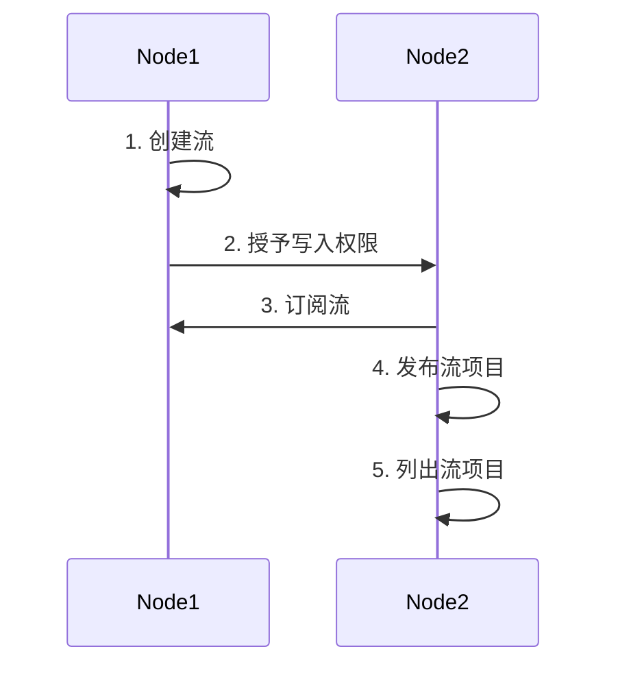

本课程的重点是介绍如何创建和使用 multichain 资产。

## 1. 概述

MultiChain 流用作在区块链上存储和检索数据的机制，非常类似于数据库。下图描述了在 MultiChain 上创建流和发布流项目的一般流程，用于说明。



在此图中，Node1 是具有"创建"权限的节点，Node2 是希望向 Node1 创建的流中发布项目的节点。

1. Node1 创建一个流。这意味着 Node1 设置了一个可以存储数据的流。

2. Node1 向 Node2 授予写入权限。这允许 Node2 向 Node1 创建的流写入或添加数据。

3. Node2 订阅该流。通过订阅，Node2 表示有兴趣接收与该流相关的更新或通知。

4. Node2 发布一个流项目。这意味着 Node2 添加了一段新数据，称为流项目。流项目的内容可以是文本、JSON 对象或十六进制字符串。

5. Node2 列出流项目。此操作涉及检索和显示已发布到该流的流项目列表。它允许 Node2 查看流中的现有数据。

---

## 2. MultiChain 流和流项目

我们可以将流与数据库表进行类比。流就像数据库表，流项目就像数据库记录。然而，与数据库不同的是，流项目一旦创建就无法删除；它只能追加到流中。

流项目的特征如下：

-   流项目是键值对。
-   键在 MultiChain 流项目中**不**是唯一的。这意味着您可以在一个流中拥有具有相同键的多个流项目。流项目可以有多个键，您可以使用其任何键来搜索项目。
-   键的长度在 0 到 256 字节之间。
-   数据可以表示为十六进制字符串、文本或 JSON 对象。
-   数据也可以配置为链上或链下存储。
-   值的大小由最大区块大小和区块中的交易数量决定。
-   每个流项目包含用于发布到区块的交易 ID。

这些特性使区块链能够以不同于传统数据库的方式使用，具有可审计和防伪能力：

-   **时序数据库（何时）**：这种数据库对于存储需要精确时间戳的可审计信息很有用。区块链的设计固有地在数据添加到每个区块时按时间顺序对其进行时间戳和序列化。这允许轻松验证和验证事件顺序，以及在时间为数据快照以便将来参考。

-   **身份驱动的数据库（谁）**：这种数据库为存储在区块链上的数据来源或真实性提供证明。每个发布交易都是不可变的，可以追溯到其所有者，确保数据的完整性和问责制。

-   **键值数据库（什么）**：由于每笔交易都是唯一且不可变的，使用键值数据库实现参考数据注册表是一种很好的方法。这种数据很少更改，对这种数据的完整性进行严格控制至关重要，因为它作为许多下游数据消费者的黄金数据源。

**注意：** MultiChain 流机制通常所有人都可以读取，权限只能用于控制谁具有写入或管理员访问权限。但是，MultiChain 引入了一项新功能，用于在区块链上存储加密数据。如果您感兴趣，值得自己进一步了解此功能。无论如何，作为一般准则，切勿在区块链上存储任何敏感数据。

---

## 3. MultiChain 流命令

### a. "create stream" 命令

在区块链上创建流（即数据库表）。

**语法：**

```
create stream "stream-name" open|restrictions|options "custom-fields" "javascript-code"
```

**参数：**

1. **"entity-type" (string, required)**: stream
2. **"stream-name" (string, required)**: 流名称，如果不是 "" 则应该唯一。
3. **open (boolean, required)**: 允许任何人在此流中发布
   或者
4. **restrictions (object, optional)**: 流限制提供了更细粒度的控制来控制谁可以发布到流。限制对象可以包含以下内容：

    ```json
    {
        "restrict" : "restrictions" (string, optional) 流限制，用逗号分隔。可能的值：write,read,offchain,onchain
        "salted" : true|false (boolean, optional) 表示是否应该对链下项目块哈希加盐
    }
    ```

5. custom-fields (object, optional) 包含自定义字段的 JSON 对象
   {...}

**示例：**

以下命令创建一个封闭的流；只有流的创建者可以向其中发布。

```
> create stream test-stream
```

以下命令创建一个开放的流；任何人都可以向其中发布。

```
> create stream test-stream true
```

以下命令创建一个只读的流；只有具有 test-stream.write 权限的地址可以向其中发布。

```
> create stream test-stream {"restrict":"write"}
```

---

### b. "publish" 命令

在区块链上发布流项目（即在数据库表中追加记录）。

**语法：**

```
publish "stream-identifier" "key"|keys "data-hex"|data-obj "options"
```

**参数：**

1. **"stream-identifier" (string, required)**: 流标识符 - 以下之一：交易 ID、流引用、流名称。

2. **"key" (string, required)**: 项目键

或者

2. **keys (array, required)**: 项目键数组

3. **"data-hex" (string, required)**: 数据十六进制字符串

或者

3. **data-json (object, required)**: JSON 数据对象
    ```json
    {
        "json" : data-json (object, required) 有效的 JSON 对象
    }
    ```

或者

3. **data-text (object, required)**: 文本数据对象

    ```json
    {
        "text" : "data-text" (string, required) 数据字符串
    }
    ```

4. **"options" (string, optional)**: 应为 "offchain" 或省略

**示例：**

以下命令发布一个流项目，键为 "key1"，十六进制字符串表示 ASCII 中的 "Hello World!"。您可以使用在线十六进制转文本转换器验证。这是流项目的原始形式，不是人类可读的，但对二进制数据很有用。

```
publish "test-stream1" "key1" 48656C6C6F20576F726C64210A
```

以下命令发布一个流项目，键为 "key2"，JSON 对象嵌套在 "json" 属性下的 JSON 参数中。

```
publish "test-stream1" "key2" '{"json":{"name":"John Smith"}}'
```

以下命令发布一个流项目，键为 "key3"，文本字符串在 "text" 属性下的 JSON 参数中。

```
publish "test-stream1" "key3" '{"text":"Hello world!"}'
```

---

### c. "subscribe" 命令

订阅流。

**语法：**

```
subscribe entity-identifier(s) ( rescan parameters )
```

**参数：**

1. "stream-identifier" (string, required) 流标识符 - 以下之一：创建交易 ID、流引用、流名称。

或者

1. "asset-identifier" (string, required) 资产标识符 - 以下之一：发行交易 ID、资产引用、资产名称。

或者

1. entity-identifier(s) (array, optional) 流或资产标识符的 JSON 数组

2. rescan (boolean, optional, default=true) 重新扫描钱包中的交易
   注意：如果 rescan 为 true，此调用可能需要几分钟才能完成。

**示例：**

订阅流并重新扫描

> multichain-cli chain1 subscribe "test-stream"

订阅流但不重新扫描

> multichain-cli chain1 subscribe "test-stream" false

---

### d. "liststreams" 命令

返回已定义流的列表。

**语法：**

```
liststreams ( stream-identifier(s) verbose count start )
```

**参数：**

1. **"stream-identifier(s)" (string, optional, default=\*)**: 流标识符 - 以下之一：创建交易 ID、流引用、流名称。

或者

1. **stream-identifier(s) (array, optional)**: 流标识符的 JSON 数组

2. **verbose (boolean, optional, default=false)**: 如果为 true，返回流创建者列表

3. **count (number, optional, default=INT_MAX - all)**: 要显示的流数量

4. **start (number, optional, default=-count - last)**: 从特定流开始，0 开始，如果为负数 - 从末尾开始

**示例：**

以下命令返回所有流的列表。

```
> liststreams
```

---

### e. "liststreamitems" 命令

返回流项目。

**语法：**

```
liststreamitems "stream-identifier" ( verbose count start local-ordering )
```

**参数：**

1. **"stream-identifier" (string, required)**: 流标识符 - 以下之一：创建交易 ID、流引用、流名称。

2. **verbose (boolean, optional, default=false)**: 如果为 true，返回有关项目交易的信息

3. **count (number, optional, default=10)**: 要显示的项目数量

4. **start (number, optional, default=-count - last)**: 从特定项目开始，0 开始，如果为负数 - 从末尾开始

5. **local-ordering (boolean, optional, default=false)**: 如果为 true，项目按钱包处理的顺序出现，如果为 false - 按它们在区块链中出现的顺序

**示例：**

以下命令返回流 "test-stream1" 中所有流项目的列表。

```
> liststreamitems "test-stream1"
```

以下命令返回流 "test-stream1" 中所有流项目的列表，带有详细信息。

```
> liststreamitems "test-stream1" true
```

以下命令返回流 "test-stream1" 中所有流项目的列表，带有详细信息，每页 20 项，从第 10 项开始。

```
> liststreamitems "test-stream1" true 20 10
```

---

### f. "liststreamkeyitems" 命令

返回特定键的流项目。

**语法：**

```
liststreamkeyitems "stream-identifier" "key" ( verbose count start local-ordering )
```

**参数：**

1. **"stream-identifier" (string, required)**: 流标识符 - 以下之一：创建交易 ID、流引用、流名称。
2. **"key" (string, required)**: 流键
3. **verbose (boolean, optional, default=false)**: 如果为 true，返回有关项目交易的信息
4. **count (number, optional, default=10)**: 要显示的项目数量
5. **start (number, optional, default=-count - last)**: 从特定项目开始，0 开始，如果为负数 - 从末尾开始
6. **local-ordering (boolean, optional, default=false)**: 如果为 true，项目按钱包处理的顺序出现，如果为 false - 按它们在区块链中出现的顺序

**示例：**

以下命令返回流 "test-stream1" 中键为 "key1" 的所有流项目的列表。

```
> liststreamkeyitems test-stream1 key1
```

以下命令返回流 "test-stream1" 中键为 "key1" 的所有流项目的列表，带有详细信息。

```
> liststreamkeyitems test-stream1 key1 true 10 100
```

以下示例创建一个具有多个键的流项目，然后使用其中一个键检索该项目。

```
> publish test-stream1 '["key1","key2","key3"]' '{"json":{"name":"John Smith"}}'
> liststreamkeyitems test-stream1 key1
> liststreamkeyitems test-stream1 key2
> liststreamkeyitems test-stream1 key4
```

示例输出显示 key1 返回 1 个项目，而 key2 返回 2 个项目。这是因为 key2 包含另一个也包含 key2 的项目。最后一个命令返回 0 个项目，因为 key4 不存在。

---

## 🛠️ 实验实践：MultiChain 流

-   在本实验课程中，我们将尝试实现以下流程。


-   Node1 和 Node2 是任意的，因此您可以选择组中任意 2 个节点来担任 Node1 和 Node2 的角色。

-   Node1 不一定是管理员，但它必须具有"创建"权限。

-   组的所有成员应该轮换并担任 Node1 和 Node2 的角色来完成本实验。

-   您也可以参考 MultiChain API 文档获取详细信息 http://www.multichain.com/developers/json-rpc-api/

---

### 步骤 1：Node1 创建流

参考 [create stream](#a-create-stream-command) 命令的说明并使用它完成步骤 1，即由 node1 创建流。

### 步骤 2：Node1 向 Node2 授予流的写入权限

参考 [grant stream-level permission](#e-grant-command) 命令的说明并使用它完成步骤 2，即在流级别向 node2 授予写入权限。

### 步骤 3：Node2 订阅流

参考 [subscribe](#c-subscribe-command) 命令的说明并使用它完成步骤 3，即订阅流。

### 步骤 4：Node2 发布流项目

参考 [publish](#b-publish-command) 命令的说明并使用它完成步骤 4，即向流中发布项目。

### 步骤 5：Node2 列出流项目

参考 [list stream by key](#f-liststreamkeyitems-command) 命令的说明并使用它完成步骤 5，即按键列出项目。
