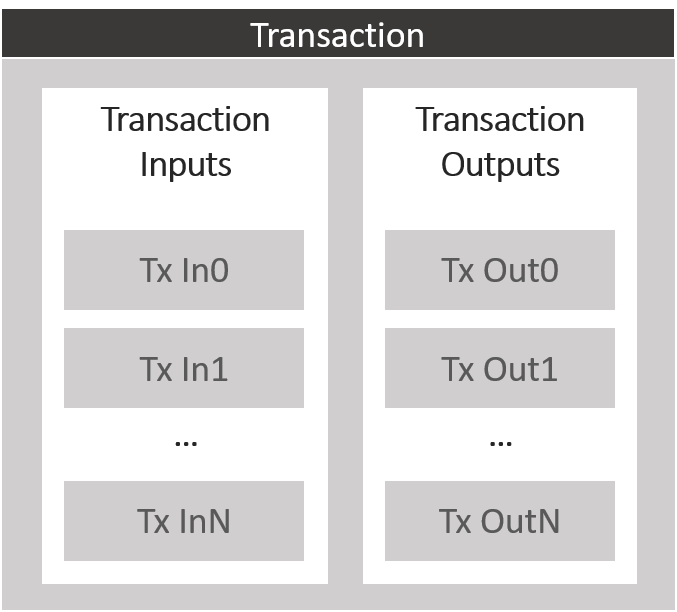
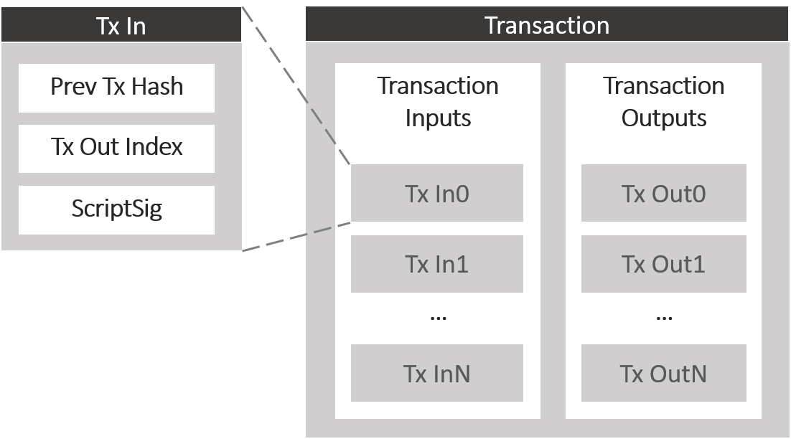
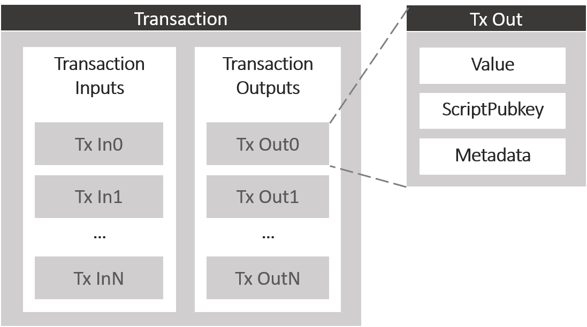
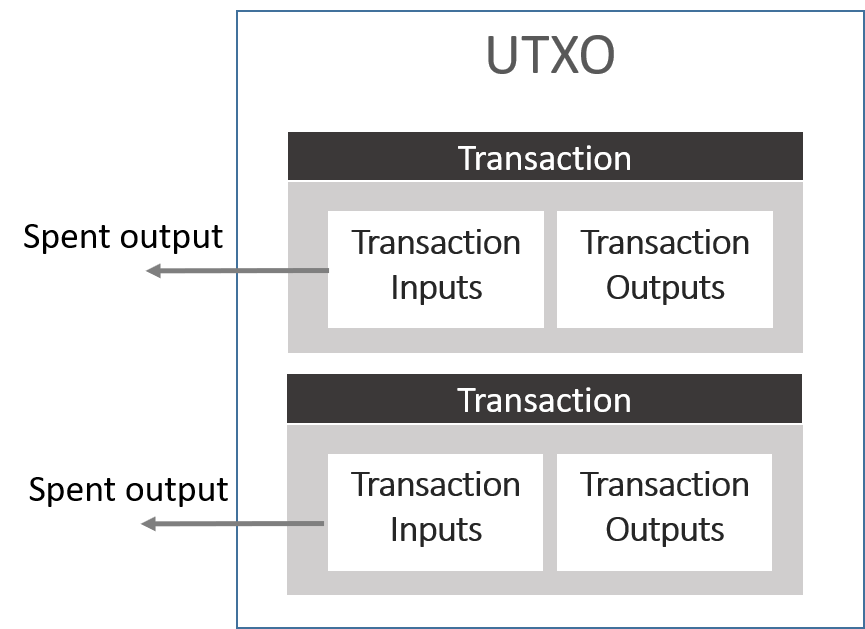
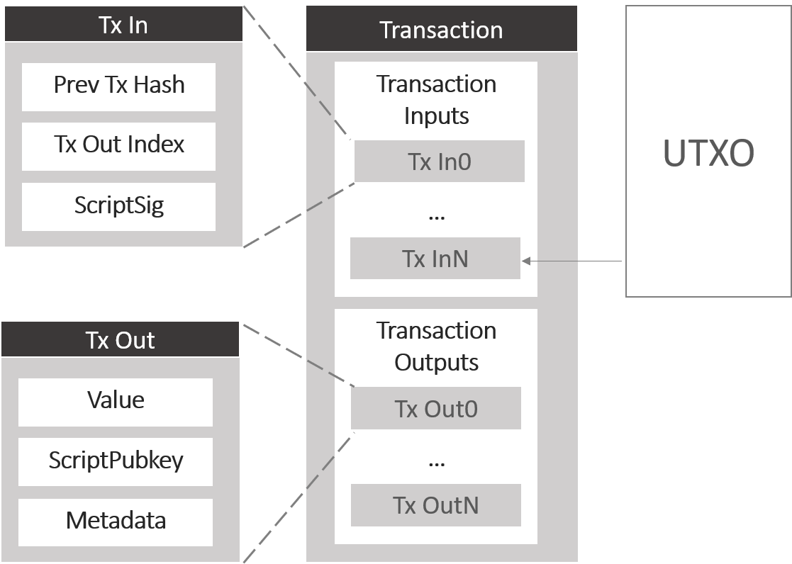
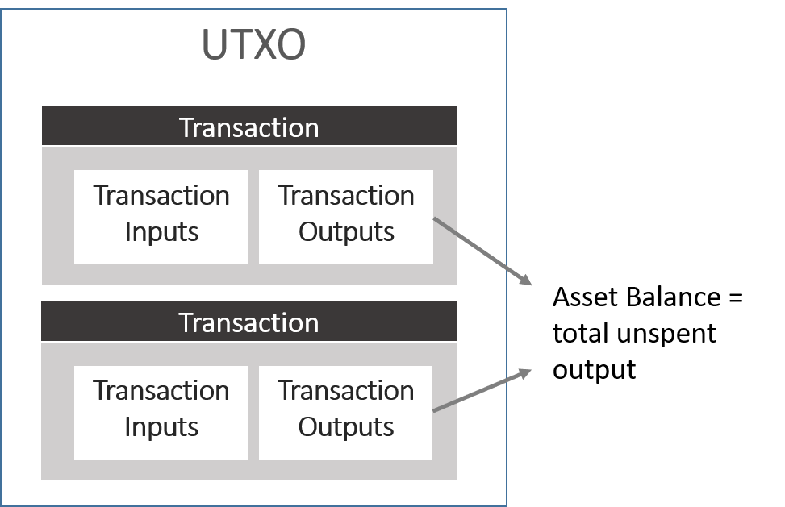

# 交易

## 1. MultiChain 交易

区块链由区块链组成，每个区块由一系列交易组成。那么什么是交易？
每个 multichain 交易本质上由 2 个列表组成：交易输入列表和交易输出列表。
有一个例外是 coinbase，指的是第一个区块的交易，没有输入。
每笔交易都以其交易 ID 来引用——交易 ID 不存储在交易中，而是从其哈希派生。
这就是为什么交易 ID 也称为交易哈希。

### a. 交易输入

每个交易输入包含两部分：

一部分是对前一个交易输出的引用。
这个引用使用前一个交易的 ID 以及输出在前一个交易中的索引或位置（从 0 开始）形成。

另一部分通常称为 ScriptSig。这是解锁脚本或用于解锁前一个交易输出中持有价值的密钥。

您可以想象交易输入代表花费或解锁一个交易输出。

### b. 交易输出

交易输出由三部分组成。

第一部分是一个表示原生加密货币的数字。在比特币的情况下，这表示锁定在此交易输出中的比特币数量。

第二部分通常称为 ScriptPubKey——这是用于锁定交易输出内包含的值的锁定脚本。

这个锁定脚本的原始目的是基于接收者的钱包地址锁定交易输出，以便交易输出只能使用接收者的私钥通过交易输入来解锁。这就是为什么出于传统原因它被称为 ScriptPubkey，其中 pubkey 表示公钥。
尽管这个脚本的传统用途是允许花费交易，但脚本实际上可以用来做其他事情，以赋予交易一定程度的可编程性。我稍后会详细讨论这个脚本。

第三部分用于存储元数据，这就是 MultiChain 用来扩展比特币协议以承载 multichain 资产、multichain 流、权限等的方式。
每个交易输出可以已花费或未花费。

### c. 未花费交易输出 (UTXO)

已花费的交易输出总是被属于发生花费的另一笔交易的交易输入引用。

交易通过将过去的交易输出链接到新的交易输入而相互连接。

最新交易的交易输出尚不会被任何交易输入引用。

这就是为什么这些新交易输出被称为未花费交易输出，区块链中所有未花费交易输出的集合称为 UTXO。

理解 UTXO 的含义对于帮助您理解如何推导钱包余额是必要的。

### d. 交易验证

为了使交易有效，必须满足以下条件：

1. 交易格式正确。这意味着交易必须格式正确且必须包含所有必要部分。

2. 交易必须合法。这意味着交易必须根据应用程序的规则有效。例如，交易必须由正确的私钥签名。

3. 交易必须被确认。这意味着交易必须被包含在一个区块中，并且该区块必须被挖掘。

4. 交易必须有效。这意味着交易必须根据协议规则有效。例如，交易不能花费超过交易输出的金额。

为了验证最后一点，必须针对 UTXO 集检查交易，以确保正在花费的交易输出尚未被另一笔交易花费。

