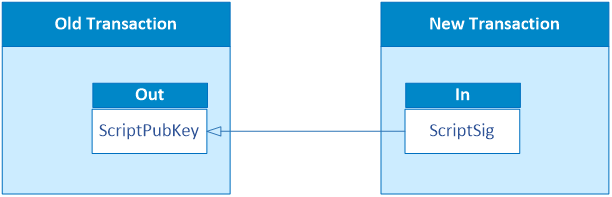
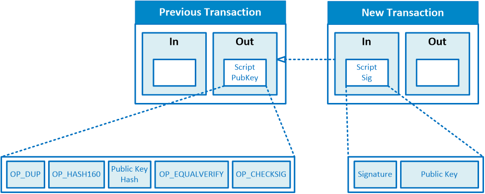
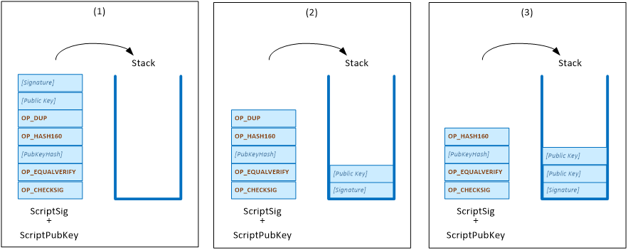
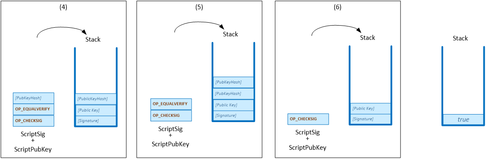

# 比特币脚本

## 1. 花费交易

"花费交易"指的是使用前一个交易输出的资金作为新交易的输入。换句话说，它涉及解锁与特定交易输出关联的锁定脚本（按惯例称为 `scriptPubKey`），然后允许这些资金作为新交易的输入。解锁脚本按惯例称为 `scriptSig`。

本课程主要关注比特币协议如何利用自己的脚本语言来促进交易花费。然而，这个概念对于整个区块链技术中交易的功能是基本的。它使数字资产的所有权能够从一方转移到另一方。

---

## 2. 脚本 - 比特币编程语言

MultiChain 使用的脚本语言是一种简单的基于堆栈的语言。

### 中缀表示法

在常规算术表示法中，运算符位于两个操作数之间，我们称之为中缀表示法。例如。

11 - 2 x 3 = 11 - 6 = 5 
  
 

表达式 `11 - 2 x 3` 首先计算 `3 x 2` 得到 `6`，然后 `11 – 6` 得到 `5`，根据算术规则进行求值。

### 后缀表示法（逆波兰表示法）

然而，中缀表示法无法被计算机有效处理，因为计算机需要读取整个表达式才能知道操作的顺序。

基于堆栈的语言使用一种称为逆波兰表示法或后缀表示法的不同表示法，这意味着运算符位于操作数之前。

因此，表达式 `11 - 2 x 3` 在后缀表示法中写成 `11 2 3 x -`。

要计算后缀表达式，我们可以按照以下步骤：

1. 创建一个空堆栈来存储中间结果。
2. 从左到右读取表达式。
3. 对于后缀表达式中的每个标记：
    - 如果是操作数（数字），将其推入堆栈。
    - 如果是运算符：
        - 从堆栈中弹出前两个操作数。
        - 按弹出顺序对操作数执行操作（例如，执行减法：second_operand - first_operand）。
        - 将结果推回堆栈。
4. 处理所有标记后，最终结果将是堆栈上剩余的唯一值。

通过这些步骤，我们得到结果：

11 2 3 x - = 11 6 - = 5

 

---

## 3.  Pay-to-PubkeyHash (P2PKH)

要花费交易输出，我们从解锁脚本（scriptSig）开始，然后将锁定脚本（scriptPubKey）附加到它。

完整的脚本如下所示：

|  P2PKH 脚本  |
| :------------: |
|   签名    |
|   公钥    |
|     OP_DUP     |
|   OP_HASH160   |
|   公钥哈希   |
| OP_EQUALVERIFY |
|  OP_CHECKSIG   |

我们将使用计算后缀表示法的算法来计算脚本。如果最终结果为 true，则交易有效。

---

## 4. 标准脚本

我们刚刚看到的脚本是称为 Pay-to-PubkeyHash (P2PKH) 脚本的标准脚本的示例。标准脚本是比特币协议中常用的脚本，并被大多数比特币客户端支持。

您可以参考 [https://en.bitcoin.it/wiki/Script](https://en.bitcoin.it/wiki/Script) 了解更多关于比特币脚本语言可以执行的不同操作以及可以使用的标准脚本类型的详细信息。

