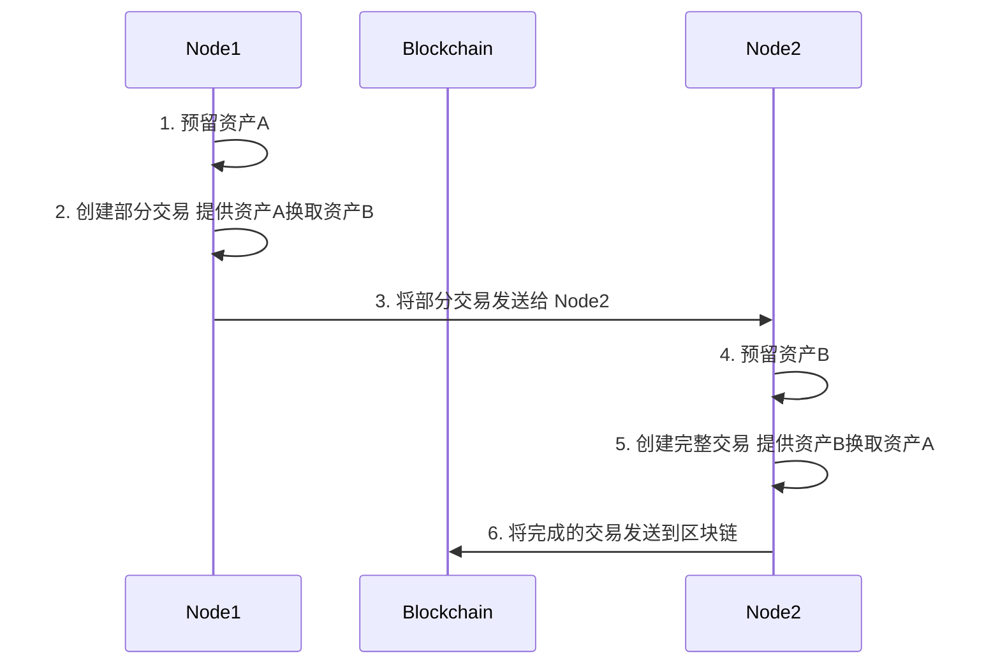

# MultiChain 原子资产交换

MultiChain 的交易和脚本设计允许交易超越基本的发送和接收操作。

在本课程中，我们将了解一个非常强大的用例，这是传统系统无法匹配的，MultiChain 可以很好地实现这一用例。

## 1. 双边交换

Alice 和 Bob 之间进行资产交换的最简单方法是创建 2 笔发送交易。这被称为双边交易。

一笔交易由 Alice 创建，向 Bob 发送 x 数量的资产 A，另一笔交易由 Bob 创建，发送 y 数量的资产 B。


双边交换的问题是对手方风险。例如，如果 Alice 向 Bob 发送资产 A，但 Bob 不向 Alice 发送资产 B，那么 Alice 将损失她的资产 A。

---

## 2. 可信第三方

为了克服 Alice 和 Bob 无法相互信任的这个问题，他们将使用一个信誉良好的可信第三方，称为 TTP，作为促进交换的中间人。这样的 TTP 可以是银行、律师或公证人，但通常是 Alice 和 Bob 都信任的实体。


Alice 和 Bob 愿意向 TTP（可信第三方）支付费用以促进此交换。然而，Alice 和 Bob 并没有消除对手方风险，只是将风险转移到了 TTP，希望风险更小。

例如，使用微信支付更加方便和高效，但它要求人们同时像信任银行一样信任微信。

---

## 3. 交付即付款 (DvP)

在缺乏信任的环境中，特别是在金融危机之后，这并不总是可能的。这就是为什么需要一种无需信任的支付方式，在这种支付方式中，您可以执行此交换而不依赖任何第三方，同时在相互直接交易时消除对手方风险。

在现实世界中，这类交换通常只在近距离支付场景中发生，例如货到付款。金融术语称为交付即付款。

---

## 4. 原子交换

区块链提供了一个解决方案，允许 Alice 和 Bob 直接相互交换资产，无需 TTP。区块链上相当于交付即付款的称为原子交换。


原子基本上意味着两方交换数字资产只能导致两种状态之一：如果双向交易都成功则成功，如果一笔或两笔交易都失败则取消，而不会给任何一方造成损失。

通过扩展之前课程中的交易和 UTXO 图表，我们可以看到如何使用下面的高层图表实现这一目标。


可以使用 MultiChain 资产在 MultiChain 上执行原子资产交换。

-   这是使用单笔交易完成的，该交易将 Server1 提供和接收的资产与 Server2 的资产进行匹配。

-   如果他们在提交到区块链时两个地址都有足够的余额，交易将成功。

-   如果任一地址的余额不足，交易将失败，在这种情况下，任何一方的提供资产都受到保护，不会被双重花费。

---

## 5. MultiChain 交易命令

### a. "preparelockunspent" 命令

为 createrawexchange、appendrawexchange 准备交换交易输出。

**语法：**

preparelockunspent asset-quantities ( lock )

**参数：**

1. **asset-quantities (object, required)**: 包含要发送的资产和内联数据的 JSON 对象，详细请参阅 help amounts-all。
2. **lock (boolean, optional, default=true)**: 锁定准备的未花费输出

**结果：**

```json
{
  "txid": "transactionid",  (string) 可在 createrawexchange 或 createrawexchange 中使用的输出交易 ID
  "vout": n  (numeric) 输出索引
}
```

**示例：**

以下示例为未来的交换交易预留 100 单位 asset3。

a) 在运行 preparelockunspent 之前检查当前资产余额。

```sh
> getaddressbalances 12tDDPm72xRFqmQ96jJtqT4cCGwTHNVsz2A4HB
# [
#    {
#        "name" : "asset3",
#        "assetref" : "66-266-55734",
#        "qty" : 300
#    }
# ]
```

b) 预留 100 单位 asset3

```bash
> preparelockunspent '{"asset3":100}'
# {
#     "txid" : "50f14dfbd17b3a3c1ac7019cdf2eee8c5dcff69dff4f10633b0e416e4c91b57d",
#     "vout" : 0
# }
```

c) 分析未花费交易

我们将使用上述 txid 从区块链中提取未花费交易。

```bash
getrawtransaction 50f14dfbd17b3a3c1ac7019cdf2eee8c5dcff69dff4f10633b0e416e4c91b57d true
# {
#     "hex" : "0100000001dd9408a09ca700cbde19fe6f7c02719e6bf1a42fa053dcbaac713ade3dffd9b6000000006b483045022100f1d24b6f522420c007aa76ba516dc1564cbc34df41d29d2782855318555ac06102200c852c51b0ac901cfbdc194540102f1836e11e06d04d0530256b1db0ba8f8d47012103013ffb59769ea760da19bcc6a22bcb7b0e4a4a1ff64e862916af2703758b8fa0ffffffff0200000000000000003776a9140dee8693d58dd6fb03aeabc8123037d9f302867d88ac1c73706b716bf1a42fa053dcbaac713ade3dffd9b6000000000000007500000000000000003776a9140dee8693d58dd6fb03aeabc8123037d9f302867d88ac1c73706b716bf1a42fa053dcbaac713ade3dffd9b6c8000000000000007500000000",
#     "txid" : "50f14dfbd17b3a3c1ac7019cdf2eee8c5dcff69dff4f10633b0e416e4c91b57d",
#     "version" : 1,
#     "locktime" : 0,
#     "vin" : [
#         {
#             "txid" : "b6d9ff3dde3a71acbadc53a02fa4f16b9e71027c6ffe19decb00a79ca00894dd",
#             "vout" : 0,
#             "scriptSig" : {
#                 "asm" : "3045022100f1d24b6f522420c007aa76ba516dc1564cbc34df41d29d2782855318555ac06102200c852c51b0ac901cfbdc194540102f1836e11e06d04d0530256b1db0ba8f8d4701 03013ffb59769ea760da19bcc6a22bcb7b0e4a4a1ff64e862916af2703758b8fa0",
#                 "hex" : "483045022100f1d24b6f522420c007aa76ba516dc1564cbc34df41d29d2782855318555ac06102200c852c51b0ac901cfbdc194540102f1836e11e06d04d0530256b1db0ba8f8d47012103013ffb59769ea760da19bcc6a22bcb7b0e4a4a1ff64e862916af2703758b8fa0"
#             },
#             "sequence" : 4294967295
#         }
#     ],
#     "vout" : [
#         {
#             "value" : 0,
#             "n" : 0,
#             "scriptPubKey" : {
#                 "asm" : "OP_DUP OP_HASH160 0dee8693d58dd6fb03aeabc8123037d9f302867d OP_EQUALVERIFY OP_CHECKSIG 73706b716bf1a42fa053dcbaac713ade3dffd9b66400000000000000 OP_DROP",
#                 "hex" : "76a9140dee8693d58dd6fb03aeabc8123037d9f302867d88ac1c73706b716bf1a42fa053dcbaac713ade3dffd9b6640000000000000075",
#                 "reqSigs" : 1,
#                 "type" : "pubkeyhash",
#                 "addresses" : [
#                     "12tDDPm72xRFqmQ96jJtqT4cCGwTHNVsz2A4HB"
#                 ]
#             },
#             "assets" : [
#                 {
#                     "name" : "asset3",
#                     "issuetxid" : "b6d9ff3dde3a71acbadc53a02fa4f16b9e71027c6ffe19decb00a79ca00894dd",
#                     "assetref" : "66-266-55734",
#                     "qty" : 100,
#                     "raw" : 100,
#                     "type" : "transfer"
#                 }
#             ]
#         },
#         {
#             "value" : 0,
#             "n" : 1,
#             "scriptPubKey" : {
#                 "asm" : "OP_DUP OP_HASH160 0dee8693d58dd6fb03aeabc8123037d9f302867d OP_EQUALVERIFY OP_CHECKSIG 73706b716bf1a42fa053dcbaac713ade3dffd9b6c800000000000000 OP_DROP",
#                 "hex" : "76a9140dee8693d58dd6fb03aeabc8123037d9f302867d88ac1c73706b716bf1a42fa053dcbaac713ade3dffd9b6c80000000000000075",
#                 "reqSigs" : 1,
#                 "type" : "pubkeyhash",
#                 "addresses" : [
#                     "12tDDPm72xRFqmQ96jJtqT4cCGwTHNVsz2A4HB"
#                 ]
#             },
#             "assets" : [
#                 {
#                     "name" : "asset3",
#                     "issuetxid" : "b6d9ff3dde3a71acbadc53a02fa4f16b9e71027c6ffe19decb00a79ca00894dd",
#                     "assetref" : "66-266-55734",
#                     "qty" : 200,
#                     "raw" : 200,
#                     "type" : "transfer"
#                 }
#             ]
#         }
#     ],
#     "blockhash" : "00106676065035e9fdd646b8b5c8585be5bf7c270e0e4871bd475bf34b2a385b",
#     "confirmations" : 97,
#     "time" : 1688545117,
#     "blocktime" : 1688545117
# }
```

从输出中我们可以看到，该交易包含 1 个输入和 2 个输出。第一个输出是我们预留的 asset3，第二个输出是返回给地址的找零。

因此，我们可以看到 preparelockunspent 用于查找合适的 UTXO 用于交换交易，并将其拆分为预留用于交易的输出和返回给用户的找零。

d) 再次检查余额

```sh
> getaddressbalances 12tDDPm72xRFqmQ96jJtqT4cCGwTHNVsz2A4HB
# [
#    {
#        "name" : "asset3",
#        "assetref" : "66-266-55734",
#        "qty" : 200
#    }
# ]
```

可用余额从 300 减少到 200。这是因为 `getaddressbalances` 只显示可用余额，不包括锁定的余额。要检查总余额，您可以使用 `getaddressbalances 12tDDPm72xRFqmQ96jJtqT4cCGwTHNVsz2A4HB 1 true`。

---

### b. "getrawtransaction" 命令

返回原始交易数据。当只给出交易哈希时，此命令对调试交易非常有用。

**语法：**

getrawtransaction "txid" ( verbose )

**注意：** 默认情况下此函数仅在某些时候有效。当交易在内存池中或 UTXO 中存在此交易的未花费输出时。要使其始终有效，您需要维护交易索引，使用 -txindex 命令行选项。

如果 verbose=0，返回一个字符串，即"txid"的序列化和十六进制编码数据。
如果 verbose 非零，返回一个关于"txid"的对象。

**参数：**

1. **"txid" (string, required)**: 交易 ID

2. **verbose (numeric or boolean, optional, default=0(false))**: 如果为 0，返回字符串，否则返回 JSON 对象

**结果（不带 verbose）**:
"data" 原始交易的十六进制字符串。

**结果（带 verbose）**:

表示解码交易的 JSON 对象。

```json
{
  "hex" : "data",                   (string) "txid" 的序列化和十六进制编码数据
  "txid" : "id",                    (string) 交易 ID（与提供的相同）
  "version" : n,                    (numeric) 版本
  "locktime" : ttt,                 (numeric) 锁定时间
  "vin" : [                         (JSON 对象数组)
     {
       "txid": "id",                (string) 交易 ID
       "vout": n,                   (numeric)
       "scriptSig": {               (JSON 对象) 脚本
         "asm": "asm",              (string) asm
         "hex": "hex"               (string) hex
       },
       "sequence": n                (numeric) 脚本序列号
     }
     ,...
   ],
  "vout" : [                        (JSON 对象数组)
     {
       "value" : x.xxx,             (numeric) btc 价值
       "n" : n,                     (numeric) 索引
       "scriptPubKey" : {           (JSON 对象)
         "asm" : "asm",             (string) asm
         "hex" : "hex",             (string) hex
         "reqSigs" : n,            (numeric) 所需签名数
         "type" : "pubkeyhash",    (string) 类型，例如 'pubkeyhash'
         "addresses" : [            (字符串的 JSON 数组)
           "address"                (string) 地址
           ,...
         ]
       }
     }
     ,...
   ],
  "blockhash" : "hash",            (string) 区块哈希
  "confirmations" : n,              (numeric) 确认数
  "time" : ttt,                    (numeric) 自 epoch 以来的交易时间（秒，1970 年 1 月 1 日 GMT）
  "blocktime" : ttt                (numeric) 自 epoch 以来的区块时间（秒，1970 年 1 月 1 日 GMT）
}
```

---

### c. "listlockunspent" 命令

返回临时不可花费输出的列表，作为 txid-vout 对的数组。

**语法：**

listlockunspent

**结果：**

```json
[
    {
        "txid" : "transactionid",  (string) 锁定的交易 ID
        "vout" : n (numeric) vout 值
    },...
]
```

---

### d. "lockunspent" 命令

暂时锁定（unlock=false）或解锁（unlock=true）指定的交易输出。锁定的交易输出在花费资产时不会被自动币选择选取。锁仅存储在内存中。节点从零个锁定输出开始，当节点停止或失败时，锁定输出列表总是被清除（由于进程退出）。

**语法：**

lockunspent unlock [{"txid":"txid","vout":n},...]

**参数：**

1. **unlock (boolean, required)** 是解锁（true）还是锁定（false）指定的交易
2. **transactions (array, optional)** JSON 对象数组。每个对象包含 txid（字符串）vout（数值）。如果省略且 unlock=true，则解锁所有输出。

```json
[                              (JSON 对象数组)
    {
        "txid":"id",               (string) 交易 ID
        "vout": n                  (numeric) 输出编号
    }
    ,...
]
```

**结果：**
true|false (boolean) 命令是否成功

**示例：**

a) 使用 preparelockunspent 锁定一个未花费。

```bash
> preparelockunspent '{"asset4":10}'
#{
#    "txid" : #"264f7a275f2224302baef28407f0f6f6ccc7595da3ed0d48072b4cbabd6abf58",
#    "vout" : 0
#}
```

b) 使用 listlockunspent 验证未花费。

```bash
> listlockunspent
# [
#     {
#         "txid" : # "264f7a275f2224302baef28407f0f6f6ccc7595da3ed0d48072b4cbabd6abf# 58",
#         "vout" : 0
#     }
# ]
```

c) 然后使用 lockunspent 解锁。

```bash
> lockunspent true '[{"txid":"264f7a275f2224302baef28407f0f6f6ccc7595da3ed0d48072b4cbabd6abf58","vout":0}]'
# true
```

d) 现在未花费列表为空。

```bash
> listlockunspent
# [
# ]
```

---

### e. "createrawexchange" 命令

创建新的交换交易。此命令由交换的第一方用于创建部分交换交易。交换可以通过交换的第二方使用 "appendrawexchange" 命令完成。

**语法：**

createrawexchange "txid" vout ask-assets

**参数：**

1. **"txid" (string, required)**: preparelockunspent 准备的输出的交易 ID。
2. **vout (numeric, required)**: 输出索引
3. **ask-assets (object, required)**: 要发送的资产的 JSON 对象，详细请参阅 help amounts-all。

**结果：**
"transaction" (string) 交易的十六进制字符串

**示例：**

a) 预留 300 单位 asset3 用于交换。

```bash
> preparelockunspent '{"asset3":100}'
# {
#     "txid" : "50f14dfbd17b3a3c1ac7019cdf2eee8c5dcff69dff4f10633b0e416e4c91b57d",
#     "vout" : 0
# }
```

b) 使用表示 100 单位 asset3 的 txid 和 vout 创建部分交换交易。包含一个 JSON 对象，要求作为交换返回 100 单位 asset4。

```bash
> createrawexchange "50f14dfbd17b3a3c1ac7019cdf2eee8c5dcff69dff4f10633b0e416e4c91b57d" 0 '{"asset4":100}'
#01000000017db5914c6e410e3b63104fff9df6cf5d8cee2edf9c01c71a3c3a7bd1fb4d
#f150000000006a47304402207cd13dced4aba12acd0e49882a795b6986e6a79677ed58
#bd77d97f330636e4e102207e8a8a210fd9c7edc2425ece306259e693c42c4ca9d44b3d
#a0428628224e8f7d832103013ffb59769ea760da19bcc6a22bcb7b0e4a4a1ff64e8629
#16af2703758b8fa0ffffffff0100000000000000003776a9140dee8693d58dd6fb03ae
#abc8123037d9f302867d88ac1c73706b7118745fff87095373b588a028b9e3113a6400
#0000000000007500000000
```

---

### f. "decoderawexchange" 命令

返回一个 JSON 对象，表示序列化的十六进制编码交换交易。

**语法：**

decoderawexchange "tx-hex" ( verbose )

**参数：**

1. **"tx-hex" (string, required)**: 交换交易十六进制字符串
2. **verbose (boolean, optional, default=false)**: 如果为 true，返回由 createrawexchange 或 appendrawexchange 创建的所有交换的数组

结果是包含交换详细信息的对象。

**示例：**

在此示例中，交换交易的十六进制字符串是之前从 `createrawexchange` 命令创建的。解码后，可以看到交换要求 100 单位 asset4 作为提供 100 单位 asset3 的回报。

**注意**：

-   输出显示 `"complete":false`，意味着该交易尚不能提交到区块链。
-   输出还显示 `"cancomplete":false`，意味着该交易永远无法完成，因为未花费已通过参与其他交易被花费。

```bash
> decoderawexchange 01000000017db5914c6e410e3b63104fff9df6cf5d8cee2edf9c01c71a3c3a7bd1fb4df150000000006a47304402207cd13dced4aba12acd0e49882a795b6986e6a79677ed58bd77d97f330636e4e102207e8a8a210fd9c7edc2425ece306259e693c42c4ca9d44b3da0428628224e8f7d832103013ffb59769ea760da19bcc6a22bcb7b0e4a4a1ff64e862916af2703758b8fa0ffffffff0100000000000000003776a9140dee8693d58dd6fb03aeabc8123037d9f302867d88ac1c73706b7118745fff87095373b588a028b9e3113a64000000000000007500000000
# {
#     "offer" : {
#         "amount" : 0,
#         "assets" : [
#             {
#                 "name" : "asset3",
#                 "assetref" : "66-266-55734",
#                 "qty" : 100
#             }
#         ]
#     },
#     "ask" : {
#         "amount" : 0,
#         "assets" : [
#             {
#                 "name" : "asset4",
#                 "assetref" : "373-266-4410",
#                 "qty" : 100
#             }
#         ]
#     },
#     "requiredfee" : 0,
#     "candisable" : true,
#     "cancomplete" : false,
#     "complete" : false
# }
```

---

### g. "appendrawexchange" 命令

向由之前调用 createrawexchange 或 appendrawexchange 给定的 tx-hex 中的原始原子交换交易添加内容。此命令由交换交易的第二方在收到第一方的部分交换交易后调用。

**语法：**

appendrawexchange "hex" "txid" vout ask-assets

**参数：**

1. **"hex" (string, required)**: 交易十六进制字符串

2. **"txid" (string, required)**: preparelockunspent 准备的输出的交易 ID。

3. **vout (numeric, required)**: 输出索引

4. **ask-assets (object, required)**: 要发送的资产的 JSON 对象

    ```json
    {
        "replace-with-asset-name":...
    }
    ```

    将 ... 替换为要求的单位数量

**结果：**

```json
{
  "hex": "value",                   (string) 带签名的原始交易（十六进制编码字符串）
  "complete": true|false            (boolean) 如果交换完成并可以发送
}
```

**示例：**

a) 第二方从第一方接收部分交换交易并解码。

```bash
> decoderawexchange 01000000017db5914c6e410e3b63104fff9df6cf5d8cee2edf9c01c71a3c3a7bd1fb4df150000000006a47304402207cd13dced4aba12acd0e49882a795b6986e6a79677ed58bd77d97f330636e4e102207e8a8a210fd9c7edc2425ece306259e693c42c4ca9d44b3da0428628224e8f7d832103013ffb59769ea760da19bcc6a22bcb7b0e4a4a1ff64e862916af2703758b8fa0ffffffff0100000000000000003776a9140dee8693d58dd6fb03aeabc8123037d9f302867d88ac1c73706b7118745fff87095373b588a028b9e3113a64000000000000007500000000
# {
#     "offer" : {
#         "amount" : 0,
#         "assets" : [
#             {
#                 "name" : "asset3",
#                 "assetref" : "66-266-55734",
#                 "qty" : 100
#             }
#         ]
#     },
#     "ask" : {
#         "amount" : 0,
#         "assets" : [
#             {
#                 "name" : "asset4",
#                 "assetref" : "373-266-4410",
#                 "qty" : 100
#             }
#         ]
#     },
#     "requiredfee" : 0,
#     "candisable" : true,
#     "cancomplete" : false,
#     "complete" : false
# }
```

为了匹配此交易，第二方需要提供 100 单位 asset4 作为 100 单位 asset3 的回报。

b) 预留 100 单位 asset4 用于交换。

```bash
> preparelockunspent '{"asset4":100}'
# {
#     "txid" : "443b14cf1a32d1e188ae431c201677bd25424fffcf916cd66ac3906aabfee603",
#     "vout" : 0
# }
```

d) 通过附加表示 100 单位 asset4 的 txid 和 vout 的部分交易来完成交换，并指定要求 100 单位 asset3。

```sh
 > appendrawexchange 01000000017db5914c6e410e3b63104fff9df6cf5d8cee2edf9c01c71a3c3a7bd1fb4df150000000006a47304402207cd13dced4aba12acd0e49882a795b6986e6a79677ed58bd77d97f330636e4e102207e8a8a210fd9c7edc2425ece306259e693c42c4ca9d44b3da0428628224e8f7d832103013ffb59769ea760da19bcc6a22bcb7b0e4a4a1ff64e862916af2703758b8fa0ffffffff0100000000000000003776a9140dee8693d58dd6fb03aeabc8123037d9f302867d88ac1c73706b7118745fff87095373b588a028b9e3113a64000000000000007500000000 443b14cf1a32d1e188ae431c201677bd25424fffcf916cd66ac3906aabfee603 0 '{"asset3":100}'
#  {
#     "hex" : "01000000027db5914c6e410e3b63104fff9df6cf5d8cee2edf9c01c71a3c3a7bd1fb4df150000000006a47304402207cd13dced4aba12acd0e49882a795b6986e6a79677ed58bd77d97f330636e4e102207e8a8a210fd9c7edc2425ece306259e693c42c4ca9d44b3da0428628224e8f7d832103013ffb59769ea760da19bcc6a22bcb7b0e4a4a1ff64e862916af2703758b8fa0ffffffff03e6feab6a90c36ad66c91cfff4f4225bd7716201c43ae88e1d1321acf143b44000000006a47304402206c1078b842ed52256316f29bd5fd53a3ff066702a99e58376333c8ee360e9bff022019620e3163b35df92505438d619878cc2e601ba18e9e792bc65d3cd207b12bfe832103cbb355bd0f558b892113dff5f45c847ef948219673f784970beb5fc532effe80ffffffff0200000000000000003776a9140dee8693d58dd6fb03aeabc8123037d9f302867d88ac1c73706b7118745fff87095373b588a028b9e3113a64000000000000007500000000000000003776a9140a9a11bb3807a641751a095bca16763ecf91568a88ac1c73706b716bf1a42fa053dcbaac713ade3dffd9b664000000000000007500000000",
#     "complete" : true
# }
```

如果我们解码这个完成的交易，我们可以看到提供和要求的资产现在已交换。

```sh
> decoderawtransaction 01000000027db5914c6e410e3b63104fff9df6cf5d8cee2edf9c01c71a3c3a7bd1fb4df150000000006a47304402207cd13dced4aba12acd0e49882a795b6986e6a79677ed58bd77d97f330636e4e102207e8a8a210fd9c7edc2425ece306259e693c42c4ca9d44b3da0428628224e8f7d832103013ffb59769ea760da19bcc6a22bcb7b0e4a4a1ff64e862916af2703758b8fa0ffffffff03e6feab6a90c36ad66c91cfff4f4225bd7716201c43ae88e1d1321acf143b44000000006a47304402206c1078b842ed52256316f29bd5fd53a3ff066702a99e58376333c8ee360e9bff022019620e3163b35df92505438d619878cc2e601ba18e9e792bc65d3cd207b12bfe832103cbb355bd0f558b892113dff5f45c847ef948219673f784970beb5fc532effe80ffffffff0200000000000000003776a9140dee8693d58dd6fb03aeabc8123037d9f302867d88ac1c73706b7118745fff87095373b588a028b9e3113a64000000000000007500000000000000003776a9140a9a11bb3807a641751a095bca16763ecf91568a88ac1c73706b716bf1a42fa053dcbaac713ade3dffd9b664000000000000007500000000
# {
#     "txid" : "7f04e887216b67a166e4b8be38d3c8b17c7d9548e072f86e72fbcdbcc1a42e97",
#     "version" : 1,
#     "locktime" : 0,
#     "vin" : [
#         {
#             "txid" : "50f14dfbd17b3a3c1ac7019cdf2eee8c5dcff69dff4f10633b0e416e4c91b57d",
#             "vout" : 0,
#             "scriptSig" : {
#                 "asm" : "304402207cd13dced4aba12acd0e49882a795b6986e6a79677ed58bd77d97f330636e4e102207e8a8a210fd9c7edc2425ece306259e693c42c4ca9d44b3da0428628224e8f7d83 03013ffb59769ea760da19bcc6a22bcb7b0e4a4a1ff64e862916af2703758b8fa0",
#                 "hex" : "47304402207cd13dced4aba12acd0e49882a795b6986e6a79677ed58bd77d97f330636e4e102207e8a8a210fd9c7edc2425ece306259e693c42c4ca9d44b3da0428628224e8f7d832103013ffb59769ea760da19bcc6a22bcb7b0e4a4a1ff64e862916af2703758b8fa0"
#             },
#             "sequence" : 4294967295
#         },
#         {
#             "txid" : "443b14cf1a32d1e188ae431c201677bd25424fffcf916cd66ac3906aabfee603",
#             "vout" : 0,
#             "scriptSig" : {
#                 "asm" : "304402206c1078b842ed52256316f29bd5fd53a3ff066702a99e58376333c8ee360e9bff022019620e3163b35df92505438d619878cc2e601ba18e9e792bc65d3cd207b12bfe83 03cbb355bd0f558b892113dff5f45c847ef948219673f784970beb5fc532effe80",
#                 "hex" : "47304402206c1078b842ed52256316f29bd5fd53a3ff066702a99e58376333c8ee360e9bff022019620e3163b35df92505438d619878cc2e601ba18e9e792bc65d3cd207b12bfe832103cbb355bd0f558b892113dff5f45c847ef948219673f784970beb5fc532effe80"
#             },
#             "sequence" : 4294967295
#         }
#     ],
#     "vout" : [
#         {
#             "value" : 0,
#             "n" : 0,
#             "scriptPubKey" : {
#                 "asm" : "OP_DUP OP_HASH160 0dee8693d58dd6fb03aeabc8123037d9f302867d OP_EQUALVERIFY OP_CHECKSIG 73706b7118745fff87095373b588a028b9e3113a6400000000000000 OP_DROP",
#                 "hex" : "76a9140dee8693d58dd6fb03aeabc8123037d9f302867d88ac1c73706b7118745fff87095373b588a028b9e3113a640000000000000075",
#                 "reqSigs" : 1,
#                 "type" : "pubkeyhash",
#                 "addresses" : [
#                     "12tDDPm72xRFqmQ96jJtqT4cCGwTHNVsz2A4HB"
#                 ]
#             },
#             "assets" : [
#                 {
#                     "name" : "asset4",
#                     "issuetxid" : "3a11e3b928a088b573530987ff5f74189355b0630d9da461c4a055f80d719000",
#                     "assetref" : "373-266-4410",
#                     "qty" : 100,
#                     "raw" : 100,
#                     "type" : "transfer"
#                 }
#             ]
#         },
#         {
#             "value" : 0,
#             "n" : 1,
#             "scriptPubKey" : {
#                 "asm" : "OP_DUP OP_HASH160 0a9a11bb3807a641751a095bca16763ecf91568a OP_EQUALVERIFY OP_CHECKSIG 73706b716bf1a42fa053dcbaac713ade3dffd9b66400000000000000 OP_DROP",
#                 "hex" : "76a9140a9a11bb3807a641751a095bca16763ecf91568a88ac1c73706b716bf1a42fa053dcbaac713ade3dffd9b6640000000000000075",
#                 "reqSigs" : 1,
#                 "type" : "pubkeyhash",
#                 "addresses" : [
#                     "12S7Eg2Gz1ZSdRXqVjzjoSybBV1m9umdZz5nHL"
#                 ]
#             },
#             "assets" : [
#                 {
#                     "name" : "asset3",
#                     "issuetxid" : "b6d9ff3dde3a71acbadc53a02fa4f16b9e71027c6ffe19decb00a79ca00894dd",
#                     "assetref" : "66-266-55734",
#                     "qty" : 100,
#                     "raw" : 100,
#                     "type" : "transfer"
#                 }
#             ]
#         }
#     ]
# }
```

此交易有 2 个 vin 和 2 个 vout，对应于下图。


---

### h. "sendrawtransaction" 命令

向本地节点和网络提交原始交易（序列化和十六进制编码）。

**语法：**

sendrawtransaction "tx-hex"

**参数：**

1. **"tx-hex" (string, required)**: 原始交易的十六进制字符串

**结果：**
"hex" (string) 十六进制中的交易哈希

---

## 🛠️ 实验实践：原子资产交换

-   在本实验课程中，我们将尝试实现以下流程。



-   Node1 和 Node2 是任意的，因此您可以选择组中任意 2 个节点来担任 Node1 和 Node2 的角色。

-   AssetA 和 AssetB 分别是 Node1 和 Node2 拥有的资产的任意名称。请创建您自己独特的资产名称。

-   组的所有成员应该轮换并担任 Node1 和 Node2 的角色来完成本实验。尝试每轮选择不同的合作伙伴。

-   您也可以参考 MultiChain API 文档获取详细信息 http://www.multichain.com/developers/json-rpc-api/

### 步骤 1：Node1 预留资产A

a) 选择您想要提供的资产并检查您的余额。

b) 使用 [preparelockunspent](./atomic-asset-swap.md#a-preparelockunspent-command) 命令预留资产。

c) 记下上面返回的 txid 和 vout。

d) 使用 [listlockunspent](./atomic-asset-swap.md#b-listlockunspent-command) 命令检查锁定的未花费列表。

e) 再次检查您的资产余额以确认可用余额已减少预留的金额。

### 步骤 2：Node1 创建部分交易

a) 选择您想向 Node2 要求的资产及其数量。（确保 Node2 拥有您要求的资产和数量）

b) 使用 [createrawexchange](./atomic-asset-swap.md#c-createrawexchange-command) 命令创建部分交易。

c) 使用 [decoderawexchange](./atomic-asset-swap.md#d-decoderawexchange-command) 命令解码部分交易，以验证提供和要求的资产是否正确。

### 步骤 3：Node1 将部分交易发送给 Node2

您需要将部分交易发送给 Node2。此步骤是链下完成的。您可以通过电子邮件或任何公开数字方式发送此交易，因为该交易已经由您预签名。

### 步骤 4：Node2 预留资产B

a) 解码交易以了解 Node1 要求什么。

b) 使用 [preparelockunspent](./atomic-asset-swap.md#a-preparelockunspent-command) 命令预留 Node1 要求的正确数量的 assetB。

c) 记下上面返回的 txid 和 vout。

### 步骤 5：Node2 创建完整交易 提供资产B换取资产A

a) 使用 [appendrawexchange](./atomic-asset-swap.md#e-appendrawexchange-command) 命令完成交易。

b) 确保上述命令的结果包含 `"complete":true`：

```sh
{
    "hex" : "...",
    "complete" : true
}
```

### 步骤 6：Node2 将完整交易发送给 Node1

a) 使用 [sendrawtransaction](./atomic-asset-swap.md#h-sendrawtransaction-command) 命令将完整交易发送到区块链。

b) 使用 [getrawtransaction](./atomic-asset-swap.md#i-getrawtransaction-command) 命令检查交易。

c) 检查 Node1 和 Node2 的余额，以验证正确数量和类型的资产是否在双方之间正确转移。
